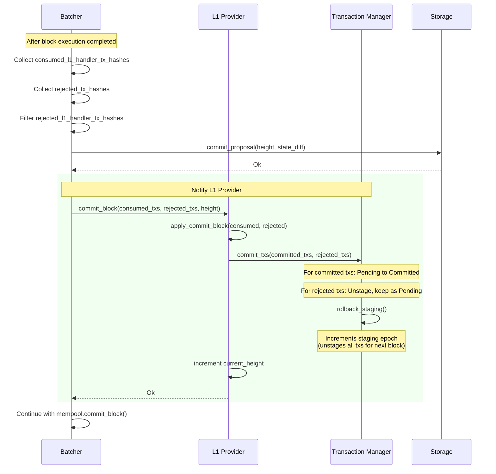

### Title
L1 handler transactions with a modest-sized L1→L2 payload always revert and permanently strand the bridged message because `l1_handler_max_amount_bounds` is a fixed, tiny cap that the message segment cost alone can exceed - (File: crates/blockifier/src/transaction/l1_handler_transaction.rs)

### Summary
`L1HandlerTransaction::execute_raw` enforces a fixed, protocol-wide gas cap (`l1_handler_max_amount_bounds`) on every L1→L2 message, independent of what the L1 sender actually paid or is willing to pay. Part of that cost - the L1/SHARP messaging cost computed from `message_segment_length` (which scales with the L1 handler's calldata/payload size) - is charged unconditionally to the `l1_gas` bucket of the cap, on top of whatever gas the L1 handler's Cairo code consumes. Because this fixed cap was lowered dramatically between versions (from `10_000_000_000` down to `40_000` for `l1_gas` in the `0.14.x` constants), any legitimate L1 message whose payload is even moderately sized can deterministically exceed the cap before any of the handler's own logic executes, causing the transaction to revert on every single execution attempt, by every honest node, forever.

### Finding Description
`execute_raw` computes `l1_handler_bounds` from `block_context.versioned_constants.os_constants.l1_handler_max_amount_bounds` and post-execution checks the total consumed `GasVector` (which includes archival/calldata cost, messaging cost, and execution cost) against these bounds via `FeeCheckReport::check_all_gas_amounts_within_bounds`: [1](#0-0) 

The messaging cost portion is computed unconditionally in `MessageResources::to_gas_vector`/`get_starknet_gas_cost`, which always assigns the message-segment cost (proportional to `l1_handler_payload_size`) plus fixed per-message overhead (counter decrease, event emission) to `l1_gas`, regardless of the transaction's resource-bound type or `GasVectorComputationMode`: [2](#0-1) 

`get_message_segment_length` shows the segment length grows linearly with `l1_handler_payload_size`: [3](#0-2) 

The per-word cost constants used for this computation: [4](#0-3) 

The bound itself dropped from `10_000_000_000` to `40_000` for `l1_gas` starting at protocol version `0.14.0`: [5](#0-4) [6](#0-5) 

With `l1_gas` bound at `40_000`, and the fixed overhead (`GAS_PER_COUNTER_DECREASE` ≈ 5000) plus roughly `GAS_PER_MEMORY_WORD + SHARP_GAS_PER_MEMORY_WORD` (≈1124) charged per payload word, a payload of only on the order of a few dozen felts is enough to exceed the entire `l1_gas` budget on its own - before any of the handler's Cairo execution steps, storage writes, or events are even counted. Since payload size is intrinsic to the L1 message and immutable once sent, this failure is fully deterministic: every node that executes this L1 handler transaction, at every block height, will get the identical `FeeCheckError::MaxGasAmountExceeded` result and revert it, consistently and irrecoverably.

The existing test suite directly demonstrates that exceeding any one of these bounds (including via a small `new_bound` override) reliably reverts the L1 handler with no execute/fee-transfer call info and `Fee(0)`: [7](#0-6) 

Critically, once an L1 handler transaction is included in a block (even as a revert), the batcher marks it as consumed/committed and the L1 provider/transaction manager transitions it out of the pending pool permanently - it is not retried: [8](#0-7) [9](#0-8) 

Because the revert is deterministic and reproducible for the payload in question, resubmission by the sequencer (or any future validator/proposer) will produce the exact same outcome - the message can never be executed successfully, matching the underlying bug class from the report: a fixed resource cap that is exceeded purely by message size/data (not by the sender's intent or by any malicious action), causing an otherwise-valid transaction to be permanently undeliverable.

### Impact Explanation
Any L1→L2 message (sent by an ordinary, unprivileged L1 sender through the bridge/messaging mechanism) whose payload is large enough to push the mandatory L1/SHARP messaging-gas cost above the fixed `l1_handler_max_amount_bounds.l1_gas` value will always revert. Because the L1 handler is the mechanism through which L1-originated bridging/message calls mint tokens, unlock deposits, or otherwise finalize cross-layer state changes on L2, an irrecoverable revert of such a message can result in permanent freezing of the funds/actions intended to be delivered by that message - the L1 side has already committed/spent the message, but the L2 side can never successfully process it. This satisfies the "permanent freezing of funds" impact bar.

### Likelihood Explanation
This does not require any malicious actor, sequencer, or operator - it is triggered purely by an ordinary user or integrator sending an L1→L2 message with an unremarkable but non-trivial payload size (well within what many bridging/multicall integrations legitimately use). Given the current `l1_gas` bound of `40_000` and roughly ~1100 gas per payload word, the threshold payload size before certain failure is very small (on the order of tens of felts), which is easily reached by real-world integrations. Likelihood is therefore high once payloads of that size are used.

### Recommendation
Do not let the L1-messaging segment cost (which scales with payload size and is unrelated to the L1 handler's execution logic) be lumped into the same fixed, protocol-defined `l1_handler_max_amount_bounds.l1_gas` cap that must also cover Cairo execution/storage costs. Either:
- Raise `l1_handler_max_amount_bounds.l1_gas` to a level that comfortably covers the maximum payload size permitted by the L1 message-sending contract, with margin for execution costs; or
- Decouple the messaging/archival cost accounting from the enforced bound (e.g., bound only the execution-derived gas, and treat the message-segment cost as informational/fee-estimation only, since it doesn't represent consumable execution resources); or
- Enforce a maximum L1 handler payload size at the point of message acceptance (mempool/L1 events provider) so that oversized messages are rejected/flagged before consuming an irreversible consumption slot, rather than allowed to be scraped, staged, and then deterministically reverted forever.

### Proof of Concept
1. An L1 user calls `sendMessageToL2` (or equivalent) with a payload containing, e.g., 40+ felts (well within normal usage for a multicall-style bridging message).
2. The corresponding `L1HandlerTransaction` is scraped, staged, and proposed for inclusion, per `docs/diagrams/06-l1-handler-flow.md`.
3. During execution, `MessageResources::to_gas_vector`/`get_starknet_gas_cost` computes `l1_gas` cost ≈ `GAS_PER_COUNTER_DECREASE` (5000) + `message_segment_length * (GAS_PER_MEMORY_WORD + SHARP_GAS_PER_MEMORY_WORD)` (~1124 per word), which alone exceeds `l1_handler_max_amount_bounds.l1_gas = 40_000` for a payload in the tens of felts, even with zero Cairo execution steps consumed.
4. `FeeCheckReport::check_all_gas_amounts_within_bounds` in `crates/blockifier/src/transaction/l1_handler_transaction.rs` (lines 92-96) returns `FeeCheckError::MaxGasAmountExceeded`, the transaction is reverted (`execute_call_info: None`, `fee == Fee(0)`) as directly reproduced by the existing test `test_l1_handler_resource_bounds` in `crates/blockifier/src/transaction/transactions_test.rs` (lines 2964-3008).
5. The reverted transaction is still included in the block and is treated as consumed/committed by the batcher (`crates/apollo_batcher/src/block_builder_test.rs`, `failed_l1_handler_transaction_consumed`), so the L1 provider's transaction manager will never re-propose it - the message is permanently lost, deterministically, on every node.

### Citations

**File:** crates/blockifier/src/transaction/l1_handler_transaction.rs (L62-96)
```rust
        let tx_context = Arc::new(block_context.to_tx_context(self));
        let limit_steps_by_resources = false;
        let l1_handler_bounds =
            block_context.versioned_constants.os_constants.l1_handler_max_amount_bounds;

        let mut remaining_gas = l1_handler_bounds.l2_gas.0;
        let mut context = EntryPointExecutionContext::new_invoke(
            tx_context.clone(),
            limit_steps_by_resources,
            SierraGasRevertTracker::new(GasAmount(remaining_gas)),
        );
        let l1_handler_payload_size = self.payload_size();

        // Create a copy of the state for the execution. It will be rolled back if the execution is
        // reverted or committed upon success.
        let mut execution_state = TransactionalState::create_transactional(state);
        let execution_result =
            self.run_execute(&mut execution_state, &mut context, &mut remaining_gas);
        match execution_result {
            Ok(execute_call_info) => {
                let receipt = TransactionReceipt::from_l1_handler(
                    &tx_context,
                    l1_handler_payload_size,
                    CallInfo::summarize_many(
                        execute_call_info.iter(),
                        &block_context.versioned_constants,
                    ),
                    &execution_state.to_state_diff()?,
                );

                // Enforce resource bounds.
                let fee_check_report = FeeCheckReport::check_all_gas_amounts_within_bounds(
                    &l1_handler_bounds,
                    &receipt.gas,
                );
```

**File:** crates/blockifier/src/fee/resources.rs (L383-422)
```rust
    /// Returns an estimation of the gas usage for processing L1<>L2 messages on L1. Accounts for
    /// both Starknet and SHARP contracts.
    pub fn to_gas_vector(&self) -> GasVector {
        let starknet_gas_usage = self.get_starknet_gas_cost();
        let sharp_gas_usage = GasVector::from_l1_gas(
            u64_from_usize(
                self.message_segment_length * eth_gas_constants::SHARP_GAS_PER_MEMORY_WORD,
            )
            .into(),
        );

        starknet_gas_usage.checked_add(sharp_gas_usage).unwrap_or_else(|| {
            panic!(
                "Message resources to gas vector overflowed: starknet gas cost is \
                 {starknet_gas_usage:?}, SHARP gas cost is {sharp_gas_usage:?}.",
            )
        })
    }

    /// Returns an estimation of the gas usage for processing L1<>L2 messages on L1. Accounts for
    /// Starknet contract only.
    pub fn get_starknet_gas_cost(&self) -> GasVector {
        let n_l2_to_l1_messages = self.l2_to_l1_payload_lengths.len();
        let n_l1_to_l2_messages = usize::from(self.l1_handler_payload_size.is_some());

        [
            GasVector::from_l1_gas(
                // Starknet's updateState gets the message segment as an argument.
                u64_from_usize(
                    self.message_segment_length * eth_gas_constants::GAS_PER_MEMORY_WORD
                // Starknet's updateState increases a (storage) counter for each L2-to-L1 message.
                + n_l2_to_l1_messages * eth_gas_constants::GAS_PER_ZERO_TO_NONZERO_STORAGE_SET
                // Starknet's updateState decreases a (storage) counter for each L1-to-L2 consumed
                // message (note that we will probably get a refund of 15,000 gas for each consumed
                // message but we ignore it since refunded gas cannot be used for the current
                // transaction execution).
                + n_l1_to_l2_messages * eth_gas_constants::GAS_PER_COUNTER_DECREASE,
                )
                .into(),
            ),
```

**File:** crates/blockifier/src/fee/gas_usage.rs (L95-101)
```rust
    if let Some(payload_size) = l1_handler_payload_size {
        // The corresponding transaction is of type L1 handler; add the length of the L1-to-L2
        // message sent by the sequencer (that will be outputted by the OS), which is of the
        // following format: from_address=calldata[0], to_address=contract_address,
        // nonce, selector, payload_size, payload=calldata[1:].
        message_segment_length += constants::L1_TO_L2_MSG_HEADER_SIZE + payload_size;
    }
```

**File:** crates/blockifier/src/fee/eth_gas_constants.rs (L1-31)
```rust
// Calldata.
pub const GAS_PER_MEMORY_ZERO_BYTE: usize = 4;
pub const GAS_PER_MEMORY_BYTE: usize = 16;
pub const WORD_WIDTH: usize = 32;
pub const GAS_PER_MEMORY_WORD: usize = GAS_PER_MEMORY_BYTE * WORD_WIDTH;

// Blob Data.
pub const FIELD_ELEMENTS_PER_BLOB: usize = 1 << 12;
pub const DATA_GAS_PER_BLOB: usize = 1 << 17;
pub const DATA_GAS_PER_FIELD_ELEMENT: usize = DATA_GAS_PER_BLOB / FIELD_ELEMENTS_PER_BLOB;

// Storage.
pub const GAS_PER_ZERO_TO_NONZERO_STORAGE_SET: usize = 20000;
pub const GAS_PER_COLD_STORAGE_ACCESS: usize = 2100;
pub const GAS_PER_NONZERO_TO_INT_STORAGE_SET: usize = 2900;
pub const GAS_PER_COUNTER_DECREASE: usize =
    GAS_PER_COLD_STORAGE_ACCESS + GAS_PER_NONZERO_TO_INT_STORAGE_SET;

// Events.
pub const GAS_PER_LOG: usize = 375;
pub const GAS_PER_LOG_TOPIC: usize = 375;
pub const GAS_PER_LOG_DATA_BYTE: usize = 8;
pub const GAS_PER_LOG_DATA_WORD: usize = GAS_PER_LOG_DATA_BYTE * WORD_WIDTH;

// SHARP empirical costs.
pub const SHARP_ADDITIONAL_GAS_PER_MEMORY_WORD: usize = 100; // This value is not accurate.
pub const SHARP_GAS_PER_MEMORY_WORD: usize =
    GAS_PER_MEMORY_WORD + SHARP_ADDITIONAL_GAS_PER_MEMORY_WORD;
// 10% discount for data availability.
pub const DISCOUNT_PER_DA_WORD: usize = (SHARP_GAS_PER_MEMORY_WORD * 10) / 100;
pub const SHARP_GAS_PER_DA_WORD: usize = SHARP_GAS_PER_MEMORY_WORD - DISCOUNT_PER_DA_WORD;
```

**File:** crates/blockifier/resources/blockifier_versioned_constants_0_14_0.json (L184-189)
```json
        "l1_handler_version": 0,
        "l1_handler_max_amount_bounds": {
            "l1_gas": 40000,
            "l1_data_gas": 20000,
            "l2_gas": 100000000
        },
```

**File:** crates/blockifier/resources/blockifier_versioned_constants_0_13_6.json (L184-189)
```json
        "l1_handler_version": 0,
        "l1_handler_max_amount_bounds": {
            "l1_gas": 10000000000,
            "l1_data_gas": 10000000000,
            "l2_gas": 10000000000
        },
```

**File:** crates/blockifier/src/transaction/transactions_test.rs (L2964-3008)
```rust
#[rstest]
#[case(L1Gas, GasAmount(1))]
// Sufficient to pass execution (enough gas to run the transaction), but fails post-execution
// resource bounds check.
#[case(L2Gas, GasAmount(200000))]
#[case(L1DataGas, GasAmount(1))]
fn test_l1_handler_resource_bounds(#[case] resource: Resource, #[case] new_bound: GasAmount) {
    let test_contract = FeatureContract::TestContract(CairoVersion::Cairo1(RunnableCairo1::Casm));

    // Set to true to ensure L1 data gas is non-zero.
    let use_kzg_da = true;

    let mut block_context = BlockContext::create_for_account_testing_with_kzg(use_kzg_da);
    let chain_info = block_context.chain_info.clone();
    let mut state = test_state(&chain_info, BALANCE, &[(test_contract, 1)]);
    let contract_address = test_contract.get_instance_address(0);

    // Modify the resource bound for the tested resource.
    let os_constants = Arc::make_mut(&mut block_context.versioned_constants.os_constants);
    match resource {
        L1Gas => os_constants.l1_handler_max_amount_bounds.l1_gas = new_bound,
        L2Gas => os_constants.l1_handler_max_amount_bounds.l2_gas = new_bound,
        L1DataGas => os_constants.l1_handler_max_amount_bounds.l1_data_gas = new_bound,
    }

    let tx = l1handler_tx(Fee(1), contract_address);

    let execution_info = tx.execute(&mut state, &block_context).unwrap();

    assert_matches!(
        execution_info,
        TransactionExecutionInfo {
            validate_call_info: None,
            execute_call_info: None,
            fee_transfer_call_info: None,
            revert_error: Some(RevertError::PostExecution(FeeCheckError::MaxGasAmountExceeded {
                resource: r,
                max_amount,
                actual_amount
            })),
            // TODO(Arni): consider checking other fields of the receipt.
            receipt: TransactionReceipt { fee, .. },
        } if r == resource && new_bound == max_amount && actual_amount > max_amount && fee == Fee(0)
    );
}
```

**File:** crates/apollo_batcher/src/block_builder_test.rs (L1064-1111)
```rust
#[rstest]
#[tokio::test]
async fn failed_l1_handler_transaction_consumed() {
    let l1_handler_txs = test_l1_handler_txs(0..2);
    let mock_tx_provider = mock_tx_provider_small_stream(l1_handler_txs.clone());

    let mut helper = ExpectationHelper::new();
    helper.expect_successful_get_new_results(0);
    helper.expect_is_done(false);
    helper.expect_add_txs_to_block(&l1_handler_txs);
    helper.expect_get_new_results_with_results(vec![
        Err(TransactionExecutorError::StateError(StateError::OutOfRangeContractAddress)),
        Ok((execution_info(), StateMaps::default())),
    ]);
    helper.expect_is_done(true);
    helper.expect_successful_get_new_results(0);

    helper.mock_transaction_executor.expect_close_block().times(1).return_once(|_| {
        Ok(BlockExecutionSummary {
            state_diff: Default::default(),
            compressed_state_diff: None,
            bouncer_weights: BouncerWeights::empty(),
            casm_hash_computation_data_sierra_gas: CasmHashComputationData::default(),
            casm_hash_computation_data_proving_gas: CasmHashComputationData::default(),
            compiled_class_hashes_for_migration: vec![],
            block_info: BlockInfo::create_for_testing(),
        })
    });

    let (_abort_sender, abort_receiver) = tokio::sync::oneshot::channel();
    let result_block_artifacts = run_build_block(
        helper.mock_transaction_executor,
        mock_tx_provider,
        None,
        false,
        abort_receiver,
        BLOCK_GENERATION_DEADLINE_SECS,
        DEFAULT_IDLE_TIMEOUT_MS,
    )
    .await
    .unwrap();

    // Verify that all L1 handler transaction's are included in the consumed l1 transactions.
    assert_eq!(
        result_block_artifacts.execution_data.consumed_l1_handler_tx_hashes,
        l1_handler_txs.iter().map(|tx| tx.tx_hash()).collect::<IndexSet<_>>()
    );
}
```

**File:** docs/diagrams/06-l1-handler-flow.md (L154-189)
```markdown
## Block Commit - Finalizing L1 Transactions


```
