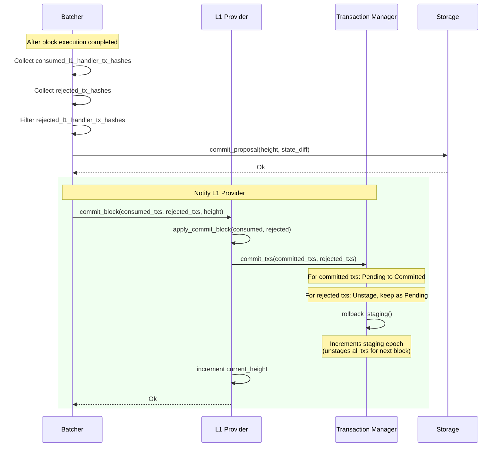

### Title
Malicious L2 contract can weaponize `l1_handler` entry points to permanently consume L1→L2 messages while reverting their effects, causing irrecoverable loss of bridged funds - (File: crates/apollo_batcher/src/block_builder.rs)

### Summary
An `l1_handler` transaction whose target entry point always reverts is still treated by the sequencer as a "processed" (Ok) transaction result, distinct from a hard execution error. Because of this, the L1-to-L2 message backing that transaction is unconditionally marked as consumed and later committed as "Committed" in the L1 provider/transaction manager, exactly as if it had succeeded. Any contract deployer can therefore deploy a contract whose `l1_handler` (e.g. a bridge deposit callback) unconditionally reverts, causing every L1→L2 message routed to it to be permanently and irrecoverably consumed without ever crediting the intended recipient, since Starknet provides no mechanism to retry a message once it is marked `Committed`.

### Finding Description
`L1HandlerTransaction::execute_raw` in [1](#0-0)  runs the target entry point inside a transactional state. If the entry point panics/reverts, `execution_state.abort()` rolls back the state changes made *within* the call, but the function still returns `Ok(l1_handler_tx_execution_info(None, receipt, Some(revert_error)))` rather than an `Err`. This is the same "successful but reverted" pattern used for ordinary invoke transactions, but for L1 handlers there is no fee-payer to punish and no way to resubmit — the L1 message has already been scraped and is being processed for the first (and only) time.

At the batcher level, `collect_execution_results_and_stream_txs` in [2](#0-1)  inserts the L1 handler's `tx_hash` into `consumed_l1_handler_tx_hashes` for **every** `Ok(...)` result, regardless of whether `tx_execution_info.revert_error` is `Some` (only logging a warning). Only the `Err(...)` branch (a true sequencer-level execution error, e.g. `StateError`) is treated as "rejected" and can potentially be retried, as confirmed by the test `failed_l1_handler_transaction_consumed` in [3](#0-2) , which explicitly asserts that a reverted L1 handler transaction still ends up in `consumed_l1_handler_tx_hashes`.

Downstream, per the documented flow in [4](#0-3) , `commit_block(consumed_txs, rejected_txs, height)` transitions committed L1 handler transactions from `Pending` to `Committed` in the transaction manager. Once `Committed`, the corresponding L1 message is never reconsidered for execution again — there is no automatic retry, and the message was already removed from the L1 message queue when it was scraped/included.

On the OS/Cairo side, `execute_l1_handler_transaction` in [5](#0-4)  calls `consume_l1_to_l2_message(execution_context=tx_execution_context, nonce=nonce)` and then runs `non_reverting_select_execute_entry_point_func`, confirming that message consumption/nonce handling is treated as a fixed, committed part of transaction processing independent of whether the wrapped entry point call panics.

Consequently, a contract owner/deployer can build a contract (e.g. posing as a token bridge, vault, or any L1-triggered callback target) whose `l1_handler` entry point unconditionally reverts for some or all inputs — analogous to the `onRepay()` callback in the referenced report always reverting. Any legitimate user funds or state transitions that were supposed to be delivered via that L1→L2 message are permanently lost: the message is consumed/committed by the sequencer, but the state effect (e.g., crediting a deposit) never lands because it was rolled back.

### Impact Explanation
This causes concrete, permanent loss of funds for any user whose L1→L2 message (e.g., a token bridge deposit or other cross-layer callback) is routed to a maliciously/faultily designed `l1_handler`. There is no path to recovery: the message is irreversibly marked `Committed` at the L1 provider level, and the L1 side has already removed/consumed the message. This matches the "concrete loss or permanent freezing of funds" criterion.

### Likelihood Explanation
Likelihood is high in terms of reachability: any unprivileged contract deployer can deploy such a contract and advertise it as a legitimate bridge/handler target; no special sequencer or operator privilege is required — only ordinary contract deployment and inducing users/L1 contracts to send messages to it. The revert can also be conditional (e.g., revert whenever the deposit amount exceeds some attacker-favorable threshold), making the attack stealthy and selective.

### Recommendation
Distinguish "processed but reverted" L1 handler transactions from a policy standpoint before permanently marking the underlying L1 message consumed/committed. Options include: providing an explicit, bounded retry/cancellation window for reverted L1 handler transactions (mirroring the existing cancellation timelock mechanism already present in the L1 provider), or ensuring L1 handler transactions that revert are treated the same as `rejected_tx_hashes` (kept `Pending`, eligible for future retry or L1-initiated cancellation) rather than folded into `consumed_l1_handler_tx_hashes`/`Committed` state.

### Proof of Concept
1. Deploy an L2 contract with an `l1_handler` entry point (e.g. `on_deposit`) that performs `storage_write_syscall` then unconditionally calls `panic_with_felt252(...)`, mirroring `l1_handler_set_value_and_revert` in [6](#0-5) .
2. Have a user send funds/a message from L1 targeting this contract's `on_deposit` handler (as tested end-to-end in [7](#0-6) ).
3. Observe that the sequencer includes the L1 handler transaction in a block; `execute_raw` returns `Ok(...)` with `revert_error: Some(...)` and no storage changes (per `test_reverted_l1_handler_tx` in [8](#0-7) ).
4. Confirm via `collect_execution_results_and_stream_txs`/`failed_l1_handler_transaction_consumed` behavior that the transaction hash is added to `consumed_l1_handler_tx_hashes` and subsequently committed (`Pending` → `Committed`) at the L1 provider, with no further processing of that L1 message ever occurring — permanently losing the deposit.

### Citations

**File:** crates/blockifier/src/transaction/l1_handler_transaction.rs (L55-143)
```rust
impl<U: UpdatableState> ExecutableTransaction<U> for L1HandlerTransaction {
    fn execute_raw(
        &self,
        state: &mut TransactionalState<'_, U>,
        block_context: &BlockContext,
        _concurrency_mode: bool,
    ) -> TransactionExecutionResult<TransactionExecutionInfo> {
        let tx_context = Arc::new(block_context.to_tx_context(self));
        let limit_steps_by_resources = false;
        let l1_handler_bounds =
            block_context.versioned_constants.os_constants.l1_handler_max_amount_bounds;

        let mut remaining_gas = l1_handler_bounds.l2_gas.0;
        let mut context = EntryPointExecutionContext::new_invoke(
            tx_context.clone(),
            limit_steps_by_resources,
            SierraGasRevertTracker::new(GasAmount(remaining_gas)),
        );
        let l1_handler_payload_size = self.payload_size();

        // Create a copy of the state for the execution. It will be rolled back if the execution is
        // reverted or committed upon success.
        let mut execution_state = TransactionalState::create_transactional(state);
        let execution_result =
            self.run_execute(&mut execution_state, &mut context, &mut remaining_gas);
        match execution_result {
            Ok(execute_call_info) => {
                let receipt = TransactionReceipt::from_l1_handler(
                    &tx_context,
                    l1_handler_payload_size,
                    CallInfo::summarize_many(
                        execute_call_info.iter(),
                        &block_context.versioned_constants,
                    ),
                    &execution_state.to_state_diff()?,
                );

                // Enforce resource bounds.
                let fee_check_report = FeeCheckReport::check_all_gas_amounts_within_bounds(
                    &l1_handler_bounds,
                    &receipt.gas,
                );
                match fee_check_report {
                    Ok(()) => {
                        // Post-execution check passed, commit the execution.
                        execution_state.commit();
                        // TODO(Arni): Consider removing this check. It is covered by the starknet
                        // core contract.
                        let paid_fee = self.paid_fee_on_l1;
                        // For now, assert only that any amount of fee was paid.
                        // The error message still indicates the required fee.
                        if paid_fee == Fee(0) {
                            return Err(TransactionExecutionError::TransactionFeeError(Box::new(
                                TransactionFeeError::InsufficientFee {
                                    paid_fee,
                                    actual_fee: receipt.fee,
                                },
                            )));
                        }

                        Ok(l1_handler_tx_execution_info(execute_call_info, receipt, None))
                    }
                    Err(fee_check_error) => {
                        // Post-execution check failed. Revert the execution.
                        execution_state.abort();
                        let receipt = TransactionReceipt::reverted_l1_handler(
                            &tx_context,
                            l1_handler_payload_size,
                        );
                        Ok(l1_handler_tx_execution_info(
                            None,
                            receipt,
                            Some(fee_check_error.into()),
                        ))
                    }
                }
            }
            Err(execution_error) => {
                execution_state.abort();
                let receipt =
                    TransactionReceipt::reverted_l1_handler(&tx_context, l1_handler_payload_size);
                Ok(l1_handler_tx_execution_info(
                    None,
                    receipt,
                    Some(gen_tx_execution_error_trace(&execution_error).into()),
                ))
            }
        }
    }
```

**File:** crates/apollo_batcher/src/block_builder.rs (L634-666)
```rust
    for (input_tx, result) in tx_chunk.iter().zip(results) {
        let optional_l1_handler_tx =
            if let InternalConsensusTransaction::L1Handler(l1_handler_tx) = input_tx {
                Some(l1_handler_tx.tx.clone())
            } else {
                None
            };
        let tx_hash = input_tx.tx_hash();

        // Insert the tx_hash into the appropriate collection if it's an L1_Handler transaction.
        if let InternalConsensusTransaction::L1Handler(_) = input_tx {
            let is_new_entry = execution_data.consumed_l1_handler_tx_hashes.insert(tx_hash);
            // Even though this doesn't get past the set insertion, this indicates a major, possibly
            // reorg-producing bug, either in some batcher cache or the l1 provider.
            assert!(is_new_entry, "Duplicate L1 handler transaction hash: {tx_hash}.");
        }

        match result {
            Ok((tx_execution_info, state_maps)) => {
                if let Some(ref revert_error) = tx_execution_info.revert_error {
                    warn!(
                        "Transaction {} is reverted during execution while still accepted. Revert \
                         Error: {}",
                        input_tx.tx_hash(),
                        revert_error,
                    );
                }
                let (tx_index, duplicate_tx_hash) =
                    execution_data.execution_infos_and_signatures.insert_full(
                        tx_hash,
                        (tx_execution_info, input_tx.tx_signature_for_commitment()),
                    );
                assert_eq!(duplicate_tx_hash, None, "Duplicate transaction: {tx_hash}.");
```

**File:** crates/apollo_batcher/src/block_builder_test.rs (L1064-1111)
```rust
#[rstest]
#[tokio::test]
async fn failed_l1_handler_transaction_consumed() {
    let l1_handler_txs = test_l1_handler_txs(0..2);
    let mock_tx_provider = mock_tx_provider_small_stream(l1_handler_txs.clone());

    let mut helper = ExpectationHelper::new();
    helper.expect_successful_get_new_results(0);
    helper.expect_is_done(false);
    helper.expect_add_txs_to_block(&l1_handler_txs);
    helper.expect_get_new_results_with_results(vec![
        Err(TransactionExecutorError::StateError(StateError::OutOfRangeContractAddress)),
        Ok((execution_info(), StateMaps::default())),
    ]);
    helper.expect_is_done(true);
    helper.expect_successful_get_new_results(0);

    helper.mock_transaction_executor.expect_close_block().times(1).return_once(|_| {
        Ok(BlockExecutionSummary {
            state_diff: Default::default(),
            compressed_state_diff: None,
            bouncer_weights: BouncerWeights::empty(),
            casm_hash_computation_data_sierra_gas: CasmHashComputationData::default(),
            casm_hash_computation_data_proving_gas: CasmHashComputationData::default(),
            compiled_class_hashes_for_migration: vec![],
            block_info: BlockInfo::create_for_testing(),
        })
    });

    let (_abort_sender, abort_receiver) = tokio::sync::oneshot::channel();
    let result_block_artifacts = run_build_block(
        helper.mock_transaction_executor,
        mock_tx_provider,
        None,
        false,
        abort_receiver,
        BLOCK_GENERATION_DEADLINE_SECS,
        DEFAULT_IDLE_TIMEOUT_MS,
    )
    .await
    .unwrap();

    // Verify that all L1 handler transaction's are included in the consumed l1 transactions.
    assert_eq!(
        result_block_artifacts.execution_data.consumed_l1_handler_tx_hashes,
        l1_handler_txs.iter().map(|tx| tx.tx_hash()).collect::<IndexSet<_>>()
    );
}
```

**File:** docs/diagrams/06-l1-handler-flow.md (L154-186)
```markdown
## Block Commit - Finalizing L1 Transactions



**File:** crates/apollo_starknet_os_program/src/cairo/starkware/starknet/core/os/execution/transaction_impls.cairo (L374-452)
```text
func execute_l1_handler_transaction{
    range_check_ptr,
    builtin_ptrs: BuiltinPointers*,
    contract_state_changes: DictAccess*,
    contract_class_changes: DictAccess*,
    outputs: OsCarriedOutputs*,
}(block_context: BlockContext*) {
    alloc_locals;

    %{ StartTx %}
    local is_reverted;
    %{ IsReverted %}
    // Skip the execution step for reverted transaction.
    if (is_reverted != FALSE) {
        %{ EndTx %}
        return ();
    }

    // TODO(Yoni): currently, the contract state is not fetched for reverted L1 handlers.
    //   Once block hash is supported, we should fetch the contract state for them as well.
    local entry_point_selector;
    %{ TxEntryPointSelector %}
    let (local tx_execution_context: ExecutionContext*) = get_invoke_tx_execution_context(
        block_context=block_context,
        entry_point_type=ENTRY_POINT_TYPE_L1_HANDLER,
        entry_point_selector=entry_point_selector,
    );
    local tx_execution_info: ExecutionInfo* = tx_execution_context.execution_info;

    local nonce;
    %{ LoadTxNonceL1Handler %}
    local chain_id = block_context.os_global_context.starknet_os_config.chain_id;

    let pedersen_ptr = builtin_ptrs.selectable.pedersen;
    with pedersen_ptr {
        let transaction_hash = compute_l1_handler_transaction_hash(
            execution_context=tx_execution_context, chain_id=chain_id, nonce=nonce
        );
    }
    update_pedersen_in_builtin_ptrs(pedersen_ptr=pedersen_ptr);

    %{ AssertTransactionHash %}

    // Write the transaction info and complete the ExecutionInfo struct.
    tempvar tx_info = tx_execution_info.tx_info;
    assert [tx_info] = TxInfo(
        version=L1_HANDLER_VERSION,
        account_contract_address=tx_execution_info.contract_address,
        max_fee=0,
        signature_start=cast(0, felt*),
        signature_end=cast(0, felt*),
        transaction_hash=transaction_hash,
        chain_id=chain_id,
        nonce=nonce,
        resource_bounds_start=cast(0, ResourceBounds*),
        resource_bounds_end=cast(0, ResourceBounds*),
        tip=0,
        paymaster_data_start=cast(0, felt*),
        paymaster_data_end=cast(0, felt*),
        nonce_data_availability_mode=0,
        fee_data_availability_mode=0,
        account_deployment_data_start=cast(0, felt*),
        account_deployment_data_end=cast(0, felt*),
        proof_facts_start=cast(0, felt*),
        proof_facts_end=cast(0, felt*),
    );
    fill_deprecated_tx_info(tx_info=tx_info, dst=tx_execution_context.deprecated_tx_info);
    assert_deprecated_tx_fields_consistency(tx_info=tx_info);

    // Consume L1-to-L2 message.
    consume_l1_to_l2_message(execution_context=tx_execution_context, nonce=nonce);
    let remaining_gas = L1_HANDLER_L2_GAS_MAX_AMOUNT;
    non_reverting_select_execute_entry_point_func{remaining_gas=remaining_gas}(
        block_context=block_context, execution_context=tx_execution_context
    );

    %{ EndTx %}
    return ();
}
```

**File:** crates/blockifier_test_utils/resources/feature_contracts/cairo1/test_contract.cairo (L544-551)
```text
    #[l1_handler]
    fn l1_handler_set_value_and_revert(
        self: @ContractState, from_address: felt252, key: StorageAddress, value: felt252,
    ) {
        let address_domain = 0;
        syscalls::storage_write_syscall(address_domain, key, value).unwrap_syscall();
        panic_with_felt252('revert in l1 handler');
    }
```

**File:** crates/apollo_integration_tests/tests/reverted_l1_handler_tx_flow_test.rs (L13-40)
```rust
#[tokio::test(flavor = "multi_thread", worker_threads = 3)]
async fn reverted_l1_handler_tx_flow() {
    end_to_end_flow(
        EndToEndFlowArgs::new(
            TestIdentifier::RevertedL1HandlerTx,
            create_test_scenarios(),
            BouncerWeights::default().proving_gas,
        )
        .expecting_reverted_transactions(),
    )
    .await
}

fn create_test_scenarios() -> EndToEndTestScenario {
    EndToEndTestScenario {
        create_rpc_txs_fn: |_| vec![],
        create_l1_to_l2_messages_args_fn: create_l1_to_l2_reverted_message_args,
        test_tx_hashes_fn: test_single_tx,
    }
}

fn create_l1_to_l2_reverted_message_args(
    tx_generator: &mut MultiAccountTransactionGenerator,
) -> Vec<L1HandlerTransaction> {
    const N_TXS: usize = 1;
    const SHOULD_REVERT: bool = true;
    create_l1_to_l2_messages_args(tx_generator, N_TXS, SHOULD_REVERT)
}
```

**File:** crates/starknet_os_flow_tests/src/tests.rs (L421-463)
```rust
/// Verifies that when an L1 handler modifies storage and then reverts, all storage changes made
/// before the revert are properly rolled back.
#[rstest]
#[case::cairo0(
    FeatureContract::TestContract(CairoVersion::Cairo0),
    "ASSERT_EQ instruction failed: 1 != 0."
)]
#[case::cairo1(
    FeatureContract::TestContract(CairoVersion::Cairo1(RunnableCairo1::Casm)),
    "revert in l1 handler"
)]
#[tokio::test]
async fn test_reverted_l1_handler_tx(
    #[case] test_contract: FeatureContract,
    #[case] revert_reason: &str,
) {
    let (mut test_builder, [test_contract_address]) = TestBuilder::create_standard([(
        test_contract,
        nontrivial_test_contract_constructor_calldata(),
    )])
    .await;

    // Add a reverting L1 handler transaction that changes the storage.
    test_builder.add_l1_handler(
        test_contract_address,
        "l1_handler_set_value_and_revert",
        calldata![Felt::THREE, Felt::ONE, Felt::TWO],
        Some(revert_reason.to_string()),
    );

    let test_output = test_builder.build_and_run().await;

    // Check that the storage was reverted (no change in test contract address).
    assert!(
        !test_output.decompressed_state_diff.storage_updates.contains_key(&test_contract_address)
    );
    // Make sure we expect no messages were sent to L2, explicitly, before validating actual output.
    assert!(test_output.expected_values.messages_to_l2.is_empty());
    test_output.perform_default_validations();
    let contract_type =
        if test_contract.cairo_version() == CairoVersion::Cairo0 { "cairo0" } else { "cairo1" };
    test_output.expect_hint_coverage(&format!("test_reverted_l1_handler_tx_{}", contract_type));
}
```
