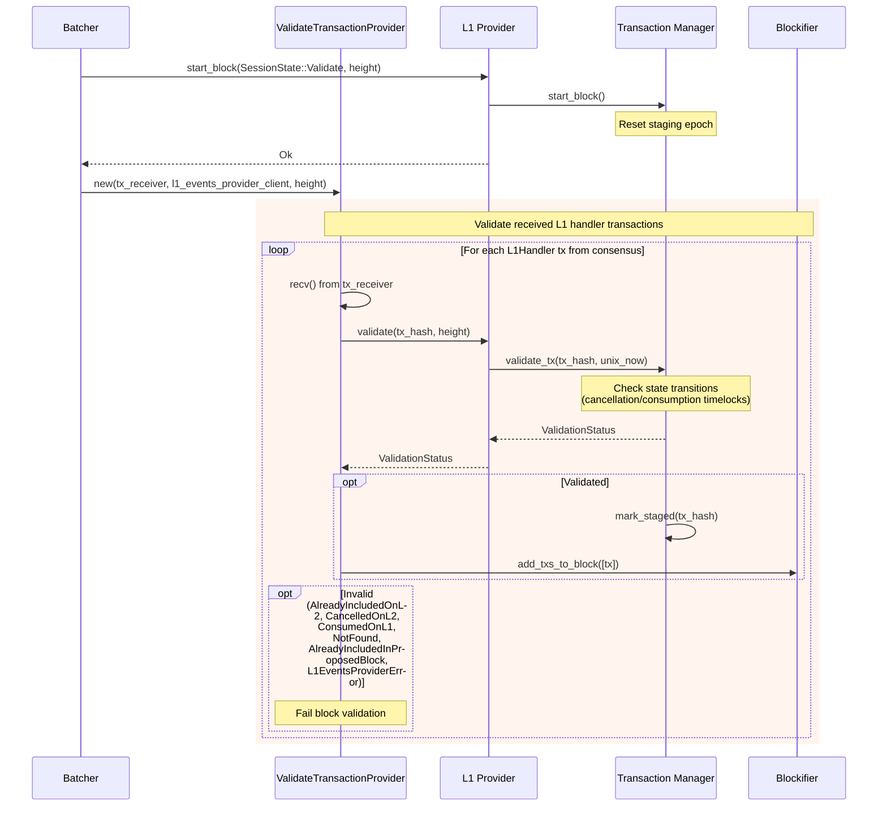

## Analysis

I found a genuine structural analog to the Y2K "grace period may exceed epoch end time" bug class in the L1 handler transaction cancellation/consumption lifecycle. The root issue in the original report is that a **time-bound state transition** (grace period vs. epoch resolution) is evaluated against a wall-clock condition that is **not pinned to a deterministic point**, so different callers evaluating the same time-bound check at different real moments can reach different outcomes for the same logical operation.

The same pattern exists in `TransactionRecord::update_time_based_state`, which flips a pending L1→L2 message from `CancellationStartedOnL2` to `CancelledOnL2` purely based on `unix_now` compared against `cancellation_requested_at + cancellation_timelock`: [1](#0-0) 

This is invoked from `TransactionManager::validate_tx`, which takes `unix_now` as a live parameter (not a deterministic, block-scoped value) each time a node validates an L1-handler transaction reachable from another node's proposal: [2](#0-1) 

The L1-handler propose/validate/commit flow diagram confirms `validate_tx(tx_hash, unix_now)` is called independently at proposal-build time and again at proposal-validation time (by every validator, at whatever real time it happens to receive/process the proposal): [3](#0-2) 

The test suite explicitly documents the resulting edge case — that a transaction can be "validatable before expiry, but if validated again after expiry" (i.e., by a slower validator, or a re-proposal in a later round) it returns a different verdict: [4](#0-3) 

The `timing_flows.rs` integration test also demonstrates that whether a given L1 handler tx is proposable/validatable flips deterministically only *within a single fake clock*, but in production this clock is each node's real wall clock, evaluated fresh on every `validate()`/`get_txs()` call: [5](#0-4) 

### Title
Non-deterministic wall-clock evaluation of L1-handler cancellation timelock can cause honest-validator rejection of valid proposals - (File: `crates/apollo_l1_events/src/transaction_record.rs`)

### Summary
`TransactionRecord::update_time_based_state` transitions a pending L1-to-L2 message from `CancellationStartedOnL2` to `CancelledOnL2` based on comparing a live `unix_now` parameter against `cancellation_requested_at + cancellation_timelock`. This check is re-evaluated independently by the proposer (at proposal-build time) and by every validator (at proposal-validation time, potentially a full round or more later), using each node's own real-time clock rather than a value pinned to the block/proposal being agreed upon.

### Finding Description
A block proposer calling `get_txs`/`TransactionManager` includes an L1 handler transaction in a proposal if, at the exact moment of proposal construction, the record's `is_validatable()` check based on `update_time_based_state(unix_now, policy)` returns true (i.e., the cancellation timelock has not yet elapsed) — [6](#0-5) . Validators, however, call the identical `validate_tx` path with their own `unix_now`, evaluated when they process the proposal — which can be seconds to many seconds later depending on network latency, execution time, and round timeouts. If the cancellation timelock boundary falls between the proposer's build time and a validator's validation time, the validator's `update_time_based_state` will observe `is_cancellation_timelock_passed == true` while the proposer's did not, transitioning the record to `CancelledOnL2` and causing `is_validatable()` to return false — [1](#0-0) . This yields `InvalidValidationStatus::CancelledOnL2` for a transaction the proposer legitimately included, causing that validator to fail validation of an otherwise valid proposal — [7](#0-6) .

This is directly analogous to the reported class: a time-bound state resolution (cancellation timelock expiry, standing in for "epoch end") is not synchronized across all parties who must agree on the outcome, so the same real-world event (the tx's validity) can resolve differently depending on when each party checks it relative to the boundary — exactly the "epoch end vs. grace period" timing mismatch in the original report.

### Impact Explanation
Because the timelock boundary is evaluated per-node/per-call rather than pinned deterministically to the block/proposal being agreed on, a subset of honest validators can reject a proposal that other honest validators (and the proposer) considered valid. Depending on quorum thresholds, this can stall the round (forcing a timeout/re-proposal) or, in adversarial timing, be exploited by a proposer choosing to submit a message whose expiry aligns just past their own build window, deliberately targeting validators with slower processing to reject the block — a form of honest-node divergence over the correctness of a committed transaction set. This can degrade liveness (repeated round failures near timelock boundaries) and, in the worst case, cause a subset of validators to diverge on whether a transaction is includable, undermining the network's ability to confirm new transactions in a timely and consistent manner.

### Likelihood Explanation
The condition requires only that the interval between proposal build and validation (network + processing latency, or round-timeout retries) straddle the `l1_handler_cancellation_timelock_seconds` boundary for some in-flight L1 handler message. This is naturally reachable any time an L1 cancellation request is sent close to a proposal's build time and the round takes even a few seconds to propagate — an ordinary operational condition, not requiring privileged access; the L1 cancellation request is a normal message any L1 sender can emit, and the resulting race is purely a function of the network's message-relay time relative to `cancellation_timelock_seconds` (config default is nonzero per `l1_handler_cancellation_timelock_seconds`, see `crates/apollo_l1_events_config/src/config.rs`).

### Recommendation
Pin the cancellation/consumption timelock evaluation to a value derived deterministically from the block/proposal under consideration (e.g., the proposal's `init.timestamp`, which is already validated against a `block_timestamp_window_seconds` bound elsewhere in the codebase — see `crates/apollo_consensus_orchestrator/src/validate_proposal.rs:259-284`) rather than each node's independent `unix_now`, so that every honest party evaluating a given proposal reaches the same validity determination for L1 handler transactions regardless of when it happens to process that proposal.

### Proof of Concept
1. Node A (proposer) builds a proposal at `unix_now = T`. An L1 handler tx `X` has `cancellation_requested_at = T - cancellation_timelock + 1` (timelock not yet expired at `T`), so `TransactionManager::validate_tx`/`get_txs` includes `X` — [6](#0-5) .
2. The proposal is broadcast; Node B (validator) receives and processes it at `unix_now = T + 2` (after normal network/processing delay), which now exceeds `cancellation_requested_at + cancellation_timelock`.
3. Node B calls `validate(tx_hash, height)` → `TransactionManager::validate_tx` → `update_time_based_state` transitions the record to `CancelledOnL2`, and `is_validatable()` returns `false` — [8](#0-7) .
4. Node B returns `InvalidValidationStatus::CancelledOnL2`, failing block validation for a proposal Node A and possibly other validators accepted, as exercised by the existing unit test demonstrating exactly this "validated before expiry, cancelled after expiry" transition — [4](#0-3) .

### Citations

**File:** crates/apollo_l1_events/src/transaction_record.rs (L191-208)
```rust
    /// Update the state of the record based on the current time and policy.
    /// This updates the state based on time-based state transitions, such as moving from
    /// CancellationStartedOnL2 to CancelledOnL2 after the timelock expires.
    pub fn update_time_based_state(&mut self, unix_now: u64, policy: TransactionRecordPolicy) {
        if let Some(requested_at) = self.cancellation_requested_at {
            if self.committed {
                return; // Committing overrides cancellations.
            }

            let cancellation_timelock = &policy.cancellation_timelock.as_secs();
            let is_cancellation_timelock_passed =
                unix_now >= *requested_at.saturating_add(cancellation_timelock);

            if is_cancellation_timelock_passed {
                self.state = TransactionState::CancelledOnL2;
            }
        }
    }
```

**File:** crates/apollo_l1_events/src/transaction_manager.rs (L116-145)
```rust
    pub fn validate_tx(&mut self, tx_hash: TransactionHash, unix_now: u64) -> ValidationStatus {
        let current_staging_epoch_cloned = self.current_staging_epoch;

        let policy = TransactionRecordPolicy {
            cancellation_timelock: self.config.l1_handler_cancellation_timelock_seconds,
        };

        let validation_status = self.with_record(tx_hash, |record| {
            // If the current time affects the state, update state now.
            record.update_time_based_state(unix_now, policy);
            if !record.is_validatable() {
                match record.state {
                    TransactionState::Committed => {
                        InvalidValidationStatus::AlreadyIncludedOnL2.into()
                    }
                    TransactionState::CancelledOnL2 => {
                        InvalidValidationStatus::CancelledOnL2.into()
                    }
                    TransactionState::Consumed => InvalidValidationStatus::ConsumedOnL1.into(),
                    _ => unreachable!(),
                }
            } else if record.try_mark_staged(current_staging_epoch_cloned) {
                ValidationStatus::Validated
            } else {
                InvalidValidationStatus::AlreadyIncludedInProposedBlock.into()
            }
        });

        validation_status.unwrap_or(InvalidValidationStatus::NotFound.into())
    }
```

**File:** docs/diagrams/06-l1-handler-flow.md (L112-151)
```markdown
## Block Validation - Validating L1 Transactions



**File:** crates/apollo_l1_events/src/l1_events_provider_tests.rs (L859-886)
```rust
#[test]
fn validate_tx_cancellation_requested_validated_then_expired_returns_cancelled() {
    // Setup.
    let tx_1 = l1_handler(1);
    let clock = Arc::new(FakeClock::new(5));
    let mut l1_events_provider = L1EventsProviderContentBuilder::new()
        .with_clock(clock.clone())
        .with_nonzero_timelock_setup()
        .with_cancel_requested_txs([tx_1.clone()])
        .with_state(ProviderState::Validate)
        .build_into_l1_provider();

    // Test.

    // Should be validatable before expiry,
    let status =
        l1_events_provider.validate(tx_1.tx_hash, l1_events_provider.current_height).unwrap();
    assert_eq!(status, ValidationStatus::Validated);
    // Now, advance time past expiry and validate again,
    // This tests the edge case: a tx can be validatable before expiry, but if validated again after
    // expiry, it should return the cancellation error.
    clock.advance(Duration::from_secs(
        l1_events_provider.config.l1_handler_cancellation_timelock_seconds.as_secs(),
    ));
    let status2 =
        l1_events_provider.validate(tx_1.tx_hash, l1_events_provider.current_height).unwrap();
    assert_eq!(status2, InvalidValidationStatus::CancelledOnL2.into());
}
```

**File:** crates/apollo_l1_events/tests/timing_flows.rs (L93-137)
```rust
    l1_events_provider.start_block(l1_events_provider.current_height, Propose).unwrap();
    // Everything's timelocked.
    assert_eq!(l1_events_provider.get_txs(2, l1_events_provider.current_height).unwrap(), []);

    clock.advance(Duration::from_secs(3));
    assert_eq!(clock.unix_now(), 4);

    // Cancellation request is stronger than new message cooldown, and prevents proposal forever.
    assert_eq!(l1_events_provider.get_txs(2, l1_events_provider.current_height).unwrap(), []);

    // But validate still works, cause cancellation timelock hasn't passed yet for anyone.
    l1_events_provider.start_block(l1_events_provider.current_height, Validate).unwrap();
    assert_eq!(
        l1_events_provider.validate(tx_hash!(2), l1_events_provider.current_height).unwrap(),
        Validated
    );
    assert_eq!(
        l1_events_provider.validate(tx_hash!(3), l1_events_provider.current_height).unwrap(),
        Validated
    );
    assert_eq!(
        l1_events_provider.validate(tx_hash!(4), l1_events_provider.current_height).unwrap(),
        Validated
    );

    clock.advance(Duration::from_secs(2));
    assert_eq!(clock.unix_now(), 6);
    // Passed timelock for the first non-cancelled transaction.
    l1_events_provider.start_block(l1_events_provider.current_height, Propose).unwrap();
    assert_eq!(
        l1_events_provider.get_txs(2, l1_events_provider.current_height).unwrap(),
        vec![l1_handler(4)]
    );

    // One of the l1 handlers is passed its cancellation timelock, no longer validatable.
    l1_events_provider.start_block(l1_events_provider.current_height, Validate).unwrap();
    for _ in 0..2 {
        assert_eq!(
            l1_events_provider.validate(tx_hash!(2), l1_events_provider.current_height).unwrap(),
            Invalid(CancelledOnL2)
        ); // Check twice for idempotency.
    }
    assert_eq!(
        l1_events_provider.validate(tx_hash!(3), l1_events_provider.current_height).unwrap(),
        Validated
```
