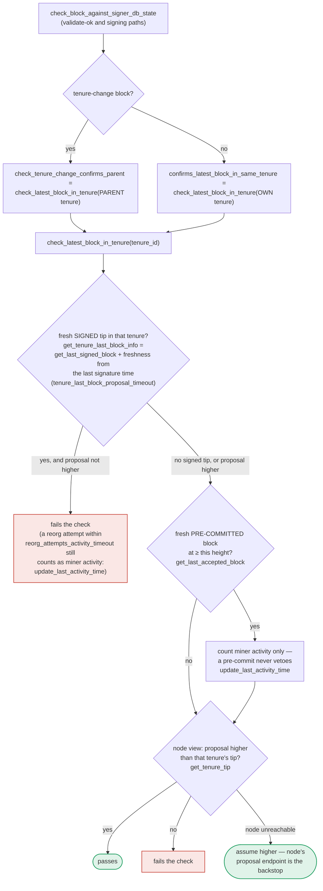

## Analysis

I found a valid analog. The eBTC finding is that **one action's validation rules were weaker than the sibling actions that are supposed to protect the same invariant**, letting an attacker exploit the weaker path to break a guarantee the stricter paths enforce. The `stacks-signer` codebase has exactly this shape: two live protocol-version code paths (`v1` and `v2`) implement the *same* "reject a duplicate/competing tenure-start block" rule with different strictness, and only one of the two paths is later re-checked. [1](#0-0) 

The v1 implementation only consults **globally accepted** blocks, while v2 additionally counts **locally accepted (signed-but-not-yet-pushed)** blocks: [2](#0-1) [3](#0-2) 

And this `DuplicateBlockFound` check only runs at proposal time — it is never re-run at validate-ok or at signing, unlike the tenure-confirmation check which is re-checked three times: [4](#0-3) 

### Title
Version-dependent `DuplicateBlockFound` check lets v1 signers sign a competing tenure-start block that v2 signers correctly reject - (File: `stacks-signer/src/chainstate/v1.rs`, `stacks-signer/src/chainstate/v2.rs`)

### Summary
`validate_tenure_change_payload` is meant to stop a miner from equivocating on the first ("BlockFound") block of a tenure by rejecting any second tenure-change proposal for a tenure that already has an accepted first block. The v2 implementation treats a **locally accepted** (signed but not yet globally confirmed) block as sufficient to reject the duplicate, matching how the sibling "own-tenure conflict" logic in the pre-commit/signature path (`get_signed_conflicts`, section 5 of `docs/signer-flows.md`) treats a signature as binding the instant it is cast. The v1 implementation only looks at **globally accepted** blocks — a much weaker bar that a malicious/equivocating miner can stay under indefinitely, since global acceptance requires the 70% signature threshold to be reached and pushed to the node.

### Finding Description
`check_proposal`/`validate_tenure_change_payload` is the only place this duplicate check runs; it is not re-verified at validate-ok time or at signing time (unlike `check_latest_block_in_tenure`, which is re-run in all three places). This means that once a signer running the v1 chainstate module has passed a tenure-change proposal through this gate, nothing downstream will catch a later equivocating proposal for the same tenure via this specific rule.

Consider a mixed-version signer fleet (a normal, expected topology during any signer-set upgrade window) evaluating two different `TenureChangeCause::BlockFound` proposals, A and B, for the same tenure, before either has reached 70% weight and been pushed to the stacks-node (i.e., before global acceptance):

- A signer running the **v2** chainstate module that has already locally accepted (signed) proposal A will reject B via `get_last_signed_block` in `validate_tenure_change_payload` (v2.rs:344-357), and separately via the own-tenure-conflict logic in section 5.
- A signer running the **v1** chainstate module evaluates B against `get_last_globally_accepted_block` (v1.rs:505-518). Because nothing has been globally accepted yet (A has not reached 70%/been pushed to the node), this check passes, and the v1 signer proceeds to validate and potentially sign B.

The equality that should hold — "no signer will place its signature over more than one first-block of the same tenure once any signer has already signed a competing first-block" — is broken solely because of which protocol-version module a given signer happens to be running, not because of any economic or majority action by an attacker. A single equivocating miner (an ordinary, unprivileged sortition winner) is sufficient to present A and B to different subsets of the signer set.

### Impact Explanation
This is a **minority-triggerable validation-verdict divergence**: two conformant signers, given the same inputs (one miner, one tenure, two competing tenure-start proposals), reach different verdicts purely due to code-path version, not due to any Byzantine or majority behavior. If the v1-side weight combined with any signers who overlap on both proposals is enough to push B over the 70% signing threshold while a disjoint v2 cohort has already committed to A, the node can end up needing to reconcile two different candidate tenure-start blocks — i.e., a temporary tip disagreement / mini-fork at a tenure boundary, exactly the class of "signer weight/verdict divergence" impact called out as in-scope (temporary tip disagreement, High).

### Likelihood Explanation
Likelihood is low-to-moderate: it requires (a) an equivocating miner willing to present two different BlockFound proposals for its own tenure, and (b) a live mix of v1/v2 signer nodes at the time (a normal occurrence during a network-wide signer upgrade, as documented by the existence of both modules and the compatibility fallback logic elsewhere in `signer.rs`). No majority stake or admin access is required — only a single misbehaving miner and the passive presence of not-yet-upgraded v1 signers.

### Recommendation
Make the duplicate/competing-tenure-start check version-independent and as strict as the v2 rule everywhere: base it on `get_last_signed_block` (locally or globally accepted) rather than `get_last_globally_accepted_block`, and additionally re-run it (or an equivalent own-tenure-conflict check) at validate-ok and at the pre-commit-threshold signing step, mirroring how `check_latest_block_in_tenure` is already re-verified in all three places.

### Proof of Concept
1. Boot a mixed signer set: some nodes running the v1 chainstate module, some running v2, all signing for the same tenure.
2. Have the tenure's winning miner submit tenure-change proposal A (`TenureChangeCause::BlockFound`) for consensus hash `CH`. Allow a subset of signers (mixed v1/v2) to locally accept/sign A, but stop short of 70% total weight / global acceptance (e.g., stall network delivery to the remaining signers, similar to `TEST_VALIDATE_STALL` used in `stacks-node/src/tests/signer/v0/reorg.rs`).
3. Have the same miner submit a second, different tenure-change proposal B, also `BlockFound`, also claiming `prev_tenure_consensus_hash` = the same parent tenure, but with a different block body/consensus hash, to the signers that have not yet seen/signed A.
4. Observe: v2 signers that already signed A reject B with `RejectReason::DuplicateBlockFound` (v2.rs `validate_tenure_change_payload`, using `get_last_signed_block`). v1 signers that have not seen a *globally accepted* block for `CH` accept and sign B, since `get_last_globally_accepted_block` returns `None` (v1.rs `validate_tenure_change_payload`).
5. Assert that some v1-only signers now hold signatures over B while some v2 signers hold signatures over A for the same tenure — a verdict divergence produced purely by protocol-version code path, matching the flow already partially exercised by `reorg_attempts_activity_timeout_exceeded` and the 50/50-split integration tests referenced in `docs/signer-flows.md:513-524`.

### Citations

**File:** docs/signer-flows.md (L389-437)
```markdown
## 7. The chainstate checks (shared)

`check_latest_block_in_tenure` answers "does this block confirm the tip we
expect?" and it runs in three places: at proposal arrival (inside
`check_proposal`), at validate-ok, and at the moment of signing. _Which_ tenure
it is asked about depends on the block: a tenure-change block is checked against
its **parent** tenure, every other block against its **own**. Never both. The
pivotal helper is `get_tenure_last_block_info`, which considers only blocks that
carry a signature (`get_last_signed_block`): a pre-commit never vetoes anything,
it only counts as miner activity.



A failed check becomes a different rejection depending on who asked.
`check_block_against_signer_db_state` returns `SortitionViewMismatch`, or
`ConnectivityIssues` when the lookup itself errored rather than answering; the v2
`check_proposal` path returns `InvalidParentBlock`.

Two things belong to the proposal path only and are **not** re-run at validate-ok
or at signing:

- `validate_tenure_change_payload` rejects with `DuplicateBlockFound` when we
  have already accepted a block in the tenure a tenure-change block is starting.
  v2 counts locally or globally accepted blocks (`get_last_signed_block`); v1
  counts only globally accepted ones (`get_last_globally_accepted_block`).
- the v2 `check_proposal` wrapper checks miner pubkey hash, consensus hash, the
  pox bitvec, and tenure-extend rules before delegating here.

Because the duplicate check never runs again, a block that crosses the pre-commit
threshold long after it was proposed relies on section 5's own-tenure conflict
guard to cover the same ground.
```

**File:** stacks-signer/src/chainstate/v1.rs (L505-518)
```rust
        let last_in_current_tenure = signer_db
            .get_last_globally_accepted_block(&block.header.consensus_hash)
            .map_err(|e| {
                SignerChainstateError::from(ClientError::InvalidResponse(e.to_string()))
            })?;
        if let Some(last_in_current_tenure) = last_in_current_tenure {
            warn!(
                "Miner block proposal contains a tenure change, but we've already signed a block in this tenure. Considering proposal invalid.";
                "proposed_block_consensus_hash" => %block.header.consensus_hash,
                "proposed_block_signer_signature_hash" => %block.header.signer_signature_hash(),
                "last_in_tenure_signer_signature_hash" => %last_in_current_tenure.block.header.signer_signature_hash(),
            );
            return Err(RejectReason::DuplicateBlockFound);
        }
```

**File:** stacks-signer/src/chainstate/v2.rs (L340-357)
```rust
        // We already confirmed in check miner activity that the current tenure is valid. So check we are not
        // reorging the tenure blocks. Only blocks we have signed (locally or globally accepted) count
        // here: a block we have merely pre-committed to carries no signature from us, so it is safe to
        // accept a competing tenure-start block in its place if it failed to reach consensus.
        let last_in_current_tenure = signer_db
            .get_last_signed_block(&block.header.consensus_hash)
            .map_err(|e| {
                SignerChainstateError::from(ClientError::InvalidResponse(e.to_string()))
            })?;
        if let Some(last_in_current_tenure) = last_in_current_tenure {
            warn!(
                "Miner block proposal contains a tenure change, but we've already signed a block in this tenure. Considering proposal invalid.";
                "proposed_block_consensus_hash" => %block.header.consensus_hash,
                "proposed_block_signer_signature_hash" => %block.header.signer_signature_hash(),
                "last_in_tenure_signer_signature_hash" => %last_in_current_tenure.block.header.signer_signature_hash(),
            );
            return Err(RejectReason::DuplicateBlockFound);
        }
```
