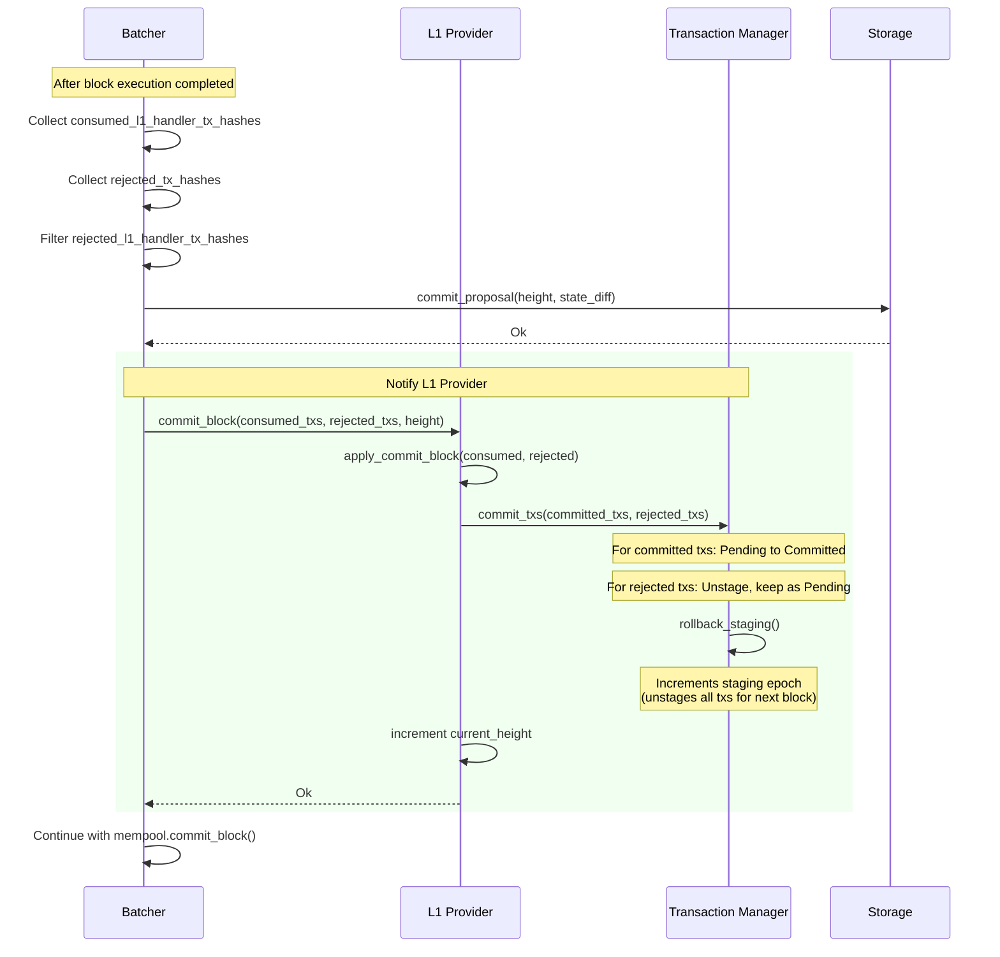

Based on my investigation, I found a direct structural analog to the reported Solidity issue in the `apollo_l1_events` crate's L1 handler transaction state machine.

### Title
Missing Status Precondition Check Before State Transition in `TransactionRecord::mark_committed` / `TransactionManager::commit_txs` - (File: `crates/apollo_l1_events/src/transaction_record.rs`)

### Summary
The `_distribute` bug class in the report is: a state-mutating function transitions an entity's status without validating that its *current* status is the expected precondition (`Pending`) first. The same pattern exists in `TransactionManager::commit_txs`, which calls `TransactionRecord::mark_committed()` for every hash in `committed_txs` without verifying the transaction's current `TransactionState` is `Pending` (or otherwise eligible) before transitioning it to `Committed`.

### Finding Description
`commit_txs` iterates over `committed_txs` and calls `mark_committed()` unconditionally: [1](#0-0) 

`mark_committed()` itself only asserts against the `committed: bool` metadata flag — it never checks the actual `state` enum (`Pending`, `Rejected`, `CancelledOnL2`, `Consumed`, `CancellationStartedOnL2`, etc.) before overwriting it to `Committed`: [2](#0-1) 

This mirrors the audited bug exactly: instead of requiring `milestoneStatus == Pending` before distributing, this code requires only that a local `committed` boolean was previously `false`, not that the transaction's lifecycle state was in the expected `Pending` precondition. Other transition functions in the same file exhibit the same pattern — e.g. `mark_cancellation_request` only checks `is_committed()`, not the full state, before force-transitioning into `CancellationStartedOnL2`: [3](#0-2) . Note `is_validatable()` treats any non-`Committed`/`Cancelled`/`Consumed` state (including `CancellationStartedOnL2` reached from a `Rejected` state) as re-validatable: [4](#0-3) 

### Impact Explanation
An L1 handler transaction whose local record has already progressed to `Rejected`, `CancelledOnL2`, or `Consumed` (states that should preclude further inclusion) can have its status force-overwritten to `Committed`/`CancellationStartedOnL2` without any check that it was actually `Pending`. This breaks the intended invariant that `Records` accurately reflects the true, singly-directional lifecycle of an L1→L2 message, which the whole `L1EventsProvider` state machine (`validate`, `get_txs`, `commit_block`) relies on for correctness of which L1 handler transactions are eligible for proposal/validation. Depending on race ordering between L1 scraping (consumption/cancellation events) and block commit, this can desynchronize a node's bookkeeping of an L1 handler transaction's true status from reality.

### Likelihood Explanation
Reaching this requires only an L1 message that is later cancelled or consumed on L1 racing with a block commit that includes/rejects the same transaction hash — no privileged proposer or operator behavior is required, only ordinary asynchronous L1 event scraping timing relative to L2 block finalization. However, I could not confirm a concrete, provable path from this record-bookkeeping desync to an actual wrong committed state root, honest-node divergence, or double execution of the L1 handler's payload, since `commit_txs` only updates internal provider metadata and does not itself drive re-execution of the transaction by the blockifier — the actual transaction data was already executed/committed via the separate block-execution pipeline before `commit_block` is invoked, per the flow documented at [5](#0-4) .

### Recommendation
Add an explicit precondition check in `mark_committed()` (and similarly in `mark_cancellation_request`) that the current `state` is one of the states from which the transition is valid (e.g., `Pending`), returning an error/logging a hard warning otherwise, rather than relying solely on the derived `committed`/`rejected` boolean flags.

### Proof of Concept
Not independently verifiable as a concrete fund-loss/divergence exploit from the available code alone — this is a code-pattern analog (missing status precondition check before a state-transition) rather than a proven end-to-end exploit. I recommend a Devin session with full test-suite access to construct a concrete repro in `crates/apollo_l1_events/src/transaction_manager_tests.rs`/`l1_events_provider_tests.rs` (race an L1 `ConsumedMessageToL2`/cancellation event against `commit_txs` including the same `tx_hash`) to determine whether this can be escalated beyond a bookkeeping inconsistency to a reachable consensus or fund-safety impact.

### Citations

**File:** crates/apollo_l1_events/src/transaction_manager.rs (L147-157)
```rust
    pub fn commit_txs(
        &mut self,
        committed_txs: &[TransactionHash],
        rejected_txs: &[TransactionHash],
    ) {
        self.rollback_staging();

        for &tx_hash in committed_txs {
            self.create_record_if_not_exist(tx_hash);
            self.with_record(tx_hash, |r| r.mark_committed()).unwrap();
        }
```

**File:** crates/apollo_l1_events/src/transaction_record.rs (L50-60)
```rust
    pub fn mark_committed(&mut self) {
        // Can't return error because committing only part of a block leaves the provider in an
        // undetermined state.
        assert!(
            !self.committed,
            "L1 handler transaction {} committed twice, this may lead to l2 reorgs,",
            self.tx.tx_hash()
        );
        self.state = TransactionState::Committed;
        self.committed = true;
    }
```

**File:** crates/apollo_l1_events/src/transaction_record.rs (L77-101)
```rust
    pub fn mark_cancellation_request(
        &mut self,
        timestamp: BlockTimestamp,
    ) -> Option<BlockTimestamp> {
        let tx_hash = self.tx.tx_hash();
        // Once committed on L2, cancellation requests are only recorded for debugging purposes, but
        // not processed.
        if self.is_committed() {
            warn!(
                "L1 handler transaction {tx_hash} was not marked for cancellation started on L2 \
                 as it is already committed."
            )
        } else {
            info!("Marking L1 handler transaction {tx_hash} as cancellation started on L2.");
            self.state = TransactionState::CancellationStartedOnL2;
        }

        match self.cancellation_requested_at {
            Some(existing) => Some(existing),
            None => {
                self.cancellation_requested_at = Some(timestamp);
                None
            }
        }
    }
```

**File:** crates/apollo_l1_events/src/transaction_record.rs (L179-181)
```rust
    pub fn is_validatable(&self) -> bool {
        !self.is_committed() && !self.is_cancelled() && !self.is_consumed()
    }
```

**File:** docs/diagrams/06-l1-handler-flow.md (L154-189)
```markdown
## Block Commit - Finalizing L1 Transactions


```
