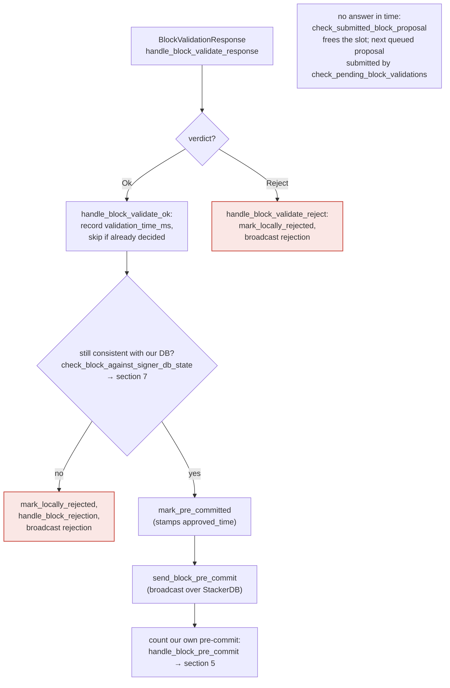

Confirmed: `libsigner/src/events.rs` has zero authentication (no token/password check) on the signer's inbound HTTP event listener. This confirms the vulnerability path below.

### Title
Unauthenticated Injection of Fake Block-Validation Verdicts into the Signer's Event Listener - (File: libsigner/src/events.rs)

### Summary
The `stacks-signer` binary runs an HTTP server (`SignerEventReceiver`) that is meant to receive events only from its paired `stacks-node` via the node's `[[events_observer]]` HTTP POST mechanism. This listener performs no authentication whatsoever on incoming requests to `/proposal_response`, `/stackerdb_chunks`, `/new_burn_block`, or `/new_block` — any TCP client that can reach the bound socket can POST a JSON payload and have it processed as if it came from the trusted local node.

### Finding Description
`SignerEventReceiver::next_event` in `libsigner/src/events.rs` dispatches based solely on the URL path of the incoming HTTP request, with no signature, token, or peer-identity check: [1](#0-0) 

The `auth_token`/`auth_password` mechanism documented for signer/node coordination governs only the *node's* `/v3/block_proposal` endpoint (i.e., how the signer authenticates to the node) — it is never referenced or checked anywhere in `libsigner`, confirmed by an empty grep for `auth_token`/`Authorization`/`auth_password` in the `libsigner` crate. There is no analogous protection on the *signer's own* listener that accepts events claiming to originate from the node.

Among the accepted paths, `/proposal_response` deserializes directly into a `BlockValidateResponse` and is treated as ground truth for "the node's validation verdict": [2](#0-1) 

That verdict flows straight into `handle_block_validate_response` → `handle_block_validate_ok`, which — if the signer is already tracking the given `signer_signature_hash` (e.g., because it received a real proposal for that block earlier) — marks the block pre-committed and broadcasts a pre-commit/vote for it, without the signer's own node ever having actually validated it: [3](#0-2) 

`docs/signer-flows.md` itself documents that this event is treated as *the* authoritative validation verdict ("The stacks-node answers the `/v3/block_proposal` submission... On OK, the signer... broadcasts a pre-commit"), i.e. the signer has no independent way to detect that the verdict it received did not actually come from its node: [4](#0-3) 

The equality that this breaks is: *the block-validation verdict the signer acts on* should equal *the verdict its own connected stacks-node actually produced*. An attacker who can reach the signer's event port can force these to diverge — supplying an `Ok` verdict for a block the node never validated (or actually rejected), or suppressing/racing a real rejection with a forged acceptance.

Sample configurations across the repo bind this listener to `0.0.0.0` (all interfaces) rather than loopback: [5](#0-4) 

The code even contains an explicit runtime warning acknowledging this exposure risk without providing any actual protection: [6](#0-5) 

### Impact Explanation
This is directly analogous to the reported Prefect flaw: an event-ingestion endpoint meant to be fed only by a trusted internal component accepts unauthenticated input from any network-reachable client. Here the consequence is protocol-relevant: a single attacker-reachable signer can be made to issue a pre-commit / signature vote for a block that its own node never validated, i.e., a validation-verdict divergence between what the node determined and what the signer acted on. Per the scope rules, this qualifies as a **High**-severity, minority-triggerable validation-divergence finding (bounded to affecting the specific signer(s) reachable at that exposed endpoint, not requiring majority collusion to *trigger* the divergence — though moving the overall network signature tally would still require sufficient colluding/duped weight).

### Likelihood Explanation
Reachability depends on network exposure of the signer's event port; several shipped reference configs bind it to `0.0.0.0`, and the code's own warning acknowledges this is a real operational risk ("communicating with an external node... could potentially expose sensitive data or functionalities to security risks if additional proper security checks are not integrated"). No cryptographic secret is required by the attacker — this is not gated by the node's `auth_token`, which protects the opposite direction (signer→node), leaving the node→signer direction wholly unauthenticated. This matches the "unprivileged, minority-triggerable" bar from the rules.

### Recommendation
Add authentication to `SignerEventReceiver`'s HTTP listener (e.g., require and verify the same `auth_token`/`auth_password` shared secret already used for node↔signer coordination, checked via an `Authorization` header on every incoming POST) before processing `/proposal_response`, `/stackerdb_chunks`, `/new_burn_block`, and `/new_block` bodies. Additionally, default-bind the signer's `endpoint` to loopback and require explicit opt-in (with authentication mandatory) for any non-loopback bind.

### Proof of Concept
1. Signer S is configured per `sample/conf/signer/mainnet-signer-conf.toml`, listening on `0.0.0.0:30000` (no unique secret checked on that port).
2. A real miner proposes block B; S receives the genuine `BlockProposal` via `/stackerdb_chunks` from its paired node and stores `BlockInfo` for `signer_signature_hash(B)`, then submits it to the node for validation (`submit_block_for_validation`).
3. Before (or instead of) the node's real response, an attacker with network access to `30000` sends:
```
POST /proposal_response HTTP/1.1
Host: <signer-ip>:30000
Content-Type: application/json
Content-Length: <n>

{"Ok": {"signer_signature_hash": "<B's hash>", "cost": {...}, "validation_time_ms": 0, ...}}
```
4. `process_event::<T, BlockValidateResponse>` deserializes this with no auth check (`libsigner/src/events.rs:438-440`), forwards `SignerEvent::BlockValidationResponse(BlockValidateResponse::Ok(...))` to the runloop.
5. `handle_block_validate_response` → `handle_block_validate_ok` finds the tracked `block_info` for that hash and — absent any signer-db state conflict — calls `mark_pre_committed` and `send_block_pre_commit`, broadcasting a pre-commit signal for B over StackerDB even though the *actual* node never returned this verdict (or returned `Reject`), demonstrating the validation-verdict divergence (`stacks-signer/src/v0/signer.rs:1882-1985`).

### Citations

**File:** libsigner/src/events.rs (L430-448)
```rust
            if request.method() != &HttpMethod::Post {
                return Err(EventError::MalformedRequest(format!(
                    "Unrecognized method '{}'",
                    request.method(),
                )));
            }
            debug!("Processing {} event", request.url());
            if request.url() == "/stackerdb_chunks" {
                process_event::<T, StackerDBChunksEvent>(request)
            } else if request.url() == "/proposal_response" {
                process_event::<T, BlockValidateResponse>(request)
            } else if request.url() == "/new_burn_block" {
                process_event::<T, BurnBlockEvent>(request)
            } else if request.url() == "/shutdown" {
                event_receiver.stop_signal.store(true, Ordering::SeqCst);
                Err(EventError::Terminated)
            } else if request.url() == "/new_block" {
                process_event::<T, StacksBlockEvent>(request)
            } else {
```

**File:** stacks-signer/src/v0/signer.rs (L1882-1985)
```rust
    /// Handle the block validate ok response
    fn handle_block_validate_ok(
        &mut self,
        stacks_client: &StacksClient,
        block_validate_ok: &BlockValidateOk,
        sortition_state: &mut Option<SortitionsView>,
    ) {
        crate::monitoring::actions::increment_block_validation_responses(true);
        let signer_signature_hash = &block_validate_ok.signer_signature_hash;
        if self
            .submitted_block_proposal
            .as_ref()
            .map(|(proposal_hash, _)| proposal_hash == signer_signature_hash)
            .unwrap_or(false)
        {
            self.submitted_block_proposal = None;
        }
        if let Some(replay_tx_hash) = block_validate_ok.replay_tx_hash {
            info!("Inserting block validated by replay tx";
                "signer_signature_hash" => %signer_signature_hash,
                "replay_tx_hash" => replay_tx_hash
            );
            self.signer_db
                .insert_block_validated_by_replay_tx(
                    signer_signature_hash,
                    replay_tx_hash,
                    block_validate_ok.replay_tx_exhausted,
                )
                .unwrap_or_else(|e| {
                    warn!("{self}: Failed to insert block validated by replay tx: {e:?}")
                });
        }
        // For mutability reasons, we need to take the block_info out of the map and add it back after processing
        let Some(mut block_info) = self.block_lookup_by_reward_cycle(signer_signature_hash) else {
            // We have not seen this block before. Why are we getting a response for it?
            debug!("{self}: Received a block validate response for a block we have are not tracking. Ignoring...");
            return;
        };

        // Record the block validation time but do not consider stx transfers or boot contract calls
        block_info.validation_time_ms = if block_validate_ok.cost.is_zero() {
            Some(0)
        } else {
            Some(block_validate_ok.validation_time_ms)
        };

        self.signer_db
            .insert_block(&block_info)
            .unwrap_or_else(|e| self.handle_insert_block_error(e));

        if block_info.valid.is_some() {
            // We should only have valid set if we have already processed a validation response for this block OR we locally marked it as rejected
            // and responded to it. If we received a new proposal for it that we wished to consider, we would have reset valid to None.
            // This is only really possible when a signer is sharing a node or we have timed out a pending validation and it suddenly arrives.
            warn!(
                "{self}: Already processed a block validate response for block {}. Ignoring validation response.", block_info.block.header.signer_signature_hash(); "valid" => ?block_info.valid,
            );
            return;
        }
        if !block_info.check_static_valid_block() {
            debug!("{self}: Block is syntatically invalid; will not store");
            return;
        }

        if let Some(block_rejection) =
            self.check_block_against_signer_db_state(stacks_client, &block_info.block)
        {
            // The signer db state has changed. We no longer view this block as valid. Override the validation response.
            if let Err(e) = block_info.mark_locally_rejected() {
                if !block_info.has_reached_consensus() {
                    warn!("{self}: Failed to mark block as locally rejected: {e:?}");
                }
            };
            self.signer_db
                .insert_block(&block_info)
                .unwrap_or_else(|e| self.handle_insert_block_error(e));
            self.handle_block_rejection(&block_rejection, sortition_state);
            self.send_block_response(&block_info.block, block_rejection.into());
        } else {
            if let Err(e) = block_info.mark_pre_committed() {
                // The block may have reached enough signatures before we validated the block so should fail to mark pre-committed
                // but still call to make sure the timestamps and validity are updated correctly.
                if !block_info.has_reached_consensus()
                    && block_info.state != BlockState::LocallyAccepted
                {
                    warn!("{self}: Failed to mark block as approved: {e:?}",);
                    return;
                }
            }

            self.signer_db
                .insert_block(&block_info)
                .unwrap_or_else(|e| self.handle_insert_block_error(e));
            self.send_block_pre_commit(signer_signature_hash.clone());
            // have to save the signature _after_ the block info
            let address = self.stacks_address.clone();
            self.handle_block_pre_commit(
                stacks_client,
                sortition_state,
                &address,
                signer_signature_hash,
            );
        }
    }
```

**File:** docs/signer-flows.md (L205-223)
```markdown
## 4. The node's validation verdict

The stacks-node answers the `/v3/block_proposal` submission. On OK, the signer
re-checks its own DB state and only then advertises willingness to sign by
broadcasting a **pre-commit**. A signature is _not_ produced here.


```

**File:** sample/conf/signer/mainnet-signer-conf.toml (L37-39)
```text
# REQUIRED: Local endpoint this signer listens on for events from the node.
# Must match the endpoint in the node's [[events_observer]] section.
endpoint = "0.0.0.0:30000"
```

**File:** stacks-signer/src/lib.rs (L123-132)
```rust
        info!("Stacks signer version {:?}", VERSION_STRING.as_str());
        info!("Starting signer with config: {:?}", config);
        warn!(
            "Reminder: The signer is primarily designed for use with a local or subnet network stacks node. \
            It's important to exercise caution if you are communicating with an external node, \
            as this could potentially expose sensitive data or functionalities to security risks \
            if additional proper security checks are not integrated in place. \
            For more information, check the documentation at \
            https://docs.stacks.co/guides-and-tutorials/running-a-signer#preflight-setup"
        );
```
