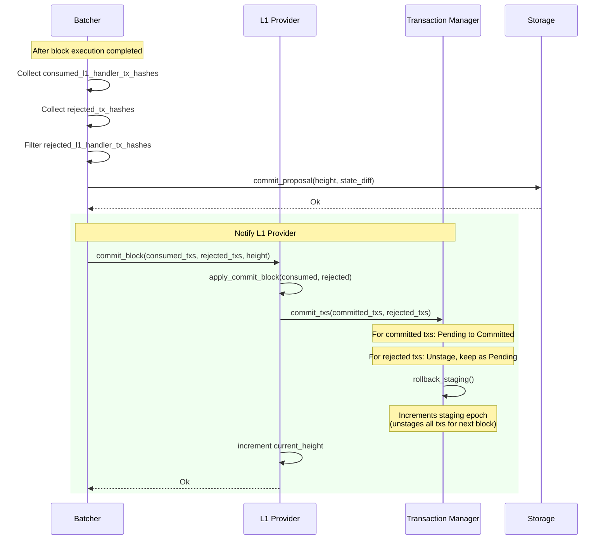

### Title
Rejected L1-to-L2 handler transactions are permanently stuck instead of being retried, and the record's own validity check does not exclude the `Rejected` state - (File: crates/apollo_l1_events/src/transaction_manager.rs)

### Summary
The L1 events `TransactionManager` moves an L1 handler transaction into a `TransactionState::Rejected` state when it is rejected in a committed block, via `TransactionManager::commit_txs` calling `TransactionRecord::mark_rejected`. Once in `Rejected` state, `is_proposable()` returns `false` (only `Pending` is proposable), so `maintain_indices` permanently drops the transaction from `proposable_index` and no honest node will ever propose it again — even though the design intent documented in `docs/diagrams/06-l1-handler-flow.md` explicitly says rejected txs should be "kept as Pending" (i.e., retried). At the same time, `TransactionRecord::is_validatable()` only excludes `Committed`, `CancelledOnL2`, and `Consumed` states, so a `Rejected` record still reports itself as validatable. [1](#0-0) [2](#0-1) [3](#0-2) [4](#0-3) 

### Finding Description
This mirrors the report's bug class: a "reject/invalidate" state transition that is applied unilaterally (analogous to `WithdrawRequestNFT::invalidateRequest()`) without a corresponding, consistent path back to a usable state, causing the underlying resource (there, locked eETH; here, the L1-to-L2 message/transaction) to become permanently stuck.

`commit_txs` is executed by every node (proposer and validators alike) as part of applying a committed block's outcome — it is not proposer-specific behavior, so this is reachable purely through the deterministic outcome of a single L1-originated transaction being included and rejected in a block: [3](#0-2) 

Once `mark_rejected` sets `state = TransactionState::Rejected`, `maintain_indices` (called by `with_record` after every mutation) removes the transaction from `proposable_index` because `is_proposable()` requires `TransactionState::Pending`: [5](#0-4) [6](#0-5) 

There is no function in `TransactionManager` or `TransactionRecord` that reverses this — no "un-reject"/"re-activate" path exists analogous to `WithdrawRequestNFT::validateRequest()`, so the L1 handler transaction (and the L1 message/funds it represents) can never again be proposed by any honest node. This is a permanent, protocol-level dead end for that message, reached through nothing more than a single L1-to-L2 message being executed and rejected once — no privileged or malicious actor is required to trigger the freeze.

Separately, and consistent with the report's second sub-issue (an internal state-consistency gap between "invalid" and "valid" bookkeeping), `is_validatable()` fails to treat `Rejected` as a non-validatable state: [7](#0-6) 

This inconsistency (permanently un-proposable per `is_proposable()`, but still reported "validatable" per `is_validatable()`) demonstrates the same class of bug as the report: the state machine has an asymmetric/one-way transition (valid→invalid) without matching bookkeeping for the reverse or terminal case, which the report calls out as the root cause of "stuck" funds.

### Impact Explanation
Any L1-to-L2 message whose corresponding L1 handler transaction is rejected once (e.g., transient execution failure) is permanently excluded from ever being retried by any honest node, since `commit_txs` is applied identically by all nodes upon block commitment and no code path returns a `Rejected` record to `Pending`. This constitutes a permanent freezing of the L1-originated message/transaction — the deposit or call encoded in that L1 handler will never be processed on L2 again, which is a direct funds-freezing impact analogous to the eETH being permanently stuck in the ether-fi report.

### Likelihood Explanation
The trigger requires only a single L1 handler transaction to be rejected during ordinary block execution — no malicious proposer, staker, or privileged actor is needed, since the rejection-to-permanent-exclusion transition is deterministic and applied by `commit_txs` on every node as part of normal block commitment. Any transient failure (rather than a permanent invalidity of the message) is enough to trigger irreversible exclusion.

### Recommendation
- Align `mark_rejected`/`commit_txs` behavior with the documented design intent ("keep as Pending"): either return rejected L1 handler transactions to `TransactionState::Pending` (re-inserting them into `proposable_index`) so they can be retried in a future block, or provide an explicit, well-defined re-activation path with proper invariant checks.
- Fix `TransactionRecord::is_validatable()` to explicitly exclude `TransactionState::Rejected`, so the validity predicate is consistent with `is_proposable()` and the indices maintained in `TransactionManager`.

### Proof of Concept
1. An L1 contract emits a `LogMessageToL2` event; the L1 events scraper calls `TransactionManager::add_tx`, creating a `TransactionRecord` in `Pending` state and indexing it in `proposable_index`. [8](#0-7) 
2. A block is built including this L1 handler transaction; during block commit, this transaction is classified as rejected (not committed) and passed into `commit_txs(committed_txs, rejected_txs)`. [3](#0-2) 
3. `mark_rejected` sets the record's state to `Rejected`; `maintain_indices` observes `is_proposable() == false` and removes the transaction hash from `proposable_index`. [1](#0-0) [9](#0-8) 
4. All subsequent calls to `get_txs` (proposal) will never surface this transaction hash again, since it only scans `proposable_index`, and there is no transition back to `Pending`. [10](#0-9) 
5. The L1 message underlying this transaction is now permanently unprocessable on L2 by any honest node, despite the design documentation claiming rejected transactions should remain retryable ("keep as Pending"). [11](#0-10)

### Citations

**File:** crates/apollo_l1_events/src/transaction_record.rs (L62-72)
```rust
    // Note: double reject not currently checked.
    pub fn mark_rejected(&mut self) {
        // Pedantic, this is unlikely to happen.
        assert!(
            !self.committed,
            "Attempted to reject a committed transaction {}",
            self.tx.tx_hash()
        );
        self.state = TransactionState::Rejected;
        self.rejected = true;
    }
```

**File:** crates/apollo_l1_events/src/transaction_record.rs (L155-181)
```rust
    pub fn is_proposable(&self) -> bool {
        matches!(self.state, TransactionState::Pending)
    }

    pub fn is_committed(&self) -> bool {
        matches!(self.state, TransactionState::Committed)
    }

    /// Answers whether the transaction was fully cancelled on L2 (cancellation request timelock
    /// has expired).
    pub fn is_cancelled(&self) -> bool {
        matches!(self.state, TransactionState::CancelledOnL2)
    }

    pub fn is_consumed(&self) -> bool {
        matches!(self.state, TransactionState::Consumed)
    }

    /// Answers whether any node can include this transaction in a block. This is generally possible
    /// in all states in its lifecycle, except after it had already been added to block, or a short
    /// time after it's cancellation was requested on L1. In particular, this includes states
    /// like: a rejected transaction, a new timelocked transaction, a
    /// transaction whose cancellation was requested on L1 too recently (there will be a
    /// timelock for this).
    pub fn is_validatable(&self) -> bool {
        !self.is_committed() && !self.is_cancelled() && !self.is_consumed()
    }
```

**File:** crates/apollo_l1_events/src/transaction_manager.rs (L72-97)
```rust
    pub fn get_txs(&mut self, n_txs: usize, now: u64) -> Vec<L1HandlerTransaction> {
        // Oldest        Now.sub(timelock)     Newest       Now
        //  |<---  passed  --->|                 |           |
        //  |<--- cooldown --->|                 |           |
        // t-------------------------------------------------->
        let cutoff = now.saturating_sub(self.config.l1_handler_proposal_cooldown_seconds.as_secs());
        let past_cooldown_txs = self.proposable_index.range(..cutoff);

        // Linear scan, but we expect this to be a small number of transactions (< 10 roughly).
        let unstaged_tx_hashes: Vec<_> = past_cooldown_txs
            .flat_map(|(_timestamp, tx_hashes)| tx_hashes.iter())
            .skip_while(|&&tx_hash| self.is_staged(tx_hash))
            .take(n_txs)
            .copied()
            .collect();

        for &tx_hash in unstaged_tx_hashes.iter() {
            let record = self.records.get(&tx_hash).expect("transaction should exist");
            assert_eq!(
                record.state,
                TransactionState::Pending,
                "Transaction {tx_hash} has state {:?}. Only Pending transactions should be in the \
                 proposable index.",
                record.state
            );
        }
```

**File:** crates/apollo_l1_events/src/transaction_manager.rs (L147-166)
```rust
    pub fn commit_txs(
        &mut self,
        committed_txs: &[TransactionHash],
        rejected_txs: &[TransactionHash],
    ) {
        self.rollback_staging();

        for &tx_hash in committed_txs {
            self.create_record_if_not_exist(tx_hash);
            self.with_record(tx_hash, |r| r.mark_committed()).unwrap();
        }
        for &tx_hash in rejected_txs {
            self.with_record(tx_hash, |r| r.mark_rejected()).expect(
                "Rejected L1 handler tx has no record. Unreachable: all L1 handler txs in a \
                 committed block were validated as known (validation rejects unknown hashes), \
                 sync commits with empty rejected_txs, and records are only removed via L1 \
                 cancellation/consumption, which can't race a block.",
            );
        }
    }
```

**File:** crates/apollo_l1_events/src/transaction_manager.rs (L173-209)
```rust
    pub fn add_tx(
        &mut self,
        tx: L1HandlerTransaction,
        block_timestamp: BlockTimestamp,
        scrape_timestamp: UnixTimestamp,
    ) {
        let tx_hash = tx.tx_hash;
        // If exists, return false and do nothing. If not, create the record as a HashOnly payload.
        let is_new_record = self.create_record_if_not_exist(tx_hash);
        // Replace a HashOnly payload with a Full payload. Do not update a Full payload.
        // A hash only payload can come from catching up from state sync, and then updated by
        // add_events from the scraper. However, if we get the same full tx twice (from the scraper)
        // it could indicate a double-scrape, and may cause the tx to be re-added to the proposable
        // index.
        self.with_record(tx_hash, move |record| match &record.tx {
            TransactionPayload::HashOnly(_) => {
                if !is_new_record {
                    info!(
                        "Transaction {tx_hash} already exists as a HashOnly payload. It was \
                         probably gotten via state sync component, and is now updated with a Full \
                         payload."
                    );
                }
                record.tx.set(tx, block_timestamp, scrape_timestamp);
                // Counts the HashOnly -> Full transition, regardless of whether the HashOnly
                // was just created here or pre-existed from state sync.
                L1_MESSAGE_SCRAPER_L1_HANDLER_TX_COUNT.increment(1);
            }
            TransactionPayload::Full { tx: _, created_at_block_timestamp: _, scrape_timestamp } => {
                warn!(
                    "Transaction {tx_hash} already exists as a Full payload, scraped at \
                     {scrape_timestamp}. This could indicate a double scrape. Ignoring the new \
                     transaction."
                );
            }
        });
    }
```

**File:** crates/apollo_l1_events/src/transaction_manager.rs (L376-408)
```rust
    // Update `proposable_index` and `consumed_queue` indices with this transaction.
    fn maintain_indices(&mut self, hash: TransactionHash) {
        if let Some(record) = self.records.get(&hash) {
            let TransactionPayload::Full { scrape_timestamp, .. } = record.tx else {
                // We haven't scraped this tx yet, so it isn't indexed.
                return;
            };

            let tx_hash = hash;
            // Check if we need to add this tx to the proposable index.
            if record.is_proposable() {
                // Assumption: txs will only be added to the index once, on arrival, so this
                // preserves arrival order.
                let tx_hashes = self.proposable_index.entry(scrape_timestamp).or_default();
                if !tx_hashes.contains(&tx_hash) {
                    tx_hashes.push(tx_hash);
                }
            } else {
                // This tx needs to be removed from the proposable index if it was on it.
                // Remove from the vec for this timestamp, and drop the entry if it becomes empty.
                match self.proposable_index.entry(scrape_timestamp) {
                    Entry::Occupied(mut entry) => {
                        let tx_hashes = entry.get_mut();
                        if let Some(index_in_vec) = tx_hashes.iter().position(|&h| h == tx_hash) {
                            tx_hashes.remove(index_in_vec);
                            if tx_hashes.is_empty() {
                                entry.remove();
                            }
                        }
                    }
                    Entry::Vacant(_) => {}
                }
            }
```

**File:** docs/diagrams/06-l1-handler-flow.md (L154-186)
```markdown
## Block Commit - Finalizing L1 Transactions


