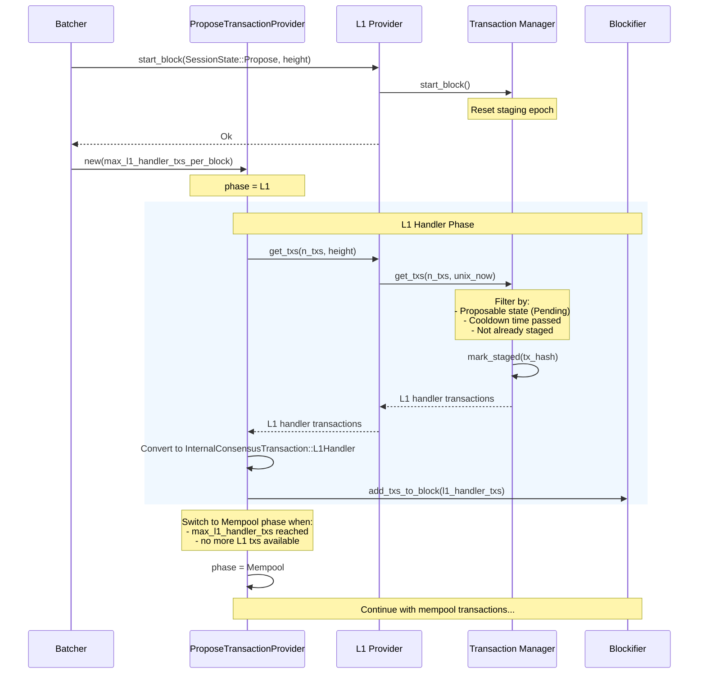

### Title
Unbounded linear scan over the L1 handler `proposable_index` allows an attacker to DoS block proposal via cheap L1→L2 messages - (File: crates/apollo_l1_events/src/transaction_manager.rs)

### Summary
`TransactionManager::get_txs`, called by the Batcher on every block proposal to fetch L1 handler transactions, performs an unbounded linear scan over `proposable_index` and skips every already-staged/pending entry before it can find `n_txs` fresh ones. Since an L1 sender can trivially create many `L1HandlerTransaction` entries (one per `LogMessageToL2` event) that remain permanently `Pending` (e.g. by making the corresponding L2 handler call always revert/fail so it is never consumed), this index can be inflated without bound, degrading or blocking every future proposal attempt.

### Finding Description
`TransactionManager::get_txs` is invoked by `L1EventsProvider::get_txs` [1](#0-0)  during the L1-handler phase of every block proposal, per the documented flow [2](#0-1) .

Its implementation scans `proposable_index`, a `BTreeMap<UnixTimestamp, Vec<TransactionHash>>` that indexes every `Pending` L1 handler transaction, and explicitly performs an unbounded linear `skip_while` over already-staged entries with only a code comment assuming "a small number of transactions (< 10 roughly)": [3](#0-2) 

The invariant documented on the struct states that `proposable_index` "contains all hashes of transactions that are proposable, and only them" [4](#0-3) , and a transaction is added to this index whenever `add_tx` is called for a scraped `LogMessageToL2` event [5](#0-4) .

Removal from `proposable_index` only happens on: consumption on L1 (`consume_tx`, requiring the message to actually be consumed) [6](#0-5) , cancellation finalized on L1 (`finalize_cancellation`, which requires an L1 cancellation request plus timelock) [7](#0-6) , or being marked `Committed`/`Rejected` at block commit time (only possible if the sequencer actually selects/executes the transaction). None of these removal paths bound the growth of `proposable_index` caused purely by an attacker emitting many `LogMessageToL2` events on L1 whose L2 handler calls the attacker deliberately never allows to succeed/consume (e.g., by making the handler function revert or requiring a condition that the attacker withholds). Each such transaction stays `Pending` forever, permanently occupying a slot in `proposable_index`.

This is directly analogous to the reported Carapace `ProtectionPool` bug: an unprivileged actor (there, the protection buyer; here, any L1 message sender) repeatedly performs a cheap action (buying dust protection / emitting a dust L1→L2 message) that appends an entry to an array/index that is never bounded and is later iterated in an unbounded loop on a critical path (premium accrual / locking capital; here, block-proposal transaction retrieval).

### Impact Explanation
Because `get_txs` is called by the Batcher for every block proposal while still in the `TxProviderPhase::L1` phase [8](#0-7) , an inflated `proposable_index` forces every proposal (by every honest sequencer/validator acting as proposer, not just a malicious one) to perform an increasingly expensive linear scan before returning L1 handler transactions. If the number of permanently-pending, cheap dust L1 handler entries grows large enough, this materially slows or effectively halts block proposal — a liveness/DoS impact ("a network unable to confirm new transactions"), reachable purely from repeated unprivileged L1 message submissions.

### Likelihood Explanation
Likelihood is High: sending `LogMessageToL2` events to the L1 StarknetCore contract is available to any L1 account without special privileges, and making an L2 handler entry point revert (so the message is scraped, added as `Pending`, but never consumed) is straightforward and requires only the L1 message-sending fee, no L2 fee is charged for a failing/never-executed handler. Attack cost is proportional purely to L1 gas for emitting many small `LogMessageToL2` events, matching the "cost of attack purely gas fees" characteristic of the original report.

### Recommendation
Bound the size of `proposable_index` (or the number of permanently-pending records per sender/overall), and/or change `get_txs`'s traversal to avoid an unbounded `skip_while` scan over already-staged entries — e.g., maintain a separate "unstaged" index/queue that pops in O(log n) rather than performing a linear skip over a growing prefix of staged transactions, and/or introduce a cap/expiry on the number of `Pending` L1 handler transactions retained without consumption.

### Proof of Concept
1. From an L1 account (no special privileges), repeatedly call the L1→L2 messaging entry point on the StarknetCore contract, each time targeting an L2 contract/selector combination engineered to always fail execution (e.g., calling a handler with arguments that make the L1 handler's requested call revert, or targeting a nonexistent contract).
2. Each such `LogMessageToL2` event is scraped and added via `TransactionManager::add_tx`, entering `proposable_index` as `Pending` [5](#0-4) .
3. Because the handler call always fails/never gets marked `Consumed`, no path removes it from `proposable_index`; repeat step 1 arbitrarily many times to grow `proposable_index` unboundedly.
4. Every subsequent call to `TransactionManager::get_txs` (invoked once per block proposal by every proposer) must linearly `skip_while` over the growing prefix of staged/pending dust entries before finding fresh proposable transactions, degrading block-proposal performance for the whole network [9](#0-8) .

### Citations

**File:** crates/apollo_l1_events/src/l1_events_provider.rs (L216-230)
```rust
    pub fn get_txs(
        &mut self,
        n_txs: usize,
        height: BlockNumber,
    ) -> L1EventsProviderResult<Vec<L1HandlerTransaction>> {
        if self.state.is_uninitialized() {
            return Err(L1EventsProviderError::Uninitialized);
        }

        self.check_height_with_error(height)?;

        match self.state {
            ProviderState::Propose => {
                let txs = self.tx_manager.get_txs(n_txs, self.clock.unix_now());
                info!(
```

**File:** docs/diagrams/06-l1-handler-flow.md (L73-110)
```markdown
## Block Proposal - Getting L1 Transactions


```

**File:** crates/apollo_l1_events/src/transaction_manager.rs (L35-39)
```rust
    /// Ordered lexicographically by scraping moment timestamp, then order-of-arrival for
    /// identical timestamps, also at any point the staged transactions are a prefix of the
    /// structure under this order.
    /// Invariant: contains all hashes of transactions that are proposable, and only them.
    /// Invarariant 2: Once removed from this index, a transaction will never be proposed again.
```

**File:** crates/apollo_l1_events/src/transaction_manager.rs (L72-113)
```rust
    pub fn get_txs(&mut self, n_txs: usize, now: u64) -> Vec<L1HandlerTransaction> {
        // Oldest        Now.sub(timelock)     Newest       Now
        //  |<---  passed  --->|                 |           |
        //  |<--- cooldown --->|                 |           |
        // t-------------------------------------------------->
        let cutoff = now.saturating_sub(self.config.l1_handler_proposal_cooldown_seconds.as_secs());
        let past_cooldown_txs = self.proposable_index.range(..cutoff);

        // Linear scan, but we expect this to be a small number of transactions (< 10 roughly).
        let unstaged_tx_hashes: Vec<_> = past_cooldown_txs
            .flat_map(|(_timestamp, tx_hashes)| tx_hashes.iter())
            .skip_while(|&&tx_hash| self.is_staged(tx_hash))
            .take(n_txs)
            .copied()
            .collect();

        for &tx_hash in unstaged_tx_hashes.iter() {
            let record = self.records.get(&tx_hash).expect("transaction should exist");
            assert_eq!(
                record.state,
                TransactionState::Pending,
                "Transaction {tx_hash} has state {:?}. Only Pending transactions should be in the \
                 proposable index.",
                record.state
            );
        }

        let mut txs = Vec::with_capacity(n_txs);
        let current_staging_epoch = self.current_staging_epoch; // borrow-checker constraint.
        for tx_hash in unstaged_tx_hashes {
            let newly_staged =
                self.with_record(tx_hash, |record| record.try_mark_staged(current_staging_epoch));
            assert_eq!(
                newly_staged,
                Some(true),
                "Inconsistent storage state: indexed l1 handler {tx_hash} is not in storage or \
                 wasn't marked as staged."
            );

            txs.push(self.records[&tx_hash].get_unchecked().clone());
        }
        txs
```

**File:** crates/apollo_l1_events/src/transaction_manager.rs (L173-209)
```rust
    pub fn add_tx(
        &mut self,
        tx: L1HandlerTransaction,
        block_timestamp: BlockTimestamp,
        scrape_timestamp: UnixTimestamp,
    ) {
        let tx_hash = tx.tx_hash;
        // If exists, return false and do nothing. If not, create the record as a HashOnly payload.
        let is_new_record = self.create_record_if_not_exist(tx_hash);
        // Replace a HashOnly payload with a Full payload. Do not update a Full payload.
        // A hash only payload can come from catching up from state sync, and then updated by
        // add_events from the scraper. However, if we get the same full tx twice (from the scraper)
        // it could indicate a double-scrape, and may cause the tx to be re-added to the proposable
        // index.
        self.with_record(tx_hash, move |record| match &record.tx {
            TransactionPayload::HashOnly(_) => {
                if !is_new_record {
                    info!(
                        "Transaction {tx_hash} already exists as a HashOnly payload. It was \
                         probably gotten via state sync component, and is now updated with a Full \
                         payload."
                    );
                }
                record.tx.set(tx, block_timestamp, scrape_timestamp);
                // Counts the HashOnly -> Full transition, regardless of whether the HashOnly
                // was just created here or pre-existed from state sync.
                L1_MESSAGE_SCRAPER_L1_HANDLER_TX_COUNT.increment(1);
            }
            TransactionPayload::Full { tx: _, created_at_block_timestamp: _, scrape_timestamp } => {
                warn!(
                    "Transaction {tx_hash} already exists as a Full payload, scraped at \
                     {scrape_timestamp}. This could indicate a double scrape. Ignoring the new \
                     transaction."
                );
            }
        });
    }
```

**File:** crates/apollo_l1_events/src/transaction_manager.rs (L221-245)
```rust
    pub fn finalize_cancellation(&mut self, tx_hash: TransactionHash) {
        let Some(record) = self.records.get(&tx_hash) else {
            info!(
                "Attempted to finalize cancellation for non-existent transaction: {tx_hash}. This \
                 can happen if the transaction was too old to be scraped (e.g. it was created \
                 before we started scraping)."
            );
            return;
        };

        // Regardless of the state of the tx in the record, if we get the cancellation event from
        // the L1 contract, we delete this tx from the records and from the proposable index, even
        // if it was Pending and ready to be proposed (which is not supposed to happen, hence the
        // warning).
        if record.state != TransactionState::CancellationStartedOnL2 {
            warn!(
                "Attempted to finalize cancellation for transaction {tx_hash} that is not in the \
                 cancellation started on L2 state, but in the {:?} state.",
                record.state
            );
        }
        // This will also call maintain_indices to remove the tx from the proposable index.
        self.with_record(tx_hash, |r| r.mark_cancellation_finalized_on_l1());
        self.records.remove(&tx_hash);
    }
```

**File:** crates/apollo_l1_events/src/transaction_manager.rs (L247-272)
```rust
    pub fn consume_tx(
        &mut self,
        tx_hash: TransactionHash,
        consumed_at: BlockTimestamp,
        unix_now: u64,
    ) -> Result<(), BlockTimestamp> {
        self.clear_old_tx_from_consumed_queue(unix_now);

        let Some(record) = self.records.get(&tx_hash) else {
            debug!(
                "Attempted to consume an unknown transaction: {tx_hash}. This can happen if the \
                 transaction was too old to be scraped (e.g. it was created before we started \
                 scraping)."
            );
            return Ok(());
        };

        // Double consumption is a bug.
        if let Some(previously_consumed_at) = record.get_consumed_at_timestamp() {
            return Err(previously_consumed_at);
        }

        // Mark the transaction as consumed.
        self.with_record(tx_hash, |record| record.mark_consumed(consumed_at));
        Ok(())
    }
```

**File:** crates/apollo_batcher/src/transaction_provider.rs (L94-110)
```rust
    async fn get_l1_handler_txs(
        &mut self,
        n_txs: usize,
    ) -> TransactionProviderResult<Vec<InternalConsensusTransaction>> {
        Ok(self
            .l1_events_provider_client
            .get_txs(n_txs, self.height)
            .await
            .inspect_err(|err| {
                warn!("L1 provider error while fetching L1 handler transactions: {:?}", err);
                BATCHER_L1_EVENTS_PROVIDER_ERRORS.increment(1);
            })
            .unwrap_or_default()
            .into_iter()
            .map(InternalConsensusTransaction::L1Handler)
            .collect())
    }
```
