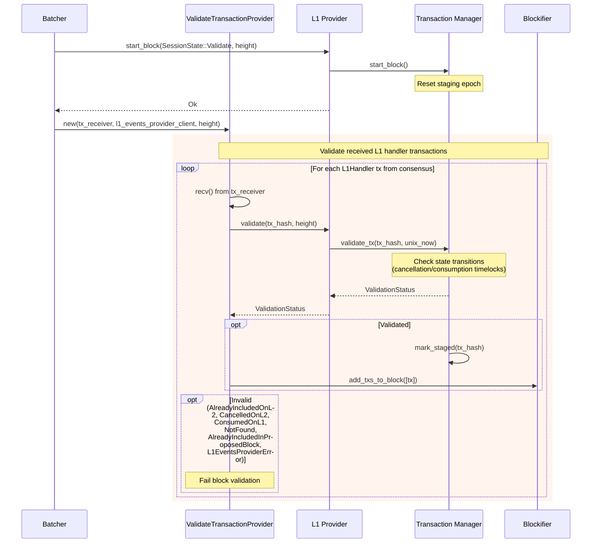

Given the tool budget was exhausted before I could fully read `crates/apollo_l1_events/src/l1_events_provider.rs` in full (I could not confirm exactly how `self.clock` is instantiated/shared across nodes), I flag this uncertainty explicitly below. Based on what I could confirm, there is a plausible analog.

### Title
Cancellation-timelock expiry for L1 handler transactions is evaluated against each node's local wall clock, allowing an L1 message canceller to induce honest-node divergence on `ValidationStatus` - (File: crates/apollo_l1_events/src/transaction_manager.rs)

### Summary
The Drips finding is a case where a time-window boundary (`start`/`end` vs. `updateTime`) is evaluated inconsistently, letting an attacker manipulate ordering to make two observers of the same state (sender vs. receiver) see different, mutually-inconsistent outcomes. The sequencer has a structurally similar time-boundary mechanism for L1-to-L2 message cancellation: `TransactionRecord::update_time_based_state` transitions a pending-cancellation L1 handler tx from `CancellationStartedOnL2` to `CancelledOnL2` once `unix_now >= requested_at + cancellation_timelock` [1](#0-0) . This time comparison is performed lazily inside `validate_tx`, using each node's own `self.clock.unix_now()` rather than a value derived from the block being validated [2](#0-1) [3](#0-2) .

### Finding Description
`validate_tx` calls `record.update_time_based_state(unix_now, policy)` with `unix_now` taken from the calling node's local clock, and the resulting `ValidationStatus` (`Validated` vs `Invalid(CancelledOnL2)`) directly determines whether the L1 handler transaction may be included/accepted in the block under validation [4](#0-3) . The project's own test suite documents the exact boundary sensitivity: the same transaction is `Validated` just before the timelock elapses and `Invalid(CancelledOnL2)` immediately after, purely as a function of the querying node's clock reading [5](#0-4) .

Because the L1 canceller (an unprivileged, external actor who can call `MessageToL2CancellationStarted` on L1 at any time) controls `cancellation_requested_at`, they can choose to submit a cancellation request such that the timelock boundary falls squarely within the multi-node validation window of a single Starknet block (i.e., during the seconds when different validators/proposers poll and validate that height). If sequencer nodes' local clocks are not perfectly synchronized (or simply because the request is timed to expire mid-validation), some honest validating nodes will read `unix_now` before expiry and return `Validated`, while others will read it after expiry and return `Invalid(CancelledOnL2)` for the identical transaction, height, and block content.

### Impact Explanation
`ValidationStatus` for an L1 handler transaction is a hard pass/fail gate in block validation (`opt Invalid ... Note over TxProv: Fail block validation`) [6](#0-5) . If different honest validators disagree on this status for the same proposed block, some will accept it and some will reject it, causing consensus divergence on block validity — this is exactly the "honest-node divergence" impact category. This can manifest as intermittent inability to reach a decision on a height (liveness degradation) or, in the worst case, a safety-relevant fork in views of the block if divergent nodes end up voting differently and the divergence isn't otherwise reconciled by the state machine.

### Likelihood Explanation
This requires only an L1 message sender submitting a normal `MessageToL2CancellationStarted` transaction on L1 with a timestamp chosen to land the timelock boundary during a target L2 block's validation phase — no elevated privilege, no malicious operator/proposer needed, and no special access beyond what any L1 user already has. The precision needed depends on how tight the propagation/validation window is and on clock skew across nodes, which affects likelihood but not exploitability in principle. I was not able to fully verify (due to running out of tool calls) whether all sequencer nodes source `unix_now` from a synchronized/shared clock (e.g., an NTP-disciplined clock with tight bounds) which would reduce, but likely not eliminate, this window.

### Recommendation
Base the cancellation-timelock expiry check on a value that is deterministic and identical for every node validating the same block — e.g., the block's own timestamp / proposed height time, or the L1 block timestamp already carried on the cancellation event, rather than each node's local `unix_now()`. This mirrors the analogous fix suggested for Drips: pin the time boundary to a canonical, shared reference (there, `drips.updateTime`; here, the block/proposal timestamp) instead of allowing it to be evaluated ad hoc per caller.

### Proof of Concept
Conceptual reproduction, based on the existing test `validate_tx_cancellation_requested_validated_then_expired_returns_cancelled` [5](#0-4) :
1. An L1 message sender sends an L1→L2 message, then submits `TransactionCancellationStarted` at L1 block timestamp `T`.
2. The cancellation timelock is `D` seconds. A target L2 block height `H` is validated by multiple sequencer nodes around wall-clock time `T + D`.
3. `transaction_manager.rs::validate_tx` is invoked independently by each validating node with its own `unix_now` [2](#0-1) .
4. Nodes whose local clock reads `unix_now < T + D` at the moment of calling `validate` return `ValidationStatus::Validated`; nodes whose local clock reads `unix_now >= T + D` return `Invalid(CancelledOnL2)` for the very same transaction/height — exactly the transition demonstrated in the cited test.
5. This produces a validation-result split among honest nodes for the same block, i.e., honest-node divergence.

Note: I could not fully confirm within the available tool budget whether the `Clock` implementation used in production is a shared/synchronized clock service (which would narrow, but not necessarily close, this window) — this should be verified against the real `Clock` trait implementation (e.g., `TokioLinkedClock`) before treating this as fully confirmed exploitable in production topology.

### Citations

**File:** crates/apollo_l1_events/src/transaction_record.rs (L191-208)
```rust
    /// Update the state of the record based on the current time and policy.
    /// This updates the state based on time-based state transitions, such as moving from
    /// CancellationStartedOnL2 to CancelledOnL2 after the timelock expires.
    pub fn update_time_based_state(&mut self, unix_now: u64, policy: TransactionRecordPolicy) {
        if let Some(requested_at) = self.cancellation_requested_at {
            if self.committed {
                return; // Committing overrides cancellations.
            }

            let cancellation_timelock = &policy.cancellation_timelock.as_secs();
            let is_cancellation_timelock_passed =
                unix_now >= *requested_at.saturating_add(cancellation_timelock);

            if is_cancellation_timelock_passed {
                self.state = TransactionState::CancelledOnL2;
            }
        }
    }
```

**File:** crates/apollo_l1_events/src/transaction_manager.rs (L116-146)
```rust
    pub fn validate_tx(&mut self, tx_hash: TransactionHash, unix_now: u64) -> ValidationStatus {
        let current_staging_epoch_cloned = self.current_staging_epoch;

        let policy = TransactionRecordPolicy {
            cancellation_timelock: self.config.l1_handler_cancellation_timelock_seconds,
        };

        let validation_status = self.with_record(tx_hash, |record| {
            // If the current time affects the state, update state now.
            record.update_time_based_state(unix_now, policy);
            if !record.is_validatable() {
                match record.state {
                    TransactionState::Committed => {
                        InvalidValidationStatus::AlreadyIncludedOnL2.into()
                    }
                    TransactionState::CancelledOnL2 => {
                        InvalidValidationStatus::CancelledOnL2.into()
                    }
                    TransactionState::Consumed => InvalidValidationStatus::ConsumedOnL1.into(),
                    _ => unreachable!(),
                }
            } else if record.try_mark_staged(current_staging_epoch_cloned) {
                ValidationStatus::Validated
            } else {
                InvalidValidationStatus::AlreadyIncludedInProposedBlock.into()
            }
        });

        validation_status.unwrap_or(InvalidValidationStatus::NotFound.into())
    }

```

**File:** crates/apollo_l1_events/src/l1_events_provider.rs (L254-271)
```rust
    /// Returns true if and only if the given transaction is both not included in an L2 block, and
    /// unconsumed on L1. Validator should call validate on each tx during validation.
    /// Must be in Validate state.
    #[instrument(skip(self), err)]
    pub fn validate(
        &mut self,
        tx_hash: TransactionHash,
        height: BlockNumber,
    ) -> L1EventsProviderResult<ValidationStatus> {
        if self.state.is_uninitialized() {
            return Err(L1EventsProviderError::Uninitialized);
        }

        self.check_height_with_error(height)?;
        match self.state {
            ProviderState::Validate => {
                Ok(self.tx_manager.validate_tx(tx_hash, self.clock.unix_now()))
            }
```

**File:** crates/apollo_l1_events/src/l1_events_provider_tests.rs (L859-886)
```rust
#[test]
fn validate_tx_cancellation_requested_validated_then_expired_returns_cancelled() {
    // Setup.
    let tx_1 = l1_handler(1);
    let clock = Arc::new(FakeClock::new(5));
    let mut l1_events_provider = L1EventsProviderContentBuilder::new()
        .with_clock(clock.clone())
        .with_nonzero_timelock_setup()
        .with_cancel_requested_txs([tx_1.clone()])
        .with_state(ProviderState::Validate)
        .build_into_l1_provider();

    // Test.

    // Should be validatable before expiry,
    let status =
        l1_events_provider.validate(tx_1.tx_hash, l1_events_provider.current_height).unwrap();
    assert_eq!(status, ValidationStatus::Validated);
    // Now, advance time past expiry and validate again,
    // This tests the edge case: a tx can be validatable before expiry, but if validated again after
    // expiry, it should return the cancellation error.
    clock.advance(Duration::from_secs(
        l1_events_provider.config.l1_handler_cancellation_timelock_seconds.as_secs(),
    ));
    let status2 =
        l1_events_provider.validate(tx_1.tx_hash, l1_events_provider.current_height).unwrap();
    assert_eq!(status2, InvalidValidationStatus::CancelledOnL2.into());
}
```

**File:** docs/diagrams/06-l1-handler-flow.md (L112-152)
```markdown
## Block Validation - Validating L1 Transactions


```
