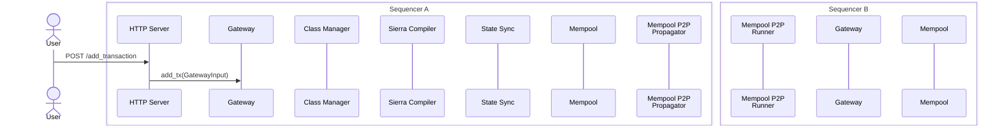

### Title
Unbounded TCP connections/tasks on the public transaction-submission HTTP server enable resource-exhaustion DoS - (File: crates/apollo_http_server/src/http_server.rs)

### Summary
The public-facing `apollo_http_server` — the entry point every unprivileged sender uses to POST transactions (`/gateway/add_transaction`, `/gateway/add_rpc_transaction`) — binds a `TcpListener` and hands it directly to `axum::serve(listener, app)` with no connection cap, no per-connection concurrency limit, and no accept-loop backpressure.

### Finding Description
`HttpServer::run` binds the listener and calls `serve(listener, app).await` directly: [1](#0-0) 

This is the only guard applied to the router: a decompression layer and two `RequestBodyLimitLayer` instances that bound the size of an individual request body, but nothing that bounds the *number* of concurrent connections or in-flight requests: [2](#0-1) 

`HttpServerConfig`/`HttpServerStaticConfig` only expose `max_request_body_size` and `dynamic_config_poll_interval` — there is no `max_connections`, `max_concurrency`, or semaphore-based admission control field at all: [3](#0-2) 

This is precisely the bug class in the MOOS/MOOSDB report: an HTTP server that accepts an unbounded number of connections/threads without limits, allowing an attacker to exhaust server resources. Contrast this with every other network-facing server in the same codebase, which the project itself hardened against exactly this class of issue:
- The internal `RemoteComponentServer` uses an `Arc<Semaphore>` (`connection_semaphore`) sized by `max_concurrency` and rejects excess connections with `503` instead of accepting them unbounded: [4](#0-3) [5](#0-4) 
- The `starknet_transaction_prover` JSON-RPC server explicitly sets `.max_connections(max_connections)` on its `ServerConfig` for both HTTP and HTTPS transports: [6](#0-5) [7](#0-6) 

`apollo_http_server` has none of these mitigations. Every accepted TCP connection spawns Tokio tasks and Hyper connection state inside `axum::serve`, unconditionally, with no semaphore, no `max_connections`, and no explicit rejection path for connections above a threshold.

### Impact Explanation
An unprivileged attacker (any external network client capable of reaching the gateway/transaction-submission HTTP endpoint) can open a very large number of concurrent TCP connections and either hold them open (e.g., via slow/incomplete requests or many idle keep-alive connections) or send bursts of connections faster than they complete. Because there is no connection admission limit, this exhausts file descriptors, memory, and Tokio worker capacity on the node process. This can degrade or halt the node's ability to accept legitimate transactions — i.e., "a network unable to confirm new transactions" for the affected sequencer, which is a valid Medium/High-severity availability impact per the validation criteria (this is a legitimate transaction-submission path, not a p2p/peer/operator-only vector).

### Likelihood Explanation
High likelihood of reachability: the HTTP server is the primary and intentionally public ingress for the entire transaction-submission flow (`POST /gateway/add_transaction`, `POST /gateway/add_rpc_transaction`), as documented in the tx-submission flow: [8](#0-7)  No authentication or per-IP/per-connection admission control exists at this layer in the code inspected; body-size limiting exists but does nothing to cap connection count. Exploitation requires only standard TCP/HTTP clients, no privileged access, no malicious peer/operator role, and no protocol-level trick beyond opening many connections — consistent with the original MOOSDB analog.

### Recommendation
Apply the same connection-admission pattern already used elsewhere in this codebase to `apollo_http_server`:
- Add a configurable `max_connections`/`max_concurrency` bound (mirroring `RemoteServerConfig::max_concurrency` in `crates/apollo_infra/src/component_server/remote_component_server.rs`) and reject connections beyond that with `503 Service Unavailable`, or
- Wrap the listener's accept loop with an `Arc<Semaphore>`-guarded custom serve loop (as `RemoteComponentServer::start` does) instead of the bare `axum::serve(listener, app)` call, or, if staying on axum/hyper primitives, use `hyper_util`'s connection builder directly with `try_acquire_owned` gating similar to `PermitGuardedService`.
- Additionally consider per-connection idle/header-read timeouts (the report specifically calls out "endless header data") to bound resource use of slow/incomplete connections, similar to the `TLS_HANDSHAKE_TIMEOUT` pattern used in `crates/starknet_transaction_prover/src/server/tls.rs`.

### Proof of Concept
1. Start a sequencer node with the default `apollo_http_server` configuration (unbounded connections, `max_request_body_size` default 5MB per `DEFAULT_MAX_REQUEST_BODY_SIZE`): [9](#0-8) 
2. From an external client, open a large number (e.g., tens of thousands) of concurrent TCP connections to the bound HTTP port, either sending no data (holding the connection open pre-request) or sending only partial HTTP headers slowly.
3. Because `HttpServer::run` (`crates/apollo_http_server/src/http_server.rs:121-122`) passes the listener straight to `axum::serve` with no connection cap, every accepted connection consumes a socket/file descriptor and Tokio task indefinitely; no `503`/rejection path exists to shed load.
4. Observe process file-descriptor/memory exhaustion and legitimate `POST /gateway/add_transaction` requests failing to be accepted or served, demonstrating denial of new-transaction submission for the sequencer.

### Citations

**File:** crates/apollo_http_server/src/http_server.rs (L120-123)
```rust
        // Create a server that runs forever.
        let listener = TcpListener::bind(&addr).await?;
        Ok(serve(listener, app).await?)
    }
```

**File:** crates/apollo_http_server/src/http_server.rs (L126-153)
```rust
    pub fn app(&self) -> Router {
        Router::new()
            // Json Rpc endpoint
            .route(
                "/gateway/add_rpc_transaction",
                self.post_method_router(add_rpc_tx),
            )
            // Rest api endpoint
            .route(
                "/gateway/add_transaction",
                self.post_method_router(add_tx),
            )
            // TODO(shahak): Remove this once we fix the centralized simulator to not use is_alive
            // and is_ready.
            .route(
                "/gateway/is_alive",
                get(|| futures::future::ready("Gateway is alive".to_owned()))
            )
            .route("/gateway/is_ready", get(is_ready))
            .layer(Extension(self.app_state.clone()))
            // Hard streaming limit on decompressed bytes — wraps the body in
            // http_body_util::Limited which errors during poll_frame() once the
            // limit is exceeded, preventing zip bombs from expanding in memory.
            .layer(RequestBodyLimitLayer::new(self.config.static_config.max_request_body_size))
            .layer(RequestDecompressionLayer::new())
            // Cap compressed wire bytes to bound network I/O.
            .layer(RequestBodyLimitLayer::new(self.config.static_config.max_request_body_size))
    }
```

**File:** crates/apollo_http_server_config/src/config.rs (L11-16)
```rust
const HTTP_SERVER_PORT: u16 = 8080;
pub const DEFAULT_MAX_SIERRA_PROGRAM_SIZE: usize = 4 * 1024 * 1024; // 4MB
// The value is chosen to be much larger than the transaction size limit as enforced by the Starknet
// protocol.
const DEFAULT_MAX_REQUEST_BODY_SIZE: usize = 5 * 1024 * 1024; // 5MB
const DEFAULT_DYNAMIC_CONFIG_POLL_INTERVAL_MS: u64 = 1_000; // 1 second.
```

**File:** crates/apollo_http_server_config/src/config.rs (L51-58)
```rust
#[derive(Clone, Debug, Serialize, Deserialize, Validate, PartialEq)]
pub struct HttpServerStaticConfig {
    pub ip: IpAddr,
    pub port: u16,
    pub max_request_body_size: usize,
    #[serde(deserialize_with = "deserialize_milliseconds_to_duration")]
    pub dynamic_config_poll_interval: Duration,
}
```

**File:** crates/apollo_infra/src/component_server/remote_component_server.rs (L283-289)
```rust
    async fn start(&mut self) {
        let bind_socket = SocketAddr::new(self.config.bind_ip, self.port);
        debug!(
            "Starting server with socket {:?} with {:?} concurrent connections",
            bind_socket, self.config.max_concurrency
        );
        let connection_semaphore = Arc::new(Semaphore::new(self.config.max_concurrency));
```

**File:** crates/apollo_infra/src/component_server/remote_component_server.rs (L303-347)
```rust
                    match connection_semaphore.try_acquire_owned() {
                        Ok(permit) => {
                            metrics.increment_number_of_connections();
                            trace!("Acquired semaphore permit for connection");
                            let client_peer_for_handler = client_peer;
                            let handle_request_service =
                                service_fn(move |req: HyperRequest<Incoming>| {
                                    trace!("Received request: {:?}", req);
                                    let request_id = req
                                        .headers()
                                        .get(REQUEST_ID_HEADER)
                                        .and_then(|header| header.to_str().ok())
                                        .and_then(|s| s.parse::<RequestId>().ok())
                                        .expect(
                                            "Request ID should be present in the request headers",
                                        );
                                    Self::remote_component_server_handler(
                                        req,
                                        request_id,
                                        client_peer_for_handler,
                                        local_client.clone(),
                                        metrics,
                                        max_request_body_bytes,
                                    )
                                });

                            // Bundle the service and the acquired permit to limit concurrency at
                            // the connection level.
                            let service = PermitGuardedService {
                                inner: handle_request_service,
                                _permit: Some(permit),
                                remote_server_metrics: metrics,
                            };

                            serve_connection!(
                                io,
                                service,
                                max_streams,
                                keepalive_interval,
                                keepalive_timeout
                            );
                            trace!(remote_addr = %client_peer, "remote component TCP connection closed");
                        }
                        Err(_) => {
                            debug!("Too many connections, denying a new connection");
```

**File:** crates/starknet_transaction_prover/src/server.rs (L106-121)
```rust
        TransportMode::Http => {
            let server_config = ServerConfig::builder()
                .max_connections(max_connections)
                .max_request_body_size(max_request_body_size)
                .build();
            let server = ServerBuilder::default()
                .set_config(server_config)
                // See `prover_http_middleware!` for the full layer-order rationale.
                .set_http_middleware(prover_http_middleware!(cors_layer, ohttp_layer))
                .build(&addr)
                .await
                .context(format!("Failed to bind JSON-RPC server to {addr}"))?;
            let local_addr = server.local_addr()?;
            let server_handle = server.start(methods);
            Ok((local_addr, server_handle))
        }
```

**File:** crates/starknet_transaction_prover/src/server/tls.rs (L51-54)
```rust
    let server_config = ServerConfig::builder()
        .max_connections(max_connections)
        .max_request_body_size(max_request_body_size)
        .build();
```

**File:** docs/diagrams/02-tx-submission-flow.md (L1-24)
```markdown
# Transaction Submission Flow


