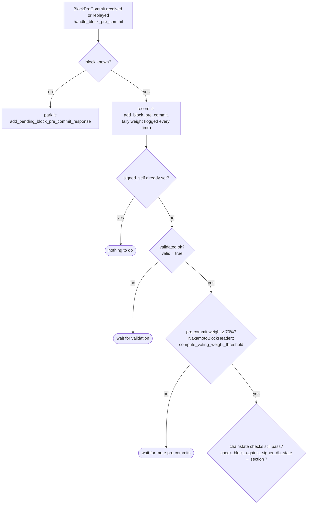

### Title
Non-deterministic, miner-controlled block timestamp validation causes signer verdict divergence on `/v3/block_proposal` - ([File: stackslib/src/net/api/postblock_proposal.rs])

### Summary
`NakamotoBlockProposal::validate()` rejects a proposed block if its miner-chosen `header.timestamp` is more than 15 seconds ahead of the *local* wall-clock of the stacks-node performing the check. Because every signer runs its own stacks-node instance and evaluates this bound independently against its own `get_epoch_time_secs()`, a single (non-colluding, non-privileged) miner can craft a block whose timestamp sits at the edge of this window such that different signer nodes — due to ordinary network latency and clock skew — reach different Accept/Reject verdicts for the very same block. This is the "validation verdict two nodes disagree on" equality break called out as an in-scope analog of the CVE-2010-4535 bug class (an externally supplied time-like value whose acceptance window is not robust to real-world variance).

### Finding Description
The relevant check is: [1](#0-0) 

```
// Validate the block's timestamp. It must be:
// - Greater than the parent block's timestamp
// - At most 15 seconds into the future
...
if self.block.header.timestamp > get_epoch_time_secs() + 15 {
    ... return Err(BlockValidateRejectReason { reason_code: ValidateRejectCode::InvalidTimestamp, ... });
}
```

`header.timestamp` is fully attacker(miner)-controlled — it is written by the miner into the `NakamotoBlockHeader` and only bounded by this ad-hoc ±15s window relative to whichever node happens to check it [2](#0-1) . Unlike deterministic consensus fields (burn totals, VRF seeds, parent hashes), `get_epoch_time_secs()` is not a shared, agreed-upon input — it is each node's own OS clock, which is not guaranteed to be synchronized across the distributed set of signer-operated stacks-nodes.

Each signer submits the proposal to its own node via this exact endpoint and treats the result as authoritative for its local decision: [3](#0-2) 

A miner can therefore produce a single, syntactically identical proposal with `timestamp = local_now + 14` (or any value close to the boundary). By the time this proposal propagates over StackerDB and is submitted for validation by each signer (which takes variable time depending on network conditions, plus each signer's own local clock drift), some nodes will observe `block.header.timestamp <= get_epoch_time_secs() + 15` (accept) while others — slightly ahead in wall-clock time or with faster propagation — will observe the opposite (reject). No majority collusion, node-operator access, or protocol-level privilege is required; this is purely a side effect of independent local-clock evaluation of an attacker-supplied timestamp with no drift tolerance beyond the fixed constant.

### Impact Explanation
This falls into the "High — a minority-triggerable sortition/VRF/static-validation divergence... temporary tip disagreement" bucket. If enough signers land on opposite sides of the boundary, the block can fail to reach the required pre-commit weight (70% per `NakamotoBlockHeader::compute_voting_weight_threshold`, referenced in the signer flow docs) in the affected round [4](#0-3) , causing the tenure to stall on this proposal until the miner re-proposes with an updated timestamp. This is a genuine static-validation verdict split across honest, unprivileged nodes — not a chain split, state-root divergence, or reward-loss event — hence High rather than Critical.

### Likelihood Explanation
Likelihood is moderate: it requires no special access, only a miner deliberately (or even incidentally, under load) picking a timestamp near the edge of the 15-second window combined with ordinary propagation delay/clock skew across a geographically distributed signer set. The existing test suite already demonstrates the sharp, non-tolerant nature of this boundary (`test_block_proposal_endpoint_reject_stale_and_future`), confirming the check has zero margin for legitimate clock variance [5](#0-4) .

### Recommendation
Do not gate block acceptance solely on each validating node's independent wall clock with a rigid additive constant. Either (a) widen and clearly document an agreed-upon clock-drift tolerance band, (b) derive the future-timestamp bound from a value all signers can agree on (e.g., relative to the burnchain tip's timestamp rather than local OS time), or (c) make the "too far in the future" check advisory/soft in the signer's decision path so that borderline timestamp disagreements do not block reaching the pre-commit threshold in a single round, and instead allow signers to defer/retry the check as their own clock advances rather than record a hard rejection.

### Proof of Concept
1. Miner builds a `NakamotoBlock` with `header.timestamp = current_unix_time + 14`.
2. Miner signs and broadcasts the block proposal via StackerDB to all signers.
3. Due to varying network latency and per-node clock skew, signer A's stacks-node evaluates the request at `local_now_A` where `header.timestamp <= local_now_A + 15` → accepts.
4. Signer B's stacks-node, slightly delayed or with a clock a couple seconds ahead, evaluates at `local_now_B` where `header.timestamp > local_now_B + 15` → rejects with `ValidateRejectCode::InvalidTimestamp` (see reject path at [6](#0-5) ).
5. The signer set now holds a mixed set of Accept/Reject verdicts for the identical block, potentially preventing the 70% pre-commit weight from being reached in that round, stalling block finalization until re-proposal.

### Citations

**File:** stackslib/src/net/api/postblock_proposal.rs (L637-669)
```rust
        // Validate the block's timestamp. It must be:
        // - Greater than the parent block's timestamp
        // - At most 15 seconds into the future
        if let StacksBlockHeaderTypes::Nakamoto(parent_nakamoto_header) =
            &parent_stacks_header.anchored_header
        {
            if self.block.header.timestamp <= parent_nakamoto_header.timestamp {
                warn!(
                    "Rejected block proposal";
                    "reason" => "Block timestamp is not greater than parent block",
                    "block_timestamp" => self.block.header.timestamp,
                    "parent_block_timestamp" => parent_nakamoto_header.timestamp,
                );
                return Err(BlockValidateRejectReason {
                    reason_code: ValidateRejectCode::InvalidTimestamp,
                    reason: "Block timestamp is not greater than parent block".into(),
                    failed_txid: None,
                });
            }
        }
        if self.block.header.timestamp > get_epoch_time_secs() + 15 {
            warn!(
                "Rejected block proposal";
                "reason" => "Block timestamp is too far into the future",
                "block_timestamp" => self.block.header.timestamp,
                "current_time" => get_epoch_time_secs(),
            );
            return Err(BlockValidateRejectReason {
                reason_code: ValidateRejectCode::InvalidTimestamp,
                reason: "Block timestamp is too far into the future".into(),
                failed_txid: None,
            });
        }
```

**File:** stackslib/src/chainstate/nakamoto/mod.rs (L903-923)
```rust
impl StacksMessageCodec for NakamotoBlockHeader {
    fn consensus_serialize<W: std::io::Write>(&self, fd: &mut W) -> Result<(), CodecError> {
        write_next(fd, &self.version)?;
        write_next(fd, &self.chain_length)?;
        write_next(fd, &self.burn_spent)?;
        write_next(fd, &self.consensus_hash)?;
        write_next(fd, &self.parent_block_id)?;
        write_next(fd, &self.tx_merkle_root)?;
        write_next(fd, &self.state_index_root)?;
        write_next(fd, &self.timestamp)?;
        write_next(fd, &self.miner_signature)?;
        write_next(fd, &self.signer_signature)?;
        write_next(fd, &self.pox_treatment)?;
        // Only present in Epoch 4.0+ headers; omitting it for older versions
        // keeps their serialization (and thus block hashes) byte-identical.
        if Self::version_includes_problematic_txs(self.version) {
            write_next(fd, &self.problematic_txs)?;
        }

        Ok(())
    }
```

**File:** stacks-signer/src/v0/signer.rs (L2053-2071)
```rust
    /// Handle the block validate response returned from our prior calls to submit a block for validation
    fn handle_block_validate_response(
        &mut self,
        stacks_client: &StacksClient,
        block_validate_response: &BlockValidateResponse,
        sortition_state: &mut Option<SortitionsView>,
    ) {
        info!("{self}: Received a block validate response: {block_validate_response:?}");
        match block_validate_response {
            BlockValidateResponse::Ok(block_validate_ok) => {
                crate::monitoring::actions::record_block_validation_latency(
                    block_validate_ok.validation_time_ms,
                );
                self.handle_block_validate_ok(stacks_client, block_validate_ok, sortition_state);
            }
            BlockValidateResponse::Reject(block_validate_reject) => {
                self.handle_block_validate_reject(block_validate_reject, sortition_state);
            }
        };
```

**File:** docs/signer-flows.md (L229-248)
```markdown
## 5. Pre-commit threshold → signature

The only place the signer produces a block signature by counting votes.
Pre-commits from peers (and our own) accumulate; at ≥70% weight the signer
decides whether to follow through. Between validation and threshold, we may have
signed a _different_ block at the same height, possibly in another tenure, so
the world must be re-checked before the signature leaves the box.



**File:** stackslib/src/net/api/tests/postblock_proposal.rs (L490-514)
```rust
    let result = results.remove(0);
    match result {
        Ok(_) => panic!("expected error"),
        Err(postblock_proposal::BlockValidateReject {
            reason_code,
            reason,
            ..
        }) => {
            assert_eq!(reason_code, ValidateRejectCode::InvalidTimestamp);
            assert_eq!(reason, "Block timestamp is not greater than parent block");
        }
    }

    let result = results.remove(0);
    match result {
        Ok(_) => panic!("expected error"),
        Err(postblock_proposal::BlockValidateReject {
            reason_code,
            reason,
            ..
        }) => {
            assert_eq!(reason_code, ValidateRejectCode::InvalidTimestamp);
            assert_eq!(reason, "Block timestamp is too far into the future");
        }
    }
```
