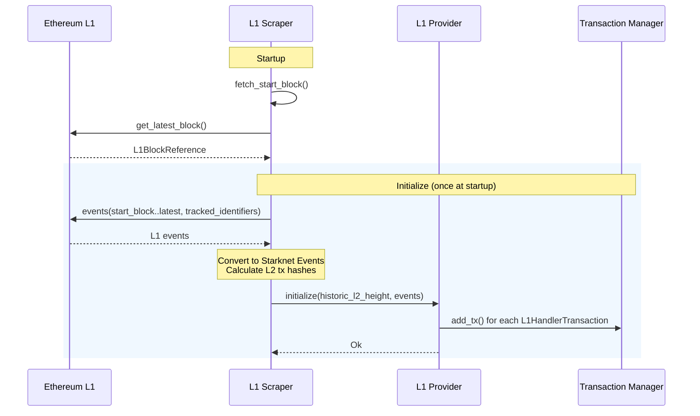

## Analysis

The reported bug class — Chainlink VRF's `minimumRequestConfirmations` being set too low, allowing an L2 reorg to change a "final" answer after it was already acted upon — maps directly onto the `finality` parameter used by the sequencer's L1 scraper components (`apollo_l1_events`, `apollo_l1_gas_price`), which is reachable indirectly by any L1 message sender (a user calling the L1→L2 messaging bridge).

### Title
Insufficient `finality` confirmation depth in the L1 events scraper lets base-layer reorgs invalidate already-committed `L1HandlerTransaction` executions - (File: `crates/apollo_l1_events/src/l1_scraper.rs`)

### Summary
The `L1EventsScraper` treats an L1 block as "final" as soon as it is `finality` blocks behind the base layer's reported tip, and immediately forwards any `LogMessageToL2` events from that block to the `L1EventsProvider`, making them proposable/valid as `L1HandlerTransaction`s on L2.<cite repo="Thankgoddavid56/sequencer--004" path="crates/apollo_l1_events/src/l1_scraper.rs" start="271="271" end="289" /> Reorg protection only re-validates the *previously* scraped block's hash on the *next* poll cycle, via `assert_no_l1_reorgs`, and simply errors out (triggering a scraper restart) if a mismatch is found — it cannot retract data already delivered to the provider and potentially already consumed in a committed L2 block. [1](#0-0) 

### Finding Description
`fetch_events` computes the "safe" tip as `latest_l1_block_number - finality` and fetches/forwards all events up to that block without any additional confirmation wait beyond this single subtraction. [2](#0-1)  These events are converted into `L1HandlerTransaction`s and pushed into the transaction manager as proposable, exactly as depicted in the scraping flow diagram (`docs/diagrams/06-l1-handler-flow.md`). [3](#0-2) 

The only reorg safety check, `assert_no_l1_reorgs`, is executed at the *start* of the *next* polling iteration and only verifies that the block hash of the block previously treated as final has not changed. [4](#0-3)  If it *has* changed, the scraper returns `L1ReorgDetected` and the process must be restarted — but by then, the events derived from the invalidated block may already have been used to build/validate an `L1HandlerTransaction` that consensus already committed into an L2 block (Starknet consensus provides fast, single-round finality, so the polling interval, default 30s, is easily long enough for this to happen). [5](#0-4) 

The code-level default for `finality` is `0` (no confirmation wait at all), matching exactly the audit report's core complaint about a too-low `minimumRequestConfirmations`. [6](#0-5)  Even the operational deployment default of `10` blocks (`l1_events_scraper_config.finality: 10`) is only safe on a base layer with genuinely fast/shallow reorg characteristics (e.g., Ethereum L1); if this sequencer is deployed as an L2/L3 settling on a base layer with deeper, more frequent reorgs (the exact scenario cited in the original report, e.g. Polygon), a 10-block "finality" window is insufficient. [5](#0-4)  The existing test suite explicitly demonstrates that when `finality` is too low relative to the actual reorg depth, the scraper only detects the problem *after* the fact and fails with `L1ReorgDetected`, rather than avoiding the incorrect data ingestion in the first place. [7](#0-6) 

The `l1_handler_proposal_cooldown_seconds` delay is not a mitigation for this: it only rate-limits *proposal* of a newly-scraped tx, while "validation is available immediately" per its own documentation, so a proposer racing ahead of the reorg-detection window can still get the transaction validated and committed by honest replicas before the scraper's next poll notices the reorg. [8](#0-7) 

### Impact Explanation
An L1 message sender submits a message to L1 (e.g., a bridge deposit) that lands in a block which is later reorganized out of the base layer. If `finality` is too low for the base layer's actual reorg depth, the sequencer's scraper treats that block as final, ingests the `LogMessageToL2` event, and the resulting `L1HandlerTransaction` (e.g., a token mint/credit on L2) gets proposed, validated, and committed to an L2 block by consensus before the reorg is detected. Because Starknet-style consensus gives immediate finality to committed blocks, this L2-side effect (e.g., minted/credited funds) becomes permanent even though the underlying L1 message never actually occurred post-reorg — resulting in unauthorized account action / concrete loss (unbacked funds credited on L2) or a state root/committed-block/L1-anchor divergence that cannot be corrected, only detected via a scraper restart that cannot roll back the already-committed L2 block.

### Likelihood Explanation
This does not require a malicious operator, staker, or prover — a normal L1 message sender interacting with the base-layer bridge, combined with a natural (or attacker-induced, e.g., MEV/reorg-as-a-service on reorg-prone base layers) reorg of depth ≥ `finality`, is sufficient. Given the operator-configured default of 10 blocks (or the code default of 0), and that many L2/L3 base layers exhibit deeper/more frequent reorgs than Ethereum L1, this is realistically triggerable, especially if this sequencer is deployed settling to a base layer other than Ethereum L1 mainnet.

### Recommendation
- Increase the reliance solely on a fixed block-count `finality` and instead track/require the base layer's own finalized/safe block tag where available, rather than an operator-tunable raw block count.
- Ensure `finality` is explicitly documented and enforced to be set according to the specific base layer's realistic reorg depth (not a one-size-fits-all constant), and consider failing safe (rejecting new proposals) rather than merely logging+restarting once a reorg beyond `finality` is detected, since restart alone cannot undo already-committed L2 effects.
- Consider adding a secondary, stricter confirmation requirement specifically for state-mutating `L1HandlerTransaction`s (e.g., mint/credit-type messages) distinct from the general event-scraping `finality`.

### Proof of Concept
1. Deploy/operate the sequencer with `l1_events_scraper_config.finality` set to a value smaller than the realistic reorg depth of the underlying base layer (default in code is `0`; default deployment config is `10`, insufficient for reorg-prone base layers). [6](#0-5) 
2. An L1 message sender sends a `LogMessageToL2` (e.g., bridge deposit) in an L1 block `B`.
3. `fetch_events` computes `latest_l1_block_number - finality` ≥ `B`, and the scraper forwards the event to the `L1EventsProvider`, making the corresponding `L1HandlerTransaction` proposable. [2](#0-1) 
4. Before the next poll cycle (default 30s), block `B` is reorganized out of the base layer.
5. In the meantime, a proposer includes the `L1HandlerTransaction` and honest validators, per `l1_handler_proposal_cooldown_seconds` documentation, can validate it "immediately," so consensus commits the block. [8](#0-7) 
6. On the next poll, `assert_no_l1_reorgs` detects the hash mismatch and errors out, forcing a scraper restart — but the L2 effects of the now-nonexistent L1 message are already permanently committed. [1](#0-0)

### Citations

**File:** crates/apollo_l1_events/src/l1_scraper.rs (L245-245)
```rust
        self.assert_no_l1_reorgs().await?;
```

**File:** crates/apollo_l1_events/src/l1_scraper.rs (L271-302)
```rust
        let latest_l1_block_number = self
            .base_layer
            .latest_l1_block_number()
            .await
            .map_err(L1EventsScraperError::BaseLayerError)?;
        let latest_l1_block_number = latest_l1_block_number
            .checked_sub(self.config.finality)
            .ok_or(L1EventsScraperError::LatestBlockNumberTooLow {
                finality: self.config.finality,
                latest_l1_block_no_finality: latest_l1_block_number,
            })?;
        let latest_l1_block = self
            .base_layer
            .l1_block_at(latest_l1_block_number)
            .await
            .map_err(L1EventsScraperError::BaseLayerError)?
            .ok_or(L1EventsScraperError::LatestL1BlockNumberNoBlockFound {
                block_number: latest_l1_block_number,
            })?;

        let Some(scrape_from_this_l1_block) = self.scrape_from_this_l1_block else {
            panic!("Should never fetch events without first getting the last processed L1 block.");
        };
        // This can happen if, e.g., changing base layers. Should ignore and try scraping again.
        if latest_l1_block.number <= scrape_from_this_l1_block.number {
            warn!(
                "Latest L1 block number {} is not greater than the last processed L1 block number \
                 {}. Ignoring, will try again on the next interval.",
                latest_l1_block.number, scrape_from_this_l1_block.number
            );
            return Ok((scrape_from_this_l1_block, vec![]));
        }
```

**File:** crates/apollo_l1_events/src/l1_scraper.rs (L427-469)
```rust
    /// Fetch scrape_from_this_l1_block again, check it still exists and that its hash is the same.
    /// If a reorg occurred up to this block, return an error (existing data in the provider is
    /// stale).
    async fn assert_no_l1_reorgs(&mut self) -> L1EventsScraperResult<(), BaseLayerType> {
        let Some(scrape_from_this_l1_block) = self.scrape_from_this_l1_block else {
            panic!(
                "Should never assert no l1 reorgs without first getting the last processed L1 \
                 block."
            );
        };
        let last_processed_l1_block_number = scrape_from_this_l1_block.number;
        let last_processed_l1_block_hash = scrape_from_this_l1_block.hash;
        let last_block_processed_fresh = self
            .base_layer
            .l1_block_at(last_processed_l1_block_number)
            .await
            .map_err(L1EventsScraperError::BaseLayerError)?;

        let Some(last_block_processed_fresh) = last_block_processed_fresh else {
            L1_MESSAGE_SCRAPER_REORG_DETECTED.increment(1);
            return Err(L1EventsScraperError::L1ReorgDetected {
                reason: format!(
                    "Last processed L1 block with number {last_processed_l1_block_number} and \
                     hash {last_processed_l1_block_hash} no longer exists."
                ),
            });
        };

        if last_block_processed_fresh.hash != last_processed_l1_block_hash {
            L1_MESSAGE_SCRAPER_REORG_DETECTED.increment(1);
            return Err(L1EventsScraperError::L1ReorgDetected {
                reason: format!(
                    "Last processed L1 block hash, {}, for block number {}, is different from the \
                     hash stored, {}",
                    last_block_processed_fresh.hash,
                    last_processed_l1_block_number,
                    last_processed_l1_block_hash
                ),
            });
        }

        Ok(())
    }
```

**File:** docs/diagrams/06-l1-handler-flow.md (L1-26)
```markdown
# L1 Handler Transaction Flow

## L1 Scraping - Initialization


```

**File:** crates/apollo_deployments/resources/app_configs/l1_events_scraper_config.json (L1-8)
```json
{
  "l1_events_scraper_config.finality": 10,
  "l1_events_scraper_config.l1_block_time_seconds": 12.0,
  "l1_events_scraper_config.max_blocks_per_fetch": 1000,
  "l1_events_scraper_config.polling_interval_seconds": 30,
  "l1_events_scraper_config.set_provider_historic_height_to_l2_genesis": false,
  "l1_events_scraper_config.startup_rewind_time_seconds": 21600
}
```

**File:** crates/apollo_l1_events_config/src/config.rs (L61-67)
```rust
            ser_param(
                "l1_handler_proposal_cooldown_seconds",
                &self.l1_handler_proposal_cooldown_seconds.as_secs(),
                "How long to wait before allowing new L1 handler transactions to be proposed \
                 (validation is available immediately), from the moment they are scraped.",
                ParamPrivacyInput::Public,
            ),
```

**File:** crates/apollo_l1_events_config/src/config.rs (L125-140)
```rust
impl Default for L1EventsScraperConfig {
    fn default() -> Self {
        Self {
            startup_rewind_time_seconds: Duration::from_secs(60 * 60),
            chain_id: ChainId::Mainnet,
            finality: 0,
            polling_interval_seconds: Duration::from_secs(30),
            set_provider_historic_height_to_l2_genesis: false,
            l1_block_time_seconds: Duration::from_secs(12),
            // Conservative default: well under the common public-RPC eth_getLogs block-range caps
            // (~1k-10k) and the 1s base-layer timeout. Operators on permissive private RPCs may
            // raise it.
            max_blocks_per_fetch: 1000,
        }
    }
}
```

**File:** crates/apollo_l1_events/src/l1_scraper_tests.rs (L71-96)
```rust
#[tokio::test]
async fn l1_reorg_block_hash() {
    // Setup.
    let mut scraper = scraper_with_dummy().await;
    let l1_block_at_response = Arc::new(Mutex::new(Some(Default::default())));
    let l1_block_at_response_clone = l1_block_at_response.clone();

    scraper
        .base_layer
        .expect_l1_block_at()
        .returning(move |_| Ok(*l1_block_at_response_clone.lock().unwrap()));

    // Test.
    // Can send messages to the provider.
    assert_eq!(scraper.send_events_to_l1_events_provider().await, Ok(()));

    // Simulate an L1 fork: last block hash changed due to reorg.
    let l1_block_hash_after_l1_reorg = L1BlockHash([123; 32]);
    *l1_block_at_response.lock().unwrap() =
        Some(L1BlockReference { hash: l1_block_hash_after_l1_reorg, ..Default::default() });

    assert_matches!(
        scraper.send_events_to_l1_events_provider().await,
        Err(L1EventsScraperError::L1ReorgDetected { .. })
    );
}
```
