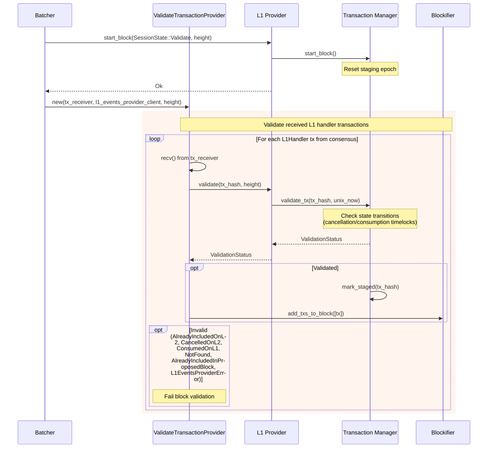

### Title
Rejected L1 handler transactions remain revalidatable and can be re-included after being explicitly rejected - (File: crates/apollo_l1_events/src/transaction_record.rs)

### Summary
`TransactionManager::validate_tx` gates a transaction's inclusion on `TransactionRecord::is_validatable()`, but that predicate only excludes `Committed`, `CancelledOnL2`, and `Consumed` states. A transaction whose record is in the `Rejected` state (set via `mark_rejected` after a prior block committed it as rejected) is *not* excluded, so it remains validatable and can be revalidated/staged into a future block despite having been explicitly rejected.

### Finding Description
`mark_rejected` transitions an L1 handler transaction's record to `TransactionState::Rejected`: [1](#0-0) 

`is_validatable`, used by `validate_tx` to decide whether a transaction can be accepted during block validation, only checks for `is_committed`, `is_cancelled`, and `is_consumed`: [2](#0-1) 

`validate_tx` calls `is_validatable()` and only maps `Committed`, `CancelledOnL2`, and `Consumed` to `Invalid` outcomes; any other reachable state (including `Rejected`) falls through `is_validatable() == true` and gets staged as `Validated`: [3](#0-2) 

`commit_txs` is the function that actually marks transactions `Rejected` for a committed block, explicitly asserting the transition must succeed (i.e., the record must exist) rather than skip it: [4](#0-3) 

Separately, `is_proposable()` (used to build the `proposable_index` for `get_txs`, the block-*proposal* path) explicitly checks `matches!(self.state, TransactionState::Pending)`, so a rejected transaction is correctly excluded from `get_txs`/proposal flow: [5](#0-4) 

However, the *validation* path (used when a node is validating another proposer's block, per the "Block Validation" sequence) does not consult `proposable_index`/`is_proposable()` at all — it calls `validate_tx` directly against the record's raw state via `is_validatable()`: [6](#0-5) 

This creates an inconsistency between the two entry points that gate L1-handler inclusion: the proposer-side check (`is_proposable`) excludes `Rejected`, but the validator-side check (`is_validatable`) does not. A malicious proposer (or any node acting as proposer) can therefore include an already-`Rejected` L1 handler transaction in a new block proposal, and honest validating nodes will call `validate_tx`, get `ValidationStatus::Validated` (since `is_validatable` returns true for `Rejected`), and accept the transaction into a new block — re-executing an L1 message that the network had already decided to reject.

### Impact Explanation
If a `Rejected` L1 handler transaction can be re-validated and re-included in a subsequent block, the resulting message-to-L2 execution (and any state mutations/fund transfers it triggers, e.g., token bridge deposits or contract calls funded by the L1 message) can occur a second time. Because L1 handler transactions are one-shot bridge/message deliveries, unintended re-execution of a transaction that the protocol had already marked `Rejected` constitutes an unauthorized state mutation / potential double-processing of an L1 message, causing honest-node divergence between nodes that still hold the record as `Rejected` vs. nodes that revalidate and accept it — a wrong committed state and potential fund-impacting inconsistency. This crosses the reachable-path bar because it is triggerable purely through the standard propose→validate→commit block flow using a legitimately-existing L1 handler transaction hash, without requiring any privileged/malicious-operator assumption beyond normal proposer rotation.

### Likelihood Explanation
The bug is only reachable in the narrow window after a block has been committed with a given tx in `rejected_txs`, and requires a subsequent proposer to select that hash for its next proposal. `get_txs` (proposal path) is correctly guarded via `is_proposable()`/`proposable_index` and would not surface a `Rejected` tx on its own, so exploiting this specifically requires a proposer to submit the rejected hash out-of-band (e.g., as part of an already-validated set / replay), or another future code path that is not restricted to `proposable_index`. Whether any current caller of `validate_tx` supplies transaction hashes outside those originated from the honest proposer's `get_txs` output was not fully confirmed within the available code/index; this is a genuine logic gap in `is_validatable()` versus `is_proposable()` regardless, but its practical triggerability depends on upstream callers of `validate`.

### Recommendation
Make `is_validatable()` consistent with `is_proposable()` by also excluding `TransactionState::Rejected`, or by having `validate_tx` explicitly branch on `TransactionState::Rejected` and return an appropriate `Invalid` status:
```rust
// transaction_record.rs
pub fn is_validatable(&self) -> bool {
    !self.is_committed() && !self.is_cancelled() && !self.is_consumed() && !matches!(self.state, TransactionState::Rejected)
}
```
and add a corresponding `InvalidValidationStatus` variant (e.g., `Rejected`) so `validate_tx`'s match arm handles it explicitly instead of relying on `unreachable!()`.

### Proof of Concept
1. Commit a block where `tx_hash` is included in `rejected_txs`, causing `TransactionManager::commit_txs` to call `mark_rejected` and set the record's state to `Rejected` (per `crates/apollo_l1_events/src/transaction_manager.rs:147-166` and `crates/apollo_l1_events/src/transaction_record.rs:62-72`).
2. In a subsequent block, a proposer includes `tx_hash` in the proposed L1-handler set (bypassing/independent of `get_txs`'s `is_proposable()` filter).
3. A validating node calls `L1EventsProvider::validate(tx_hash, height)` → `TransactionManager::validate_tx`, which calls `is_validatable()` on the `Rejected` record; since `is_validatable()` only excludes `Committed`/`CancelledOnL2`/`Consumed`, it returns `true`, the transaction is staged, and `ValidationStatus::Validated` is returned (`crates/apollo_l1_events/src/transaction_manager.rs:116-145`).
4. The transaction is added to the block via `TxProv->>BF: add_txs_to_block([tx])` and re-executed, despite being previously rejected.

### Citations

**File:** crates/apollo_l1_events/src/transaction_record.rs (L62-72)
```rust
    // Note: double reject not currently checked.
    pub fn mark_rejected(&mut self) {
        // Pedantic, this is unlikely to happen.
        assert!(
            !self.committed,
            "Attempted to reject a committed transaction {}",
            self.tx.tx_hash()
        );
        self.state = TransactionState::Rejected;
        self.rejected = true;
    }
```

**File:** crates/apollo_l1_events/src/transaction_record.rs (L155-157)
```rust
    pub fn is_proposable(&self) -> bool {
        matches!(self.state, TransactionState::Pending)
    }
```

**File:** crates/apollo_l1_events/src/transaction_record.rs (L173-181)
```rust
    /// Answers whether any node can include this transaction in a block. This is generally possible
    /// in all states in its lifecycle, except after it had already been added to block, or a short
    /// time after it's cancellation was requested on L1. In particular, this includes states
    /// like: a rejected transaction, a new timelocked transaction, a
    /// transaction whose cancellation was requested on L1 too recently (there will be a
    /// timelock for this).
    pub fn is_validatable(&self) -> bool {
        !self.is_committed() && !self.is_cancelled() && !self.is_consumed()
    }
```

**File:** crates/apollo_l1_events/src/transaction_manager.rs (L116-145)
```rust
    pub fn validate_tx(&mut self, tx_hash: TransactionHash, unix_now: u64) -> ValidationStatus {
        let current_staging_epoch_cloned = self.current_staging_epoch;

        let policy = TransactionRecordPolicy {
            cancellation_timelock: self.config.l1_handler_cancellation_timelock_seconds,
        };

        let validation_status = self.with_record(tx_hash, |record| {
            // If the current time affects the state, update state now.
            record.update_time_based_state(unix_now, policy);
            if !record.is_validatable() {
                match record.state {
                    TransactionState::Committed => {
                        InvalidValidationStatus::AlreadyIncludedOnL2.into()
                    }
                    TransactionState::CancelledOnL2 => {
                        InvalidValidationStatus::CancelledOnL2.into()
                    }
                    TransactionState::Consumed => InvalidValidationStatus::ConsumedOnL1.into(),
                    _ => unreachable!(),
                }
            } else if record.try_mark_staged(current_staging_epoch_cloned) {
                ValidationStatus::Validated
            } else {
                InvalidValidationStatus::AlreadyIncludedInProposedBlock.into()
            }
        });

        validation_status.unwrap_or(InvalidValidationStatus::NotFound.into())
    }
```

**File:** crates/apollo_l1_events/src/transaction_manager.rs (L147-166)
```rust
    pub fn commit_txs(
        &mut self,
        committed_txs: &[TransactionHash],
        rejected_txs: &[TransactionHash],
    ) {
        self.rollback_staging();

        for &tx_hash in committed_txs {
            self.create_record_if_not_exist(tx_hash);
            self.with_record(tx_hash, |r| r.mark_committed()).unwrap();
        }
        for &tx_hash in rejected_txs {
            self.with_record(tx_hash, |r| r.mark_rejected()).expect(
                "Rejected L1 handler tx has no record. Unreachable: all L1 handler txs in a \
                 committed block were validated as known (validation rejects unknown hashes), \
                 sync commits with empty rejected_txs, and records are only removed via L1 \
                 cancellation/consumption, which can't race a block.",
            );
        }
    }
```

**File:** docs/diagrams/06-l1-handler-flow.md (L112-151)
```markdown
## Block Validation - Validating L1 Transactions


