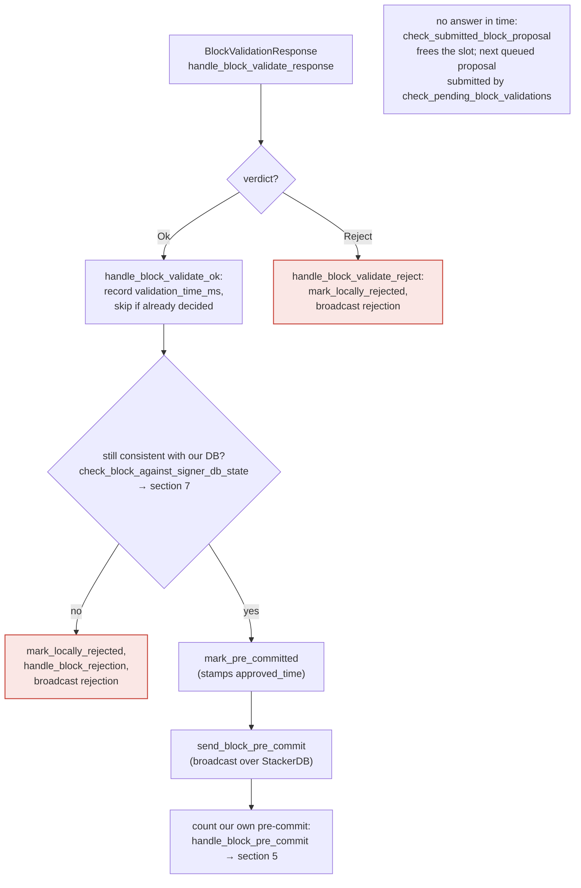

### Title
Wall-clock resource-limiter timeouts in block-proposal validation cause signers to reach different accept/reject verdicts on the identical block, enabling minority-triggered tip disagreement - (File: `clarity/src/vm/resource_limiter.rs`, `stackslib/src/net/api/postblock_proposal.rs`)

### Summary
The `_execMatchOneToOneOrders`-style bug class in the external report is "a gas-metering side effect that depends on runtime conditions the attacker controls, and different observers of the same transaction can be charged/behave differently." The closest reachable analog in this repo is the wall-clock (`Instant::now`) resource limiter used to bound Clarity execution/analysis time during **block-proposal validation** by signers. Because the bound is wall-clock time rather than the deterministic Clarity cost metric, an attacker can craft a single transaction whose deterministic cost is safely under the consensus cost limit but whose real execution time sits near the configured `max_tx_execution_time_secs`/`max_tx_analysis_time_secs` threshold. Different signer nodes (different hardware/load) will then reach different `Ok`/`Reject` verdicts for the exact same block proposal.

### Finding Description
`ResourceLimiter`/`TimeTracker` in [1](#0-0)  measures elapsed wall-clock time from `Instant::now()` and fails a transaction with `ExecutionResourceBudgetExceeded`/`AnalysisResourceBudgetExceeded` once `elapsed >= max_duration`. The code explicitly documents that this bound "MUST be unlimited during consensus-critical processing... because that must remain deterministic," and is only exercised on "non-consensus voting paths: mining and block-proposal validation" [2](#0-1) .

That non-consensus path is exactly the signer's `/v3/block_proposal` validation, in `NakamotoBlockBuilder`'s block replay in [3](#0-2) , which builds a `TransactionResourceBudgets` with per-tx wall-clock deadlines (`per_tx_max_execution_time`, `per_tx_max_analysis_time`) and an overall `block_deadline`. A transaction that exceeds its budget is treated as `Problematic`/`Rejected`, causing the whole block proposal to be rejected by that particular signer node (see the `is_problematic` handling in [4](#0-3) ).

The verdict from this endpoint feeds directly into whether a signer sends its pre-commit/signature or a rejection, as documented in the signer flow: `handle_block_validate_response` → `Ok` leads to pre-commit/signing, `Reject` leads to `mark_locally_rejected` and broadcasting a rejection [5](#0-4) . Because wall-clock execution time for the *same bytes* varies with CPU speed, thread contention, and load, a transaction engineered to sit just below/above the configured timeout on average hardware will non-deterministically pass on faster/idle nodes and fail on slower/busier nodes. This breaks the intended equality "all honest signers reach the same accept/reject verdict for the same block proposal."

### Impact Explanation
This matches the rule-permitted "High - a minority-triggerable sortition/VRF/static-validation divergence... temporary tip disagreement" category. A single unprivileged user (the block's transaction author, or a miner including such a transaction) — a minority actor, no majority collusion needed — can craft one transaction that is deterministically cheap (well under `ExecutionCost` budget, so it can never invalidate a block or fork the chain by itself) but has wall-clock runtime hovering at the resource-limiter threshold. This causes some fraction of signers to reject the proposal as "problematic" (`ExecutionResourceBudgetExceeded`) while others validate it `Ok`, splitting the weighted pre-commit/signature pool and delaying or, near the 30%/70% boundary, materially raising the chance that a legitimate block fails to reach the 70% signing threshold in time — a temporary tip disagreement / stalled tenure, not a permanent chain split (since deterministic cost tracking remains the actual consensus rule and unlimited on replay/commit, per [6](#0-5) ).

### Likelihood Explanation
Likelihood is non-trivial: no elevated privileges are required, only the ability to submit or have a miner include a transaction whose real Clarity-VM execution time is close to the operator-configured timeout (values are node-local config, e.g. `max_execution_time`, `max_analysis_time`, `max_tx_execution_time_secs` in [7](#0-6)  and `postblock_proposal.rs`). An attacker can iterate offline against a representative node to calibrate a transaction (e.g., heavy string/buffer manipulation, deeply nested `match`/`fold`, or contract-analysis-heavy constructs) whose cost stays under the deterministic budget while wall time straddles the configurable deadline, exploiting normal machine-to-machine timing variance among the signer set.

### Recommendation
- Do not gate block-proposal accept/reject decisions on wall-clock timers alone; if a defense-in-depth timeout is needed, treat a timeout as "inconclusive" (retry/abstain) rather than a hard rejection that gets broadcast and tallied against the block, so it cannot itself tip the 70%/30% threshold.
- Alternatively, base the "problematic" detection purely on the deterministic `ExecutionCost` metric (already consensus-safe) and make the wall-clock/memory limiter's outcome only used for local safety (e.g., killing a runaway process) without producing a `BlockRejection` that is broadcast to peers.
- If wall-clock limits must influence rejections, standardize the timeout relative to a deterministic proxy (e.g., cost units) instead of `Instant::now()`, so all conforming nodes reach the same verdict for the same bytes.

### Proof of Concept
1. An attacker (or the current miner) crafts a Clarity transaction `T` whose analysis/execution `ExecutionCost` is safely below `BLOCK_LIMIT`, but whose actual interpreter wall-clock time is engineered (via calibration against a reference node) to be near the configured `max_tx_execution_time_secs`/`max_tx_analysis_time_secs`.
2. The miner includes `T` in a Nakamoto block and broadcasts the proposal to signers.
3. Each signer node independently replays the block via `NakamotoBlockBuilder`/`try_mine_tx_with_len` under its own `TransactionResourceBudgets` wall-clock deadlines (`stackslib/src/net/api/postblock_proposal.rs:726-782`).
4. Faster/idle signer nodes finish `T` under the deadline and return `Ok`; slower/loaded signer nodes exceed the deadline and get `ExecutionResourceBudgetExceeded`, causing `is_problematic` to mark the block `Rejected` (`stackslib/src/chainstate/stacks/miner.rs:661-733`).
5. Signers broadcast conflicting verdicts (`handle_block_validate_ok` vs `handle_block_validate_reject`), some pre-committing/signing and others rejecting the identical block bytes — producing a split pre-commit/signature pool and a temporary tip disagreement until enough weight resolves one way.

### Citations

**File:** clarity/src/vm/resource_limiter.rs (L24-41)
```rust
/// Tracks wall-clock time spent in a single execution phase of one transaction
/// (Clarity evaluation *or* contract analysis) and signals when a configured
/// deadline has elapsed.
///
/// [`TimeTracker::NoTracking`] is the deterministic-replay / no-limit case (it must be used on
/// the commit/replay path so consensus stays deterministic).
///
/// [`TimeTracker::MaxTime`] is used only on the non-consensus voting paths:
/// block assembly (mining) and block-proposal validation (signers) to bound the time
/// a single transaction can spend.
#[derive(Clone, Copy)]
enum TimeTracker {
    NoTracking,
    MaxTime {
        start_time: Instant,
        max_duration: Duration,
    },
}
```

**File:** clarity/src/vm/resource_limiter.rs (L181-199)
```rust
/// Specifies the maximum wallclock time and the maximum heap allocation
/// that can be used by an operation. The two relevant operations are
/// contract analysis and execution, each of which have separate budgets
/// (see `TransactionResourceBudgets`).
///
/// Call [`ResourceBudget::start_tracking`] to receive a [`ResourceLimiter`] that
/// fixes the baseline (current time and memory allocation) and that can be polled
/// to ensure usage stays within limits.
///
/// Memory tracking requires that the [`TrackingAllocator`] has been installed.
///
/// This is NOT related to cost tracking. The latter is consensus-critical and therefore
/// deterministic. The purpose of the [`ResourceBudget`] is defense-in-depth: If
/// a bug in clarity evaluation or analysis causes a long runtime or a huge amount
/// of memory being used, the miner will not include it in a block, and the signer
/// will reject the block as problematic.
///
/// During consensus-critical work, the budget MUST be [`ResourceBudget::unlimited`]
/// to ensure determinism.
```

**File:** stackslib/src/net/api/postblock_proposal.rs (L726-782)
```rust
        let mut miner_tenure_info =
            builder.load_tenure_info(chainstate, &burn_dbconn, tenure_cause)?;
        let burn_chain_height = miner_tenure_info.burn_tip_height;
        let mut tenure_tx = builder.tenure_begin(&burn_dbconn, &mut miner_tenure_info)?;

        let block_deadline = Instant::now() + Duration::from_secs(timeout_secs);
        let per_tx_max_execution_time = Duration::from_secs(max_tx_execution_time_secs);
        // Bound the analysis phase during proposal validation by the
        // dedicated per-tx analysis budget, independently of the eval budget above.
        let per_tx_max_analysis_time = Duration::from_secs(max_tx_analysis_time_secs);
        let mut receipts_total = 0u64;

        let max_tx_mem_bytes_opt = if max_tx_mem_bytes > 0 {
            Some(max_tx_mem_bytes)
        } else {
            None
        };
        let resource_budgets = TransactionResourceBudgets::new()
            .with_analysis_budget(
                ResourceBudget::new()
                    .with_max_duration(Some(per_tx_max_analysis_time))
                    .with_max_memory_use(max_tx_mem_bytes_opt),
            )
            .with_execution_budget(
                ResourceBudget::new()
                    .with_max_duration(Some(per_tx_max_execution_time))
                    .with_max_memory_use(max_tx_mem_bytes_opt),
            );

        for (i, tx) in self.block.txs.iter().enumerate() {
            // Enforce the overall block validation budget between txs. A tx
            // running over its own per-tx limit is the tx's fault and is
            // handled below; running out of overall budget is the block's
            // fault and shouldn't flag any specific tx as problematic.
            if Instant::now() >= block_deadline {
                warn!(
                    "Rejected block proposal";
                    "reason" => "Block validation timed out",
                    "next_tx_index" => i,
                );
                return Err(BlockValidateRejectReason {
                    reason: format!("Block validation timed out before tx {i} could be processed"),
                    reason_code: ValidateRejectCode::InvalidBlock,
                    failed_txid: None,
                });
            }

            let tx_len = tx.tx_len();

            let tx_result = builder.try_mine_tx_with_len(
                &mut tenure_tx,
                tx,
                tx_len,
                &BlockLimitFunction::NO_LIMIT_HIT,
                &resource_budgets,
                &mut receipts_total,
            );
```

**File:** stackslib/src/chainstate/stacks/miner.rs (L661-733)
```rust
    pub fn is_problematic(
        tx: &StacksTransaction,
        error: Error,
        epoch_id: StacksEpochId,
    ) -> (bool, Error) {
        let error = match error {
            Error::ClarityError(e) => match handle_clarity_runtime_error(e, epoch_id) {
                ClarityRuntimeTxError::Rejected(RejectedRuntimeTxError::Clarity {
                    error: e,
                    ..
                }) => {
                    // this transaction would invalidate the whole block, so don't re-consider it
                    info!("Problematic transaction would invalidate the block, so dropping from mempool"; "txid" => %tx.txid(), "error" => %e);
                    return (true, Error::ClarityError(e));
                }
                // An included failure is still mineable: recover the original `ClarityError`.
                ClarityRuntimeTxError::Included(included) => Error::ClarityError(included.into()),
                ClarityRuntimeTxError::Rejected(RejectedRuntimeTxError::Cost {
                    cost,
                    budget,
                    ..
                }) => Error::ClarityError(ClarityError::CostError(cost, budget)),
                ClarityRuntimeTxError::Rejected(
                    RejectedRuntimeTxError::ExecutionResourceBudgetExceeded { message: s, .. },
                ) => {
                    // This transaction took too long to execute or used too much heap memory. Consider it problematic.
                    info!("Problematic transaction caused ExecutionResourceBudgetExceeded";
                          "error" => s.clone(),
                          "txid" => %tx.txid(),
                          "origin" => %tx.get_origin().get_address(false),
                          "payload" => ?tx.payload,
                    );
                    return (true, Error::ExecutionResourceBudgetExceeded(s));
                }
            },
            Error::InvalidFee => {
                // The transaction didn't have enough STX left over after it was run.
                // While such a transaction *could* be mineable in the future, e.g. depending on
                // which code paths were hit, the user should really have attached an appropriate
                // tx fee in the first place.  In Stacks 2.1, the code will debit the fee first, so
                // this will no longer be an issue.
                info!("Problematic transaction caused InvalidFee";
                      "txid" => %tx.txid(),
                      "origin" => %tx.get_origin().get_address(false),
                      "payload" => ?tx.payload,
                );
                return (true, Error::InvalidFee);
            }
            Error::ExecutionResourceBudgetExceeded(s) => {
                // The transaction took too long to execute or used too much heap memory. Consider it problematic.
                info!("Problematic transaction caused ExecutionResourceBudgetExceeded";
                      "error" => s.clone(),
                      "txid" => %tx.txid(),
                      "origin" => %tx.get_origin().get_address(false),
                      "payload" => ?tx.payload,
                );
                return (true, Error::ExecutionResourceBudgetExceeded(s));
            }
            Error::AnalysisResourceBudgetExceeded(s) => {
                // The transaction's contract analysis took too long or used too much memory. Consider it problematic
                // so the contract-publish is dropped and blacklisted instead of being re-mined.
                info!("Problematic transaction caused AnalysisResourceBudgetExceeded";
                      "error" => s.clone(),
                      "txid" => %tx.txid(),
                      "origin" => %tx.get_origin().get_address(false),
                      "payload" => ?tx.payload,
                );
                return (true, Error::AnalysisResourceBudgetExceeded(s));
            }
            e => e,
        };
        (false, error)
    }
```

**File:** stackslib/src/chainstate/stacks/miner.rs (L765-784)
```rust
    pub fn unlimited() -> Self {
        Self::new()
    }

    pub fn from_settings(settings: &BlockBuilderSettings) -> Self {
        let memory_limit = if settings.max_assembly_mem_bytes > 0 {
            Some(settings.max_assembly_mem_bytes)
        } else {
            None
        };

        Self {
            execution_budget: ResourceBudget::new()
                .with_max_duration(settings.max_execution_time)
                .with_max_memory_use(memory_limit),
            analysis_budget: ResourceBudget::new()
                .with_max_duration(settings.max_analysis_time)
                .with_max_memory_use(memory_limit),
        }
    }
```

**File:** docs/signer-flows.md (L205-227)
```markdown
## 4. The node's validation verdict

The stacks-node answers the `/v3/block_proposal` submission. On OK, the signer
re-checks its own DB state and only then advertises willingness to sign by
broadcasting a **pre-commit**. A signature is _not_ produced here.



> Anchors: `handle_block_validate_response`, `handle_block_validate_ok`,
> `handle_block_validate_reject`, `check_block_against_signer_db_state`,
> `send_block_pre_commit` (signer.rs)
```
