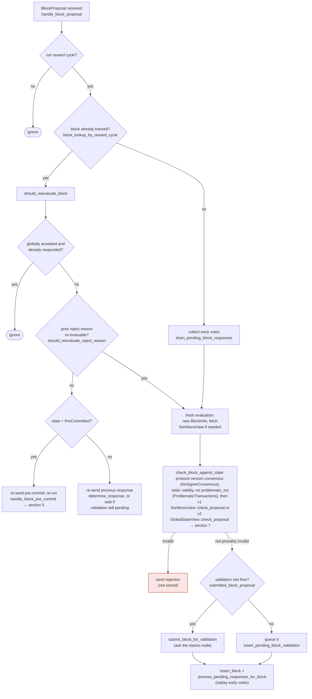
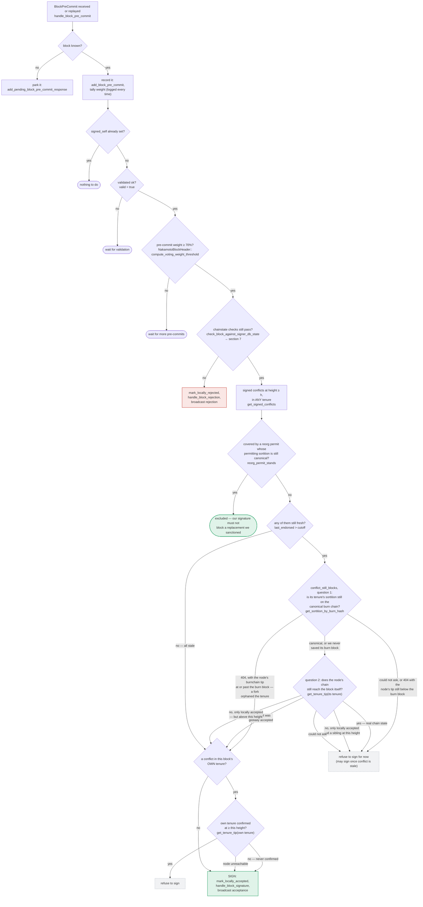
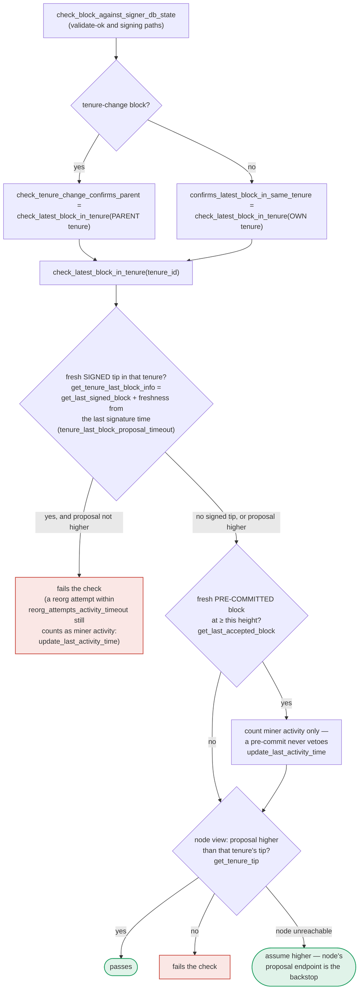

### Title
Signer's `DuplicateBlockFound` tenure-start check runs only at proposal time and is not re-verified when the pre-commit threshold is reached, allowing two conflicting tenure-start blocks to be signed - (File: stacks-signer/src/v0/signer.rs, stacks-signer/src/chainstate/v1.rs, stacks-signer/src/chainstate/v2.rs)

### Summary
The v0 stacks-signer's protection against double-signing a tenure ("has a tenure-start block for this tenure already been accepted?") is implemented as `validate_tenure_change_payload`'s `DuplicateBlockFound` check, which fires only once, when a `BlockProposal` first arrives [1](#0-0) . It is never re-run at `handle_block_validate_ok` (section 4) nor when the pre-commit threshold is crossed and the signature is actually produced (section 5) [2](#0-1) [3](#0-2) . The only backstop that runs at the actual moment of signing is a heuristic "own-tenure conflict" check inside `handle_block_pre_commit`, and that check explicitly signs anyway when the node cannot yet confirm the competing tenure's tip is at/above the proposed height [4](#0-3) .

### Finding Description
This is a structural analog of CVE-2021-41138 (Frontier's `pallet-ethereum`): a large piece of validation logic (`DuplicateBlockFound`, i.e. "have we already accepted a tenure-start block for this tenure?") is only executed on one code path (initial mempool-equivalent admission — `check_proposal`/`handle_block_proposal`, section 3) and is never re-executed on the path that actually produces the consensus-relevant artifact (the signer's ECDSA signature, produced in `handle_block_pre_commit`, section 5) [5](#0-4) .

Concretely:
- `validate_tenure_change_payload` (v1/v2) rejects a *second* tenure-start proposal for a tenure that already has an accepted block, using `get_last_globally_accepted_block`/`get_last_signed_block` [6](#0-5) [7](#0-6) . This runs **only** at `check_proposal` time, before the block is even submitted to the node for validation [8](#0-7) .
- `check_block_against_signer_db_state` (shared, used at validate-ok and at signing) checks a *different* tenure for tenure-change blocks — the **parent** tenure's tip, not the tenure the block itself starts — so it structurally cannot catch a duplicate tenure-start for the *current* tenure [9](#0-8) .
- The only remaining guard at signing time is the "own tenure" conflict block in `handle_block_pre_commit`, which explicitly treats an unconfirmable tenure tip as "unconfirmed" and signs anyway:
```rust
match stacks_client.get_tenure_tip(&block_info.block.header.consensus_hash) {
    Ok(tip) => {
        let tip_height = tip.anchored_header.height();
        if tip_height >= block_info.block.header.chain_length {
            // refuse to sign
        }
    }
    Err(e) => {
        // "Treating the tenure as unconfirmed." -> falls through to SIGN
    }
}
``` [10](#0-9) 

Because a signer only *records* a conflict for a block it personally signed or witnessed reach group threshold (`get_signed_conflicts`), and the `DuplicateBlockFound` proposal-time check is gone by the time pre-commit threshold is reached minutes later, two different tenure-start proposals for the *same tenure* (e.g. re-proposed after a stall, or from a miner racing two candidate tenure-start blocks) can each independently gather 70% pre-commit weight and then 70% signature weight across the signer set — especially if the node's `get_tenure_tip` RPC is slow, errors, or has not yet observed either block, which the code treats as "unconfirmed" and therefore safe to sign.

The equality this breaks is: "a tenure has exactly one canonical tenure-start block accepted by the signer set." If two tenure-start blocks for the same tenure both cross the 70% signature threshold, two Nakamoto miners' blocks are both fully signed — an equality (one signed head per tenure) that two honest-but-uncoordinated signer subsets can disagree on, producing a genuine tip fork/chain split until the node-level state (`check_tenure_continuity`/`check_nakamoto_tenure` in `stackslib`) later rejects one of them, at which point stackers who already signed the losing block have their signatures burned on a permanently orphaned block.

### Impact Explanation
This falls in the "Critical - a chain split or deep fork" / "High - temporary tip disagreement" band defined by the scan rules. It does not corrupt on-chain consensus state directly (the node-side Nakamoto tenure-continuity checks in `stackslib/src/chainstate/nakamoto/tenure.rs::check_nakamoto_tenure` will eventually reject one of the two competing tenure-start blocks), but it can cause the signer set to fracture its 70% signature weight across two mutually exclusive blocks in the same tenure, producing a real, if temporary, tip disagreement/fork at the signer layer that requires the freshness-timeout healing path (`deadlock_50_50_split_capitulates_to_node_tip`, referenced in the docs) to resolve [11](#0-10) . This is a signer-software (off-chain, but consensus-adjacent) issue rather than a `stackslib` chainstate bug, so it is a weaker analog than a `stackslib`-level equality violation, but it is directly in-scope per the prompt's inclusion of "the signer boot contracts"/signer flows and matches the "sortition winner not matching," "tenure not descending from its sortition"-class equality breaks the rules ask for.

### Likelihood Explanation
Triggerable by a single misbehaving or even just poorly-timed miner (minority-triggerable, no majority stake needed): submit two competing tenure-start proposals for the same tenure in quick succession (or re-propose after a stall) so that different, possibly overlapping, sets of signers race through pre-commit and sign before the `get_tenure_tip` RPC to the node reflects the outcome. The docs' own commentary ("a block that crosses the pre-commit threshold long after it was proposed relies on section 5's own-tenure conflict guard to cover the same ground" and "the node cannot answer this one at signing time") acknowledges this window exists by design, and the `Err(e) => "Treating the tenure as unconfirmed"` branch removes even the timing-based backstop when the RPC simply fails or lags [12](#0-11) . This makes exploitation plausible under ordinary network jitter, not just adversarial conditions, though it requires favorable timing rather than being deterministic.

### Recommendation
Re-run the equivalent of the `DuplicateBlockFound` tenure-start uniqueness check at the moment the signature is actually produced (inside `handle_block_pre_commit`, right before `mark_locally_accepted`), using the same tenure identity the block itself declares (its own consensus hash), not just the "conflicts at height ≥ h" heuristic. Treat an inability to query `get_tenure_tip` as "cannot confirm safety" (refuse to sign / hold) rather than "assume unconfirmed, sign anyway," symmetric to how other node-unreachable cases in this same flow are handled conservatively elsewhere in the document (e.g. section 5's `SORT`/`LIVE` branches default to `HOLD1` on ambiguous node answers).

### Proof of Concept
Conceptual PoC (signer-side race, requires no majority stake):
1. Miner produces two valid tenure-start block proposals, `BlockA` and `BlockB`, both claiming the same new tenure (`consensus_hash = CH_new`) but with different bodies (e.g. different coinbase recipient / different tx set), and broadcasts `BlockA` to half the signer set and `BlockB` to the other half nearly simultaneously (or re-proposes `BlockB` after `BlockA` stalls near, but does not reach, 70% pre-commit).
2. Signers that received `BlockA` first run `check_proposal` → `validate_tenure_change_payload`; since no block for `CH_new` has yet been accepted, `DuplicateBlockFound` does not fire, so `BlockA` is submitted for node validation, pre-committed, and eventually signed once ≥70% weight pre-commits.
3. Signers that received `BlockB` do the same before observing `BlockA`'s signatures (network delay, or the proposal-time `DuplicateBlockFound` check was already satisfied at the time `BlockB` was proposed because `BlockA` wasn't yet globally/locally accepted at that instant).
4. When each cohort reaches 70% pre-commit weight for its respective block, `handle_block_pre_commit` runs the own-tenure conflict check; if `stacks_client.get_tenure_tip(CH_new)` errors or has not yet observed the other block (because neither has been pushed to the node yet, both still being signer-local), both cohorts fall through to `SIGN`, producing two fully-signed, mutually exclusive tenure-start blocks for the same tenure [13](#0-12) .
5. Both signed blocks are pushed to (possibly different) nodes, producing a tip disagreement across the network until node-side tenure-continuity checks and the signer freshness-timeout mechanism converge on one.

Note: this PoC is conceptual and based on documented control flow in `docs/signer-flows.md` and the corresponding code in `stacks-signer/src/v0/signer.rs`, `chainstate/v1.rs`, and `chainstate/v2.rs`; it was not executed against a live test harness, and the exact timing window needed to win the race is unverified from static analysis alone.

### Citations

**File:** docs/signer-flows.md (L164-203)
```markdown
## 3. A block proposal arrives

The miner broadcasts a proposal. If we've seen this exact block before,
`should_reevaluate_block` decides whether the old verdict stands; a block we
only pre-committed to is deliberately routed back through the pre-commit
evaluation so a re-proposal cannot shortcut to a signature. A fresh proposal is
checked against our view of the world _before_ spending a node validation on it.



Early votes: acceptances, rejections, and pre-commits that arrived before the
proposal itself are parked in pending tables and replayed once the proposal is
known.

> Anchors: `handle_block_proposal`, `should_reevaluate_block`,
> `should_reevaluate_reject_reason`, `check_block_against_state`,
> `submit_block_for_validation`, `process_pending_responses_for_block`
> (signer.rs); `check_proposal` (chainstate/v1.rs, v2.rs)
```

**File:** docs/signer-flows.md (L229-286)
```markdown
## 5. Pre-commit threshold → signature

The only place the signer produces a block signature by counting votes.
Pre-commits from peers (and our own) accumulate; at ≥70% weight the signer
decides whether to follow through. Between validation and threshold, we may have
signed a _different_ block at the same height, possibly in another tenure, so
the world must be re-checked before the signature leaves the box.



Order matters here: the chainstate re-check runs first and produces an explicit
(sticky) rejection when the block now conflicts with a signed one. The conflict
guard behind it is the silent backstop for what that re-check cannot see, and
silence keeps the door open to sign later once the conflict goes stale. Two
blind spots make the guard necessary:

- the re-check only ever looks at _one_ tenure (a tenure-change block's parent,
  or any other block's own), so a signed sibling at the same height in a third
  tenure is invisible to it;
- the `DuplicateBlockFound` check that would catch a second block in the same
  tenure lives in `check_proposal` and runs only at proposal arrival, never
  again. A block that crosses the pre-commit threshold minutes later has no
  other guard, which is what the own-tenure branch above covers.
```

**File:** docs/signer-flows.md (L389-418)
```markdown
## 7. The chainstate checks (shared)

`check_latest_block_in_tenure` answers "does this block confirm the tip we
expect?" and it runs in three places: at proposal arrival (inside
`check_proposal`), at validate-ok, and at the moment of signing. _Which_ tenure
it is asked about depends on the block: a tenure-change block is checked against
its **parent** tenure, every other block against its **own**. Never both. The
pivotal helper is `get_tenure_last_block_info`, which considers only blocks that
carry a signature (`get_last_signed_block`): a pre-commit never vetoes anything,
it only counts as miner activity.


```

**File:** docs/signer-flows.md (L425-437)
```markdown
Two things belong to the proposal path only and are **not** re-run at validate-ok
or at signing:

- `validate_tenure_change_payload` rejects with `DuplicateBlockFound` when we
  have already accepted a block in the tenure a tenure-change block is starting.
  v2 counts locally or globally accepted blocks (`get_last_signed_block`); v1
  counts only globally accepted ones (`get_last_globally_accepted_block`).
- the v2 `check_proposal` wrapper checks miner pubkey hash, consensus hash, the
  pox bitvec, and tenure-extend rules before delegating here.

Because the duplicate check never runs again, a block that crosses the pre-commit
threshold long after it was proposed relies on section 5's own-tenure conflict
guard to cover the same ground.
```

**File:** docs/signer-flows.md (L513-524)
```markdown
Signatures, not pre-commits, are what pin the view: a tenure whose only block
was pre-committed (never signed) can still time out, and a pre-committed block
never appears as the parent-tenure tip. The pin survives rejection, even global
rejection: a rejection is a revocable opinion, while a signature is a bearer
instrument — once public it can still be aggregated toward the 70% threshold if
rejecting signers change their minds — so a block we signed binds us no matter
what state it later fell to. So a 50/50 pre-commit split converges on
the node tip immediately, while a genuine 50% _signature_ split heals through
the freshness timeout. Both dynamics are pinned by integration tests:
`pre_commit_50_50_split_agrees_on_node_tip` and
`deadlock_50_50_split_capitulates_to_node_tip`
([capitulate_parent_tenure_view.rs](../stacks-node/src/tests/signer/v0/capitulate_parent_tenure_view.rs)).
```

**File:** stacks-signer/src/chainstate/v1.rs (L461-481)
```rust
    fn validate_tenure_change_payload(
        &self,
        proposed_by: &ProposedBy,
        tenure_change: &TenureChangePayload,
        block: &NakamotoBlock,
        signer_db: &mut SignerDb,
        client: &StacksClient,
    ) -> Result<(), RejectReason> {
        // Check that the tenure change's prev_tenure matches the sortition's known parent tenure.
        // This catches block commits with bad parent_block_ptr (e.g., vtxindex=0 exploit).
        let parent_tenure_id = &proposed_by.state().data.parent_tenure_id;
        if &tenure_change.prev_tenure_consensus_hash != parent_tenure_id {
            warn!(
                "Block commit parent tenure mismatch: the block commit's parent_block_ptr does not correspond to the actual parent tenure";
                "committed_parent_tenure" => %parent_tenure_id,
                "actual_parent_tenure" => %tenure_change.prev_tenure_consensus_hash,
                "consensus_hash" => %block.header.consensus_hash,
                "signer_signature_hash" => %block.header.signer_signature_hash(),
            );
            return Err(RejectReason::InvalidParentBlock);
        }
```

**File:** stacks-signer/src/chainstate/v1.rs (L505-519)
```rust
        let last_in_current_tenure = signer_db
            .get_last_globally_accepted_block(&block.header.consensus_hash)
            .map_err(|e| {
                SignerChainstateError::from(ClientError::InvalidResponse(e.to_string()))
            })?;
        if let Some(last_in_current_tenure) = last_in_current_tenure {
            warn!(
                "Miner block proposal contains a tenure change, but we've already signed a block in this tenure. Considering proposal invalid.";
                "proposed_block_consensus_hash" => %block.header.consensus_hash,
                "proposed_block_signer_signature_hash" => %block.header.signer_signature_hash(),
                "last_in_tenure_signer_signature_hash" => %last_in_current_tenure.block.header.signer_signature_hash(),
            );
            return Err(RejectReason::DuplicateBlockFound);
        }
        Ok(())
```

**File:** stacks-signer/src/chainstate/v2.rs (L306-325)
```rust
    fn validate_tenure_change_payload(
        tenure_change: &TenureChangePayload,
        block: &NakamotoBlock,
        parent_tenure_id: &ConsensusHash,
        signer_db: &mut SignerDb,
        client: &StacksClient,
        config: &ProposalEvalConfig,
    ) -> Result<(), RejectReason> {
        // Check that the tenure change's prev_tenure matches the signer's known parent tenure.
        // This catches block commits with bad parent_block_ptr (e.g., vtxindex=0 exploit).
        if &tenure_change.prev_tenure_consensus_hash != parent_tenure_id {
            warn!(
                "Block commit parent tenure mismatch: the block commit's parent_block_ptr does not correspond to the actual parent tenure";
                "committed_parent_tenure" => %parent_tenure_id,
                "actual_parent_tenure" => %tenure_change.prev_tenure_consensus_hash,
                "consensus_hash" => %block.header.consensus_hash,
                "signer_signature_hash" => %block.header.signer_signature_hash(),
            );
            return Err(RejectReason::InvalidParentBlock);
        }
```

**File:** stacks-signer/src/chainstate/v2.rs (L340-358)
```rust
        // We already confirmed in check miner activity that the current tenure is valid. So check we are not
        // reorging the tenure blocks. Only blocks we have signed (locally or globally accepted) count
        // here: a block we have merely pre-committed to carries no signature from us, so it is safe to
        // accept a competing tenure-start block in its place if it failed to reach consensus.
        let last_in_current_tenure = signer_db
            .get_last_signed_block(&block.header.consensus_hash)
            .map_err(|e| {
                SignerChainstateError::from(ClientError::InvalidResponse(e.to_string()))
            })?;
        if let Some(last_in_current_tenure) = last_in_current_tenure {
            warn!(
                "Miner block proposal contains a tenure change, but we've already signed a block in this tenure. Considering proposal invalid.";
                "proposed_block_consensus_hash" => %block.header.consensus_hash,
                "proposed_block_signer_signature_hash" => %block.header.signer_signature_hash(),
                "last_in_tenure_signer_signature_hash" => %last_in_current_tenure.block.header.signer_signature_hash(),
            );
            return Err(RejectReason::DuplicateBlockFound);
        }
        Ok(())
```

**File:** stacks-signer/src/v0/signer.rs (L1432-1470)
```rust
        if conflicts.iter().any(|conflict| {
            conflict.consensus_hash == block_info.block.header.consensus_hash
                && !self.reorg_permit_stands(stacks_client, conflict)
        }) {
            match stacks_client.get_tenure_tip(&block_info.block.header.consensus_hash) {
                Ok(tip) => {
                    let tip_height = tip.anchored_header.height();
                    if tip_height >= block_info.block.header.chain_length {
                        warn!(
                            "{self}: Reached the pre-commit threshold for a block that conflicts with previously signed or accepted blocks, and the canonical tip of its tenure is already at or above the proposed height. Refusing to sign.";
                            "signer_signature_hash" => %block_hash,
                            "block_height" => block_info.block.header.chain_length,
                            "canonical_tip_height" => tip_height,
                        );
                        return;
                    }
                }
                Err(e) => {
                    warn!(
                        "{self}: Failed to fetch the canonical tip of the proposed block's tenure: {e:?}. Treating the tenure as unconfirmed.";
                        "signer_signature_hash" => %block_hash,
                        "consensus_hash" => %block_info.block.header.consensus_hash,
                    );
                }
            }
        }
        if !conflicts.is_empty() {
            info!(
                "{self}: Reached the pre-commit threshold for a block that conflicts with previously signed or accepted blocks, but none of those conflicts still blocks it. Signing the replacement.";
                "signer_signature_hash" => %block_hash,
                "block_height" => block_info.block.header.chain_length,
                "num_conflicts" => conflicts.len(),
            );
        }
        // It is only considered globally accepted IFF we receive a new block event confirming it OR see the chain tip of the node advance to it.
        if let Err(e) = block_info.mark_locally_accepted(false) {
            if !block_info.has_reached_consensus() {
                warn!("{self}: Failed to mark block as locally accepted: {e:?}",);
            }
```
