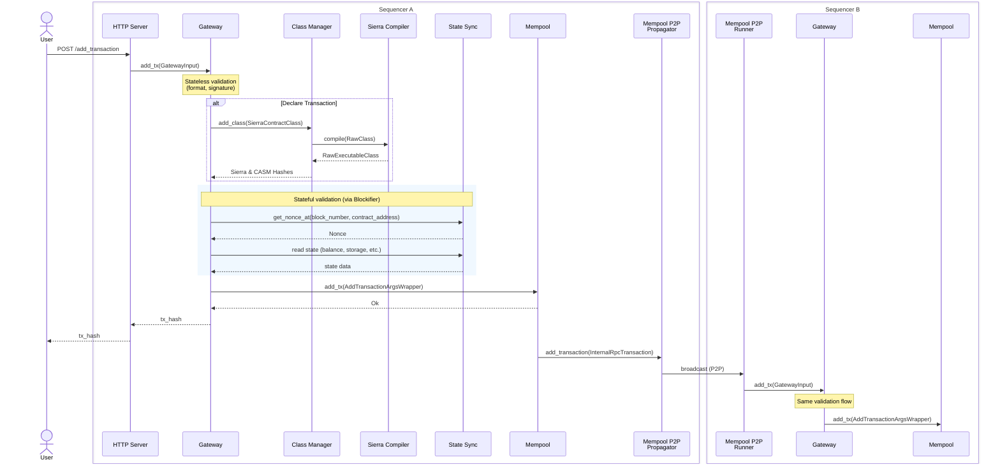

## Finding: Unbounded Native Recursion over Attacker-Influenced `NestedIntList` Bytecode-Segment Structure

### Title
Stack-Overflow DoS via Unbounded Recursive `bytecode_hash_node`/Segment-Structure Processing on Declared Classes - (File: `crates/starknet_api/src/contract_class/compiled_class_hash.rs`)

### Summary
The GHSA-443j-6p7g-6v4w report describes a DoS caused by unbounded recursive processing of a nested/self-referential structure (YAML anchors) with no depth limit. The sequencer contains an analogous pattern: the compiled-class-hash computation and the Starknet-OS bytecode-segment-structure builder both recurse over a `NestedIntList`/`CasmContractClass.bytecode_segment_lengths` tree with **no recursion-depth bound**, and this computation runs **in-process** (not inside the resource-limited compiler subprocess) as part of handling a Declare transaction and during OS re-execution.

### Finding Description
`bytecode_hash_node` recurses once per level of `bytecode_segment_lengths` with no depth check: [1](#0-0) 

The same unbounded-recursion pattern exists in the Starknet-OS bytecode segment builder used during re-execution: [2](#0-1) 

and in `blockifier`'s `NestedFeltCounts` builder, which is only depth-bounded to 1 level for a *different* purpose (felt-size counting) but still shows the same tree is walked recursively elsewhere without a bound: [3](#0-2) 

Critically, `bytecode_segment_lengths` is not sequencer-internal metadata that is trivially shallow — it is produced by the external Sierra→CASM compiler based on the submitted Sierra program's control-flow/function nesting, and is then hashed **synchronously in the `SierraCompiler` process itself**, after the actual compilation subprocess (which *is* resource-limited) has already returned: [4](#0-3) 

The subprocess resource limits (`ResourceLimits`, CPU time, memory) only wrap the external `cairo-lang` compiler invocation: [5](#0-4) 

but `executable_class.hash(&HashVersion::V2)` (line 69 of `lib.rs`) executes natively inside the long-lived `SierraCompiler`/`ClassManager` process, unconstrained by the subprocess sandbox. This hash call is what invokes `bytecode_hash_node`, entering the unbounded recursive descent shown above. This is reachable directly from `ClassManager::add_class`, which is triggered by any account submitting a Declare transaction through the gateway: [6](#0-5) 

The declare flow is: gateway → class manager → sierra compiler → (subprocess compile) → in-process `hash()` → class manager stores class → gateway stateful validation. [7](#0-6) 

If a Sierra program can be crafted (within `max_bytecode_size`) whose compiled CASM segmentation tree is extremely deep (e.g. via deeply nested function calls/branches, since segment boundaries generally follow function/branch nesting rather than raw bytecode length), the native Rust recursion in `bytecode_hash_node` can exhaust the thread's stack and crash the `SierraCompiler`/`ClassManager` process — an unbounded-recursion DoS directly analogous to the nested-YAML-anchor DoS in the report, differing only in the recursive structure being walked (segment tree vs. YAML anchor graph) and in the fact that the depth here comes from attacker-controlled Sierra code structure rather than syntactic self-reference.

### Impact Explanation
A crash of the `SierraCompiler`/`ClassManager` component (native stack overflow typically aborts the process, since Rust does not catch stack overflows as recoverable panics) would take down the process handling all declare-transaction compilation for that node. Because `max_concurrent_declare_compilations` only throttles concurrency and does not prevent an individual malicious declare from crashing the worker performing the in-process hash, a single crafted Declare transaction from any unprivileged sender could repeatedly crash this service, degrading or halting the node's ability to admit new Declare transactions — matching the "network unable to confirm new transactions" criterion for a valid analog (for declare transactions specifically).

### Likelihood Explanation
Reachability is straightforward: any account can submit a Declare transaction, and compilation/hash computation of the submitted class is mandatory and unconditional on this path. The main uncertainty (see below) is whether the external `cairo-lang` Sierra→CASM compiler's segmentation algorithm can actually be driven to produce enough nesting depth (within the `max_bytecode_size` limit) to overflow a native stack — this depends on segmentation logic implemented in the `cairo_lang_starknet_classes` crate, which is outside this repository and which I was not able to inspect with the tools available.

### Recommendation
- Bound the recursion depth of `bytecode_hash_node` (and the analogous `create_bytecode_segment_structure_inner` in `starknet_os`) and convert them to iterative (stack-based, heap-allocated worklist) implementations, or explicitly reject `NestedIntList` trees whose depth exceeds a sane maximum before hashing.
- Alternatively/additionally, perform the `executable_class.hash(...)` call inside the same resource-limited subprocess as compilation (or in a dedicated thread with an explicit, bounded stack size and depth guard) so a crash there does not take down the long-lived `SierraCompiler`/`ClassManager` process.
- Add a fuzz/property test that crafts a Sierra program producing a maximally deep segment tree (within `max_bytecode_size`) and confirms hashing completes without stack exhaustion.

### Proof of Concept
Not executable from the available (read-only) tooling. A concrete PoC would require: (1) determining the actual maximum achievable `NestedIntList` nesting depth producible by the `cairo_lang_starknet_classes` Sierra→CASM compiler for a Sierra program within `max_bytecode_size`, and (2) submitting a Declare transaction with such a program to a running gateway/class-manager instance to observe whether `bytecode_hash_node`'s native recursion overflows the stack. I was unable to verify point (1) because the segmentation algorithm lives in the external `cairo_lang_starknet_classes` crate, not in this repository's indexed sources, so the exploitability of this analog (specifically, whether legitimately-compiled segment trees can reach dangerous depths) remains unconfirmed and should be validated by a Devin session with full repository/dependency access before treating this as a confirmed exploitable bug.

### Citations

**File:** crates/starknet_api/src/contract_class/compiled_class_hash.rs (L111-132)
```rust
fn bytecode_hash_node<H, NL>(iter: &mut impl Iterator<Item = Felt>, node: &NL) -> (usize, Felt)
where
    H: StarkHash,
    NL: HashableNestedIntList,
{
    if node.is_leaf() {
        let len = node.get_segment_length();
        let data = iter.take(len).collect_vec();
        assert_eq!(data.len(), len);
        (len, H::hash_array(&data))
    } else {
        // Compute `1 + poseidon(len0, hash0, len1, hash1, ...)`.
        let inner_nodes = node
            .iter_children()
            .map(|child| bytecode_hash_node::<H, NL>(iter, child))
            .collect_vec();
        let hash = H::hash_array(
            &inner_nodes.iter().flat_map(|(len, hash)| [Felt::from(*len), *hash]).collect_vec(),
        ) + Felt::ONE;
        (inner_nodes.iter().map(|(len, _)| len).sum(), hash)
    }
}
```

**File:** crates/starknet_os/src/hints/hint_implementation/compiled_class/utils.rs (L277-307)
```rust
pub(crate) fn create_bytecode_segment_structure_inner(
    bytecode: &[Felt],
    bytecode_segment_lengths: NestedIntList,
    bytecode_offset: usize,
) -> (BytecodeSegmentNode, usize) {
    match bytecode_segment_lengths {
        NestedIntList::Leaf(length) => {
            let segment_end = bytecode_offset + length;
            let bytecode_segment = bytecode[bytecode_offset..segment_end].to_vec();

            (BytecodeSegmentNode::Leaf(BytecodeSegmentLeaf { data: bytecode_segment }), length)
        }
        NestedIntList::Node(lengths) => {
            let mut segments = vec![];
            let mut total_len = 0;
            let mut bytecode_offset = bytecode_offset;

            for item in lengths {
                let (current_structure, item_len) =
                    create_bytecode_segment_structure_inner(bytecode, item, bytecode_offset);

                segments.push(BytecodeSegment { length: item_len, node: current_structure });

                bytecode_offset += item_len;
                total_len += item_len;
            }

            (BytecodeSegmentNode::InnerNode(BytecodeSegmentInnerNode { segments }), total_len)
        }
    }
}
```

**File:** crates/blockifier/src/execution/contract_class.rs (L162-194)
```rust
    /// Recursively builds the nested structure and returns it with the number of items consumed.
    fn new_inner(
        bytecode_segment_lengths: &NestedIntList,
        bytecode: &[BigUintAsHex],
        segmentation_depth: usize,
    ) -> (Self, usize) {
        assert!(segmentation_depth <= 1, "Only supported for segmentation depth at most 1.");

        match bytecode_segment_lengths {
            NestedIntList::Leaf(len) => {
                let felt_size_groups = FeltSizeCount::from(&bytecode[..*len]);
                (NestedFeltCounts::Leaf(*len, felt_size_groups), *len)
            }
            NestedIntList::Node(segments_vec) => {
                let mut total_felt_count = 0;
                let mut segments = Vec::with_capacity(segments_vec.len());

                for segment in segments_vec {
                    // Recurse into the segment layout.
                    let (segment, felt_count) = Self::new_inner(
                        segment,
                        &bytecode[total_felt_count..],
                        segmentation_depth + 1,
                    );
                    // Accumulate the count from the segment`s subtree.
                    total_felt_count += felt_count;
                    segments.push(segment);
                }

                (NestedFeltCounts::Node(segments), total_felt_count)
            }
        }
    }
```

**File:** crates/apollo_compile_to_casm/src/lib.rs (L60-74)
```rust
    pub fn compile(&self, class: RawClass) -> SierraCompilerResult<RawExecutableHashedClass> {
        let class = SierraContractClass::try_from(class)?;
        let sierra_version =
            class.get_sierra_version().map_err(SierraCompilerError::SierraVersionFormat)?;
        let class = into_contract_class_for_compilation(&class);

        // TODO(Elin): handle resources (whether here or an infra. layer load-balancing).
        let executable_class = self.compiler.compile(class)?;
        // TODO(Elin): consider spawning a worker for hash calculation.
        let executable_class_hash = executable_class.hash(&HashVersion::V2);
        let executable_class = ContractClass::V1((executable_class, sierra_version));
        let executable_class = RawExecutableClass::try_from(executable_class)?;

        Ok((executable_class, executable_class_hash))
    }
```

**File:** crates/apollo_compile_to_casm/src/compiler.rs (L30-55)
```rust
    pub fn compile(
        &self,
        contract_class: ContractClass,
    ) -> Result<CasmContractClass, CompilationUtilError> {
        let compiler_binary_path = &self.path_to_binary;
        let additional_args = &[
            "--add-pythonic-hints",
            "--max-bytecode-size",
            &self.config.max_bytecode_size.to_string(),
            "--allowed-libfuncs-list-name",
            if self.config.audited_libfuncs_only { "audited" } else { "all" },
        ];
        let resource_limits = ResourceLimits::new(
            Some(self.config.max_cpu_time),
            None,
            Some(self.config.max_memory_usage),
        );

        let stdout = compile_with_args(
            compiler_binary_path,
            contract_class,
            additional_args,
            resource_limits,
        )?;
        Ok(serde_json::from_slice::<CasmContractClass>(&stdout)?)
    }
```

**File:** crates/apollo_class_manager/src/class_manager.rs (L70-102)
```rust
    #[instrument(skip(self, class), ret, err)]
    pub async fn add_class(&mut self, class: RawClass) -> ClassManagerResult<ClassHashes> {
        let sierra_class = SierraContractClass::try_from(&class)?;
        let class_hash = sierra_class.calculate_class_hash();
        if let Ok(Some(executable_class_hash_v2)) =
            self.classes.get_executable_class_hash_v2(class_hash)
        {
            // Class already exists.
            return Ok(ClassHashes { class_hash, executable_class_hash_v2 });
        }

        let compilation_start_time = Instant::now();
        let (raw_executable_class, executable_class_hash_v2) =
            self.compiler.compile(class.clone()).await.map_err(|err| match err {
                SierraCompilerClientError::SierraCompilerError(error) => {
                    ClassManagerError::SierraCompiler { class_hash, error }
                }
                SierraCompilerClientError::ClientError(error) => {
                    ClassManagerError::Client(error.to_string())
                }
            })?;
        debug!(
            %class_hash,
            compiled_class_hash = %executable_class_hash_v2,
            compilation_elapsed_ms = compilation_start_time.elapsed().as_millis(),
            class_size_bytes =
                class.size().map_or("Failed to get class size".to_owned(), |size| size.to_string()),
            casm_size_bytes =
                raw_executable_class.size().map_or("Failed to get casm size".to_owned(), |size| size.to_string()),
            "Finished compiling class."
        );

        self.validate_class_length(&raw_executable_class)?;
```

**File:** docs/diagrams/02-tx-submission-flow.md (L1-53)
```markdown
# Transaction Submission Flow


```
