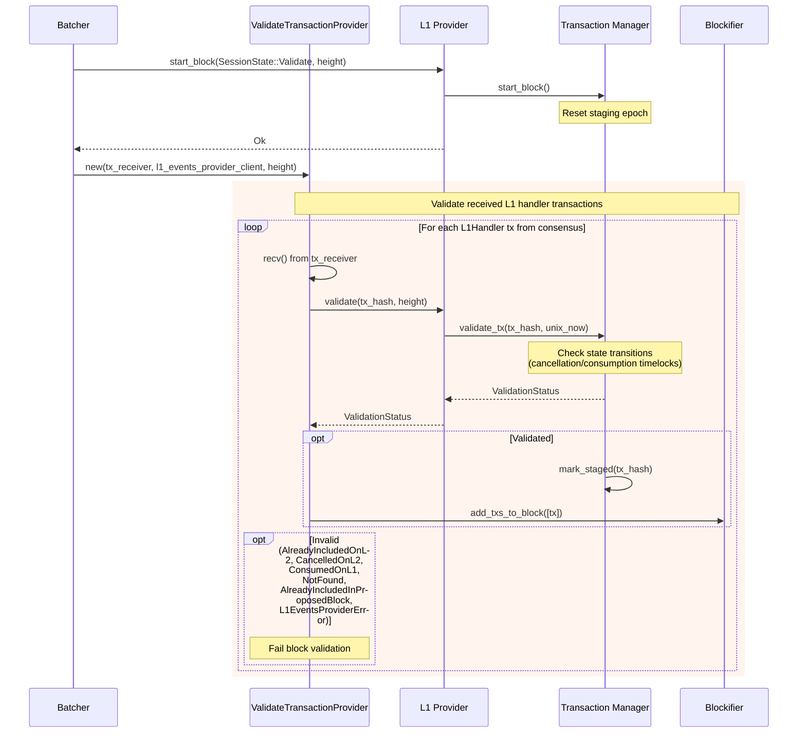

### Title
`finalize_cancellation` deletes an L1 handler transaction record without checking the `staged` lock, causing honest-node consensus divergence - ([File: crates/apollo_l1_events/src/transaction_manager.rs])

### Summary
`TransactionManager::finalize_cancellation` removes an L1-handler transaction's bookkeeping record from `self.records` unconditionally whenever a `TransactionCanceled` L1 event is scraped — even if that transaction is currently `staged` (i.e. already included in an in-flight block proposal/validation round, the L1-provider's analog of a "lock"). This mirrors the reported `kick_token` bug class: an administrative/cleanup path (`finalize_cancellation`) does not respect the concurrency lock (`staged_epoch`) that the normal propose/validate/commit flow relies on, so a state mutation can land in the middle of an in-flight, not-yet-committed operation.

### Finding Description
The `staged` flag is the provider's concurrency-safety mechanism: `get_txs`/`validate_tx` mark a transaction as staged for the current block attempt so it can't be double-included, and `commit_txs`/`start_block` are the only places that are supposed to change staged transactions' fate (via `rollback_staging`/`mark_committed`/`mark_rejected`).

`finalize_cancellation`, however, is reachable purely by L1 events (ultimately controlled by the original L1 message sender who requested and can finalize the cancellation of their own message) and bypasses this protection: [1](#0-0) 

The code explicitly acknowledges the race but only logs a warning instead of refusing/guarding the mutation:
```
// Regardless of the state of the tx in the record, if we get the cancellation event from
// the L1 contract, we delete this tx from the records and from the proposable index, even
// if it was Pending and ready to be proposed (which is not supposed to happen, hence the
// warning).
```

Compare with `validate_tx`, which is what an honest validator calls per L1-handler tx received in a proposal: [2](#0-1) 

If the record was deleted by `finalize_cancellation` between the time a proposer staged/proposed the tx (`get_txs`) and the time a validator processes it, `validate_tx` returns `InvalidValidationStatus::NotFound` for that validator, which per the documented flow causes that validator to fail/reject the block validation: [3](#0-2) 

Because the L1 event scraper on different sequencer nodes polls L1 independently and asynchronously (`add_events` is driven by each node's own scraper cadence), whether a given node has already processed the `TransactionCanceled` event for tx X at the moment it validates a specific proposal is non-deterministic across nodes: [4](#0-3) 

This directly parallels the analog's root cause: a lock-respecting code path (`help_transfer`/`validate_tx`) exists, but a separate, reachable mutation path (`kick_tokens`/`finalize_cancellation`) ignores the lock and mutates the same record, producing state divergence for anyone who observes the mutation mid-flight versus anyone who doesn't.

### Impact Explanation
Different honest nodes can reach different validation verdicts for the *same* proposed block purely due to the relative timing of L1 event scraping vs. block validation — some nodes will see the L1-handler transaction as `NotFound` (record deleted by `finalize_cancellation`) and reject the block, while others (who haven't yet scraped the same L1 event) will see it as still `Pending`/stageable and accept it. This is honest-node divergence on block validity, which can stall consensus (nodes disagree on whether a proposal is valid) or, in the worst case, let the block get committed on nodes that didn't observe the cancellation while other nodes have already purged/invalidated it, leaving providers in inconsistent local states (`records` deleted vs `Committed`) that can affect future proposals/validations for other L1 handler transactions sharing the same code paths.

### Likelihood Explanation
The condition depends on natural network asynchrony (L1 polling intervals differ slightly across sequencer nodes, or a proposal happens to be built right as a cancellation timelock expires) rather than any active exploit by a validator — the transaction's original L1 sender only needs to normally request and finalize a cancellation (a legitimate action available to any L1 message sender) shortly after (or concurrently with) the sequencer including that L1-handler transaction in a proposal. The source code itself documents this exact race ("which is not supposed to happen, hence the warning") but does not prevent it, indicating the developers were aware of, but did not close, this timing window. As with the original report, this is more likely to happen by accident given normal, uncoordinated timing than to be reliably weaponized, but it is not purely theoretical.

### Recommendation
Have `finalize_cancellation` check the "staged" lock (analogous to the `assert_not_locked` patch) before mutating/removing the record: if the transaction is currently staged for the block being proposed/validated, defer the deletion (e.g., queue it, similar to the `consumed_queue` timelock mechanism) until the current staging epoch rolls over via `commit_block`/`start_block`, instead of deleting mid-flight. Alternatively, treat records with in-flight staged status as ineligible for immediate deletion, and only physically remove them once no proposal is depending on their presence.

### Proof of Concept
1. L1 sender requests cancellation of message M (transaction hash X) — `Event::TransactionCancellationStarted` is scraped by all nodes, `request_cancellation` sets state to `CancellationStartedOnL2`.
2. Once the L1 timelock passes, sender finalizes the cancellation on L1, and the `Event::TransactionCanceled` event becomes scrapable.
3. Node A (proposer) has not yet scraped the finalize event; it calls `get_txs`, includes X in a block proposal (`staged=true`, state=`Pending`), and broadcasts the proposal.
4. Node B, which has already scraped the `TransactionCanceled` event, has already invoked `finalize_cancellation(X)` — deleting X's record entirely — before it processes the incoming proposal.
5. Node B calls `validate(X, height)` → `tx_manager.validate_tx` → record not found → `InvalidValidationStatus::NotFound` → Node B rejects the proposal.
6. Meanwhile Node C, which (like Node A) hasn't yet scraped the cancellation, still has X as `Pending`, stages it successfully, and accepts the proposal.
7. Nodes B and C now disagree on the validity of the identical proposal, purely as a function of each node's independent L1-scraping timing — an honest-node consensus divergence triggered by a normal action (message cancellation) of the original L1 message sender.

### Citations

**File:** crates/apollo_l1_events/src/transaction_manager.rs (L116-145)
```rust
    pub fn validate_tx(&mut self, tx_hash: TransactionHash, unix_now: u64) -> ValidationStatus {
        let current_staging_epoch_cloned = self.current_staging_epoch;

        let policy = TransactionRecordPolicy {
            cancellation_timelock: self.config.l1_handler_cancellation_timelock_seconds,
        };

        let validation_status = self.with_record(tx_hash, |record| {
            // If the current time affects the state, update state now.
            record.update_time_based_state(unix_now, policy);
            if !record.is_validatable() {
                match record.state {
                    TransactionState::Committed => {
                        InvalidValidationStatus::AlreadyIncludedOnL2.into()
                    }
                    TransactionState::CancelledOnL2 => {
                        InvalidValidationStatus::CancelledOnL2.into()
                    }
                    TransactionState::Consumed => InvalidValidationStatus::ConsumedOnL1.into(),
                    _ => unreachable!(),
                }
            } else if record.try_mark_staged(current_staging_epoch_cloned) {
                ValidationStatus::Validated
            } else {
                InvalidValidationStatus::AlreadyIncludedInProposedBlock.into()
            }
        });

        validation_status.unwrap_or(InvalidValidationStatus::NotFound.into())
    }
```

**File:** crates/apollo_l1_events/src/transaction_manager.rs (L221-245)
```rust
    pub fn finalize_cancellation(&mut self, tx_hash: TransactionHash) {
        let Some(record) = self.records.get(&tx_hash) else {
            info!(
                "Attempted to finalize cancellation for non-existent transaction: {tx_hash}. This \
                 can happen if the transaction was too old to be scraped (e.g. it was created \
                 before we started scraping)."
            );
            return;
        };

        // Regardless of the state of the tx in the record, if we get the cancellation event from
        // the L1 contract, we delete this tx from the records and from the proposable index, even
        // if it was Pending and ready to be proposed (which is not supposed to happen, hence the
        // warning).
        if record.state != TransactionState::CancellationStartedOnL2 {
            warn!(
                "Attempted to finalize cancellation for transaction {tx_hash} that is not in the \
                 cancellation started on L2 state, but in the {:?} state.",
                record.state
            );
        }
        // This will also call maintain_indices to remove the tx from the proposable index.
        self.with_record(tx_hash, |r| r.mark_cancellation_finalized_on_l1());
        self.records.remove(&tx_hash);
    }
```

**File:** docs/diagrams/06-l1-handler-flow.md (L112-152)
```markdown
## Block Validation - Validating L1 Transactions


```

**File:** crates/apollo_l1_events/src/l1_events_provider.rs (L124-191)
```rust
    /// Accept new events from the scraper.
    #[instrument(skip_all, err)]
    pub fn add_events(&mut self, events: Vec<Event>) -> L1EventsProviderResult<()> {
        if self.state.is_uninitialized() {
            return Err(L1EventsProviderError::Uninitialized);
        }

        // TODO(guyn): can we remove this "every sec" since the polling interval is rather long?
        info_every_n_ms!(1000, "Adding {} l1 events", events.len());
        trace!("Adding events: {events:?}");

        for event in events {
            match event {
                Event::L1HandlerTransaction {
                    l1_handler_tx,
                    block_timestamp,
                    scrape_timestamp,
                } => {
                    self.tx_manager.add_tx(l1_handler_tx, block_timestamp, scrape_timestamp);
                }
                Event::TransactionCancellationStarted {
                    tx_hash,
                    cancellation_request_timestamp,
                } => {
                    if !self.tx_manager.exists(tx_hash) {
                        warn!(
                            "Dropping cancellation request for old L1 handler transaction \
                             {tx_hash}: not in the provider and will never be scraped at this \
                             point."
                        );
                        continue;
                    }

                    self.tx_manager
                        .request_cancellation(tx_hash, cancellation_request_timestamp)
                        .inspect(|previous_request_timestamp| {
                            // Re-requesting a cancellation is meaningful for the L1 timelock, but
                            // for the l2 timelock we only consider the first cancellation
                            // relevant.
                            info!(
                                "Dropping duplicated cancellation request for {tx_hash} at \
                                 {cancellation_request_timestamp}, previous request block \
                                 timestamp still stands: {previous_request_timestamp}"
                            );
                        });
                }
                Event::TransactionCanceled { tx_hash } => {
                    info!(
                        "Cancellation finalized for tx_hash: {tx_hash}. Deleting the tx from the \
                         provider records."
                    );
                    self.tx_manager.finalize_cancellation(tx_hash);
                }
                Event::TransactionConsumed { tx_hash, timestamp: consumed_at } => {
                    if let Err(previously_consumed_at) =
                        self.tx_manager.consume_tx(tx_hash, consumed_at, self.clock.unix_now())
                    {
                        // This should never happen. So if it does, better to fail loudly.
                        panic!(
                            "Double consumption of {tx_hash} at {consumed_at}, previously \
                             consumed at {previously_consumed_at}."
                        );
                    }
                }
            }
        }
        Ok(())
    }
```
